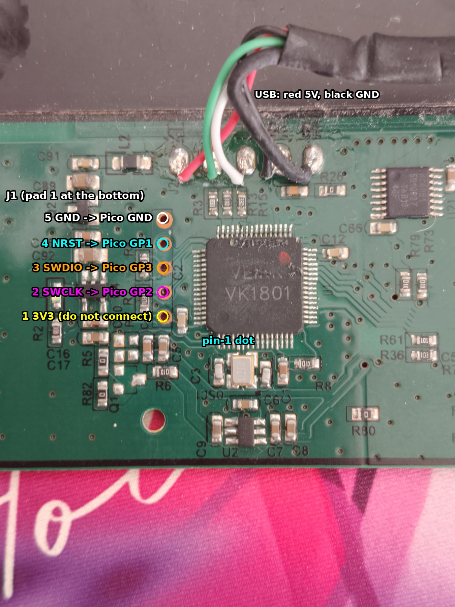
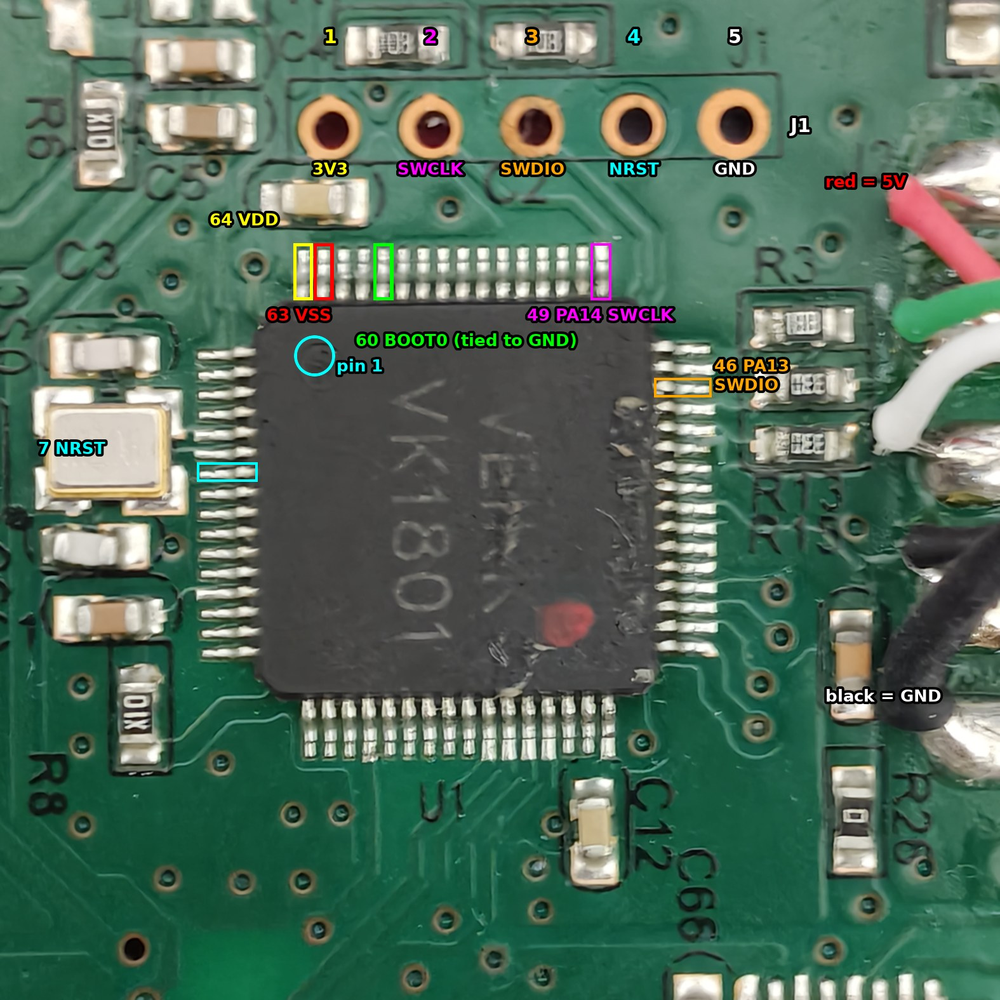

<!-- banner:start -->
> [!CAUTION]
> **This entire document was written by Claude Opus 5.5 on xHigh reasoning.** I did not check
> every byte of it, and I am **not responsible for anything in here that turns out to be wrong.**
> Some of it probably is. Flash something because a README told you to, turn your tablet into a
> very expensive coaster, and that is on you. Not me, not Claude, you.
>
> Read the code yourself. Measure with your own multimeter. Check every address and every
> command before you run it. Better yet, do the shi yourself and use this as a map, not a
> manual. **You have been warned.**

**Same thing, but shorter and just looks nicer i guess? → [vivlos.dev/s640](https://vivlos.dev/s640/)**
<!-- banner:end -->


# Veikk S640: SWD unbrick, firmware internals, and the zero-smoothing patch

Everything learned while bringing a bricked Veikk S640 drawing tablet back to life over SWD
with a Raspberry Pi Pico, then reading its firmware to find out where the report rate and
the cursor smoothing come from. Every number here was measured or read from the chip or the
firmware image. Things that were not verified say so.

Written 2026-10-06. Firmware analysed: Veikk's official update `S640-251022` (50,276 bytes,
SHA-256 `150fbc8b…287b45`).

> **Do not run anything here on a working tablet without reading section 3 first.** Getting
> SWD access requires removing the chip's read protection, and that **erases the whole flash**,
> including per-unit data that this document cannot give back to you (section 3.6).

## Contents

1. [Quick facts](#1-quick-facts)
2. [Hardware](#2-hardware)
3. [How it was bricked, and how it was recovered](#3-how-it-was-bricked-and-how-it-was-recovered)
4. [The firmware image](#4-the-firmware-image)
5. [How the firmware works](#5-how-the-firmware-works)
6. [Report rate: why 1000 Hz is not possible here](#6-report-rate-why-1000-hz-is-not-possible-here)
7. [Zero smoothing](#7-zero-smoothing)
8. [Corrections to the earlier notes](#8-corrections-to-the-earlier-notes)
9. [Tools, scripts and data in this repository](#9-tools-scripts-and-data-in-this-repository)
10. [Checksums](#10-checksums)
11. [Open questions](#11-open-questions)
12. [Annotated listings](#12-annotated-listings)

---

## 1. Quick facts

| Thing | Value | How it was found |
| :--- | :--- | :--- |
| Unit used | one Veikk S640, called **V1** in the earlier notes; no revision marking on the photographed parts of the PCB (2.1) | owner, photos |
| Tablet | Veikk S640, USB `2feb:0001`, manufacturer string `VEIKK.INC`, product `S640` | `lsusb`, kernel log |
| MCU marking | `VEIKK VK1801` (relabelled), LQFP64, 16 pins per side | photos |
| Core | ARM Cortex-M3 r2p1, CPUID `0x412FC231` | SWD read of `0xE000ED00` |
| SWD DPIDR | `0x1BA01477` | OpenOCD |
| Device ID (OpenOCD `stm32f1x` driver) | `0x13030410` | OpenOCD |
| Flash / SRAM | 64 KB / 8 KB (`0x1FFFF7E0` reads `0x00080040`) | SWD |
| Peripheral map | GigaDevice GD32F1x0 style: GPIO on AHB at `0x48000000`, USBD `0x40005C00`, FMC `0x40022000`, ADC `0x40012400` | firmware + SWD |
| System clock | 72.00 MHz (12 MHz crystal x 6 PLL, inferred from `RCU_CFG0 = 0x0011800A`) | DWT cycle counter over 1 s |
| Debug header | J1, 5 through-holes: 3V3, SWCLK, SWDIO, NRST, GND | multimeter |
| BOOT0 | pin 60, tied straight to GND (0 Ω) | multimeter |
| Read protection | was ON (`FMC_OBSTAT = 0xFFFFFF02`, option byte SPC = `0x00`) | SWD |
| Pen report rate | 250 Hz (4.0 ms), limited by the antenna scan, not USB | measured |
| USB polling | `bInterval 1` on all IN endpoints in `S640-251022` | descriptor + `lsusb -v` |
| Pen coordinates | 0.005 mm per unit (5080 LPI), X 0 to 30480, Y 0 to 20320 | report builder + measurements |
| Firmware smoothing | 8-sample boxcar on X/Y + a motion "hold" (deadzone), both removed by the v2 patch | breakpoints + RAM reads |

---

## 2. Hardware

### 2.1 The unit these notes come from

| | |
| :--- | :--- |
| Model | Veikk S640 (6 x 4 inch), the version the earlier notes call **V1**. Veikk also sells an "S640 V2"; nothing here was checked on one |
| PCB revision | no version or date marking on the parts of the board in the photos (front side around the MCU and the antenna front end) |
| USB | `2feb:0001`, `bcdDevice 0x0000`, strings `VEIKK.INC` / `S640` |
| MCU | marked `VEIKK VK1801`, LQFP64, device ID `0x13030410` |
| Firmware it came with | unknown version, never read out (lost in the unlock, 3.6). The earlier notes measured `bInterval 3` on it |
| Firmware now | `S640-251022` with the v2 patch (7.4) |
| Pen | the pen that came with it; model not recorded. The hover frequency measurement returns a period of 2621 to 2687 TIMER2 ticks (5.7) |

If your tablet's MCU marking, USB ID, J1 layout or the bytes the patch scripts check differ
from this table, **stop**: you have different hardware or firmware, and nothing below is
known to apply.

### 2.2 Board



Photo orientation used throughout this document: chip text `VK1801` upright, J1 is the
vertical column of 5 gold through-holes to the left of the chip, **pad 1 is the bottom hole**.
The USB cable is soldered to pads at the top (red = 5 V, black = GND, green and white = data).

Parts seen on the board (from the photos in [`images/raw/`](images/raw/)):

| Ref | Part | Notes |
| :--- | :--- | :--- |
| U1 | `VEIKK VK1801`, LQFP64 | the MCU, a relabelled GigaDevice GD32F1x0 class part (Cortex-M3 core with STM32F0 style peripherals) |
| OSC1 | crystal | below the chip in the photo above, wired to pins 5 and 6 (PF0/PF1). 12 MHz inferred from the PLL setting |
| U7, U8, U18, U19, U21, U22 | `HC4051` 8-channel analog multiplexers | select the antenna coils |
| U10, U11, U14 | `UTC MC4580` dual op-amps | receive amplifier and integrator chain |
| U4 | small IC left of J1 | probably the 3.3 V regulator (not traced); the rail measures 3.30 to 3.33 V |
| D1 | probably the status LED | top left in the rotated photo |
| R3, R13, R15 | resistors next to pins 44 and 45 | in the USB D+/D- path (PA11/PA12) |
| J2 | USB cable pads | |

[`images/raw/IMG20260929140039.jpg`](images/raw/IMG20260929140039.jpg) shows the antenna front end (the HC4051 and MC4580 parts).

### 2.3 MCU pins that matter



The second photo is the board rotated 90 degrees clockwise (pin-1 dot at the top left, J1 as
a row above the chip). In it J1 pad 1 is the **left** hole, which is the same hole as
"bottom" in the first photo.

Standard LQFP64 numbering for this family (pin 1 at the dot, counting counter-clockwise).
Pins 7, 46, 49, 60, 63 and 64 were checked with a meter; the rest follow from the package
pinout and from what the firmware drives.

| Pin | Name | Use on this board |
| :--- | :--- | :--- |
| 5, 6 | PF0, PF1 | crystal |
| 7 | NRST | reset, also on J1 pad 4 |
| 22, 23 | PA6, PA7 | mux address lines (driven by the coil select routines) |
| 24 | PC4 | mux address line |
| 27 | PB1 | switched around every coil measurement (integrator or sample control, see 5.3) |
| 28 | PB2 | set or cleared per axis before each measurement (front-end path select) |
| 30 | PB11 | mux control (enable) |
| 37 to 40 | PC6, PC7, PC8, PC9 | excitation drive, toggled together (mask `0x3C0`) to generate the carrier |
| 41 | PA8 | mux control (enable) |
| 44, 45 | PA11, PA12 | USB D-, D+ |
| 46 | PA13 | SWDIO, also on J1 pad 3 |
| 49 | PA14 | SWCLK, also on J1 pad 2 |
| 60 | BOOT0 | tied to GND on the board |
| 63, 64 | VSS, VDD | |

### 2.4 J1 debug header

| J1 pad | Signal | Connects to | Volts, tablet powered | Diode reading to GND, unpowered |
| :--- | :--- | :--- | :--- | :--- |
| 1 (bottom) | 3V3 | VDD | 3.33 V | 761 (pin 64 reads about 760) |
| 2 | SWCLK | pin 49 (beep) | 0 V (PA14 has an internal pull-down) | open |
| 3 | SWDIO | pin 46 (beep) | 3.30 V (PA13 has an internal pull-up) | open |
| 4 | NRST | pin 7 (same voltage and diode reading) | 3.19 V | 1312 (pin 7 reads 1200 to 1300) |
| 5 (top) | GND | GND (beep) | 0 V | 002, beeps |

Wiring used for the recovery (Raspberry Pi Pico running `debugprobe_on_pico`):

| Pico pin (physical) | Pico GPIO | J1 pad |
| :--- | :--- | :--- |
| 4 | GP2 | 2, SWCLK |
| 5 | GP3 | 3, SWDIO |
| 3 | GND | 5, GND |
| 2 | GP1 | 4, NRST (optional, see 3.4) |
| none | none | 1, 3V3: leave unconnected, the tablet powers itself from USB |

Physical pin numbers count from the USB end of the Pico, on the row that starts with GP0.

### 2.5 BOOT0 cannot be used

BOOT0 (pin 60) measures **0 Ω to GND**. It is tied to ground on the board, so the chip
can never be strapped into its ROM bootloader from BOOT0. Bridging pin 64 (3.3 V) to pin 60,
which was tried on 2026-09-29, shorts the 3.3 V rail to GND. **Do not do it.** The tablet's
"enter DFU" USB command (section 3.1) jumps to Veikk's own bootloader in flash, which needs
working firmware to receive the command. With broken firmware, SWD is the only way in.

---

## 3. How it was bricked, and how it was recovered

### 3.1 Before 2026-10-06 (from the earlier notes, written with another AI assistant)

These facts come from [`history/VEIKK_S640_REVERSE_ENGINEERING_original.md`](history/VEIKK_S640_REVERSE_ENGINEERING_original.md) and the
scripts in [`history/`](history/). They were not re-tested on 2026-10-06 unless stated.

* The tablet exposes three HID interfaces: 0 = pen (boot mouse protocol), 1 = keys,
  2 = vendor channel with an OUT endpoint.
* OpenTabletDriver sends `09 01 04 00 00 00 00 00 00` on interface 2 to switch the tablet
  into its vendor reporting mode (the tablet answers `09 81 04 …`).
* Writing `00 09 04 2f eb 00 00 00 00 c0` (report ID 0 plus 9 bytes) to the interface 2
  hidraw node makes the tablet re-enumerate as `28e9:0189` (GigaDevice's USB ID) with the DFU
  alt-setting name `@Internal Flash  /0x08000000/12*001Ka,116*001Kg`.
* The earlier notes assumed that was the chip's ROM bootloader. **The firmware shows it is
  not** (verified 2026-10-06 in [`asm/32_hardfault_reset_and_vendor_cmds.lst`](asm/32_hardfault_reset_and_vendor_cmds.lst) and
  [`asm/33_main_loop.lst`](asm/33_main_loop.lst)): the command is checked at `0x08001922` (`cmp r1,#0x2f`,
  `cmp r3,#0xeb`, `cmp r8,#0xc0`), which sets the byte at `0x20001030` and answers `0x84`.
  The main loop then sees that byte (`0x0800671A`), calls `0x08000BB8` and `0x08009A4E`
  (probably USB shutdown, not traced), waits for a 100-tick countdown at `0x2000100D`,
  disables TIMER5, and if the word at **`0x0800D800`** looks like a stack pointer (`word & 0x2FFE0000 == 0x20000000`)
  it loads it into MSP (`0x08000182`, `msr msp, r0`) and jumps to the address stored at
  **`0x0800D804`**. So the DFU bootloader is Veikk code at `0x0800D800` in the main flash,
  outside the firmware image.
* `dfu-util` failed on that bootloader with `LIBUSB_ERROR_OTHER` on SET_INTERFACE, so a
  custom pyusb flasher (`gd32_dfu_flash.py`) was used. The bootloader's descriptor marks the
  first 12 KB (`12*001Ka`) as read-only, and writes there were silently ignored. Read-back was
  refused.
* `S640-251022.bin` was flashed through that DFU; only the part from `0x08003000` up
  actually landed. The earlier notes record the tablet at 248.8 Hz before and 247.8 Hz after.
* `flash_500hz.py` then erased the pages from `0x08003000` to the end of the image
  (`0x08003000` to about `0x0800C7FF`) and started programming page by page. Per the owner,
  the script died partway through programming. Nothing in the script restores the erased pages
  if a step fails, so the flash was left with an intact first 12 KB (old code) and a partly
  erased rest. Its payload, `s640_firmware_500hz.bin`, only changed the three `bInterval`
  bytes of the USB configuration descriptor from 1 to 2 (`0x0800A57F`, `0x0800A598`,
  `0x0800A5B1`). That would have **halved** the USB polling rate, so the "500 Hz" patch could
  never have worked.
* Result: no LED, nothing on USB. The HardFault handler of this firmware (`0x08001588`) is
  `msr faultmask` followed by a system reset through AIRCR (`0x05FA0004` into `0xE000ED0C`),
  so a crash just restarts the chip forever without ever enumerating.
* 2026-09-29: BOOT0 attempts (no effect, BOOT0 is grounded). 2026-10-03: first SWD attempt
  with a Pico failed with `cannot read IDR` (wiring was unverified at the time). A MicroPython
  pad scanner ([`tools/padscan.sh`](tools/padscan.sh)) was written to find the J1 pinout with the Pico's ADC; it
  never logged a reading ([`data/padscan.log`](data/padscan.log) only has serial-port errors).

### 3.2 Finding the debug pins with a multimeter

Done in three rounds. All values are in [`data/session_outputs_2026-10-06.txt`](data/session_outputs_2026-10-06.txt).

1. **Tablet powered, DC volts, black probe on the black USB wire.** Pin 64 read 3.3 V, so the
   chip has power; pin 7 (NRST) read a steady 3.19 V, so the chip is not held in reset; pin 60
   read 0 V. J1 pads bottom to top: 3.33, 0, 3.30, 3.19, 0 V.
2. **Unpowered, diode/continuity mode against GND.** J1 pads: 761, open, open, 1312, beep.
   Pin 64 about 760, pin 7 1200 to 1300, pins 49 and 46 open. Matching readings identify pad 1
   as VDD and pad 4 as NRST; the beep makes pad 5 GND.
3. **Unpowered, ohms.** BOOT0 to GND: 0. Continuity pad 2 to pin 49 and pad 3 to pin 46: both beep.

The SWCLK/SWDIO split also matches the reset state of the pins: PA14 (SWCLK) has an internal
pull-down (0 V on pad 2), PA13 (SWDIO) a pull-up (3.30 V on pad 3).

### 3.3 Turning a Pico into an SWD probe

1. Hold BOOTSEL and plug the Pico in. It appears as `2e8a:0003 RP2 Boot` with a drive called `RPI-RP2`.
2. Copy `debugprobe_on_pico.uf2` onto it (SHA-256 in section 10). It re-enumerates as
   `2e8a:000c Raspberry Pi Debugprobe on Pico (CMSIS-DAP)`, firmware version 2.0.0.
3. Wire it as in 2.4. Then plug in the tablet first and the Pico second.

A charge-only USB cable is a common reason for the Pico not appearing at all.

### 3.4 Connecting, and what went wrong first

OpenOCD 0.12.0 (`nix-shell -p openocd`). The command that works on this tablet:

```
openocd -f interface/cmsis-dap.cfg -c 'transport select swd; set CPUTAPID 0' \
        -f target/stm32f1x.cfg -c 'adapter speed 1000; reset_config none' -c 'init; halt'
```

* `set CPUTAPID 0` stops the `stm32f1x` config from rejecting a non-ST ID.
* `adapter speed` must come **after** `target/stm32f1x.cfg`, which sets 1000 kHz itself.
* `reset_config none` connects to the running chip. Connect-under-reset
  (`srst_only srst_nogate connect_assert_srst`) **did not work** on this board: DPIDR read
  back as `0xFFFFFFFF` and halt timed out after "external reset detected".

`Error connecting DP: cannot read IDR` appeared at every speed (1 MHz, 100 kHz, 50 kHz,
10 kHz) until the wiring was fixed. Two wiring faults caused it, found with the meter by
beeping from the **Pico pin to the chip pin** (not just to the J1 pad):

1. On the first try there were no wires between the Pico and the tablet at all.
2. On the second, the SWDIO wire touched both pad 2 and pad 3 (GP3 beeped to pins 46 and 49)
   and the SWCLK wire touched nothing.

Once the wiring was right:

```
Info : SWD DPIDR 0x1ba01477
Info : [stm32f1x.cpu] Cortex-M3 r2p1 processor detected
Info : [stm32f1x.cpu] target has 6 breakpoints, 4 watchpoints
Error: [stm32f1x.cpu] clearing lockup after double fault
Error: Failed to read memory at 0x08000004
```

The core was in **lockup** (a fault while handling a fault), PC `0x08001210`. Flash reads
failed because of read protection:

| Address | Value | Meaning |
| :--- | :--- | :--- |
| `0x4002201C` FMC_OBSTAT | `0xFFFFFF02` | bit 1 set: flash read protection active |
| `0x40022010` FMC_CTL | `0x00000080` | LK set (flash controller locked) |
| `0x1FFFF800` option bytes | `00ffff00 00ff00ff 00ff00ff 00ff00ff` | SPC = `0x00`, nSPC = `0xFF` (anything other than `0xA5` = protected) |
| `0x1FFFF7E0` | `0x00080040` | 64 KB flash, 8 KB SRAM |
| `0xE000ED00` CPUID | `0x412FC231` | Cortex-M3 r2p1 |
| `0xE000EDF0` DHCSR | `0x00030003` | halted under debug |
| `0x20000000` | `d5dffd01 02c9b8b6 0bd8be20 1add3856` | SRAM content at that moment |

Read protection explains why SWD could not read flash. Why the DFU bootloader refused the
first 12 KB is not proven: its own descriptor declares those 12 pages read-only (`a`), and
read protection on GigaDevice and ST parts also write-protects the first pages, so either
could be the reason.

### 3.5 Removing read protection (mass erase)

```
openocd … -c 'init; halt; stm32f1x unlock 0; shutdown'
```

OpenOCD printed `device id = 0x13030410` and `flash size = 64 KiB`. The option bytes then
read `00ff5aa5 …` (SPC = `0xA5`, unprotected) but `FMC_OBSTAT` still showed protection until
the tablet was **unplugged and plugged back in** (option bytes are loaded at power-on). After
that `FMC_OBSTAT = 0xFFFFFF00` and the whole flash read `0xFFFFFFFF`.

### 3.6 What the mass erase destroys

| Region | Content | Can it be restored? |
| :--- | :--- | :--- |
| `0x08000000` to `0x0800C463` | firmware | yes, `S640-251022.bin` is a complete image from `0x08000000` (vector table at 0) |
| `0x0800D000`, `0x0800D400` | settings pages the firmware loads at start and rewrites (section 4.4) | **no**, per-unit content. The tablet tracks the pen without them |
| `0x0800D800` up to `0x0800FC5F` | **Veikk's DFU bootloader** (3.1) | **no**. It is not in any public file we have. Consequence: the "enter DFU" command and Veikk's USB updater no longer work on this tablet; the firmware checks for a valid vector table at `0x0800D800` first, so the command just does nothing now. Update over SWD instead |
| `0x0800FC60` to `0x0800FC7F` | factory tags checked by the firmware | **yes**, the four expected values are constants in the firmware (4.3) |
| anything else outside the image | unknown | unknown |

The tablet's original firmware version (whatever was on it before the DFU flash in 3.1) is
also gone; it was never read out. If you own a working S640, a dump of `0x0800D000` to
`0x0800FFFF` (bootloader, settings and tags) would fill the gaps in this document.

If you have a working tablet and want to keep its original flash, look at the published
GD32F1x0 read-protection bypass by Positive Technologies ("GigaVulnerability") before
unlocking. It was **not tried here**.

### 3.7 Flashing the firmware back

```
openocd -f interface/cmsis-dap.cfg -c 'transport select swd; set CPUTAPID 0' \
        -f target/stm32f1x.cfg -c 'adapter speed 1000; reset_config none; init; halt;
          program S640-251022.bin 0x08000000 verify;
          program patches/factory_tags_fc60.bin 0x0800FC60 verify;
          reset run; shutdown'
```

Both writes printed `** Verified OK **`, and the tablet came up as `2feb:0001` with the pen
working. The factory tags only need writing once; later firmware flashes do not erase that
page (they only erase the pages the image covers).

[`patches/factory_tags_fc60.bin`](patches/factory_tags_fc60.bin) (32 bytes, unused bytes `0xFF`):

```
0x0800FC60: 55 47 45 45 ff ff ff ff   "UGEE"
0x0800FC68: 33 37 32 31 ff ff ff ff   "3721"
0x0800FC70: 30 32 32 36 ff ff ff ff   "0226"
0x0800FC78: 8c 42 09 d2 ff ff ff ff   0xD209428C
```

Without the `"3721"` tag the tracking scan returns immediately (4.3) and the pen is never
detected. That is the first thing to check if a re-flashed tablet sees no pen.

### 3.8 Flashing any image later

With the Pico still wired:

```
cd veikk-s640-zero-smoothing
nix-shell -p openocd --run "openocd -f interface/cmsis-dap.cfg -c 'transport select swd; set CPUTAPID 0' -f target/stm32f1x.cfg -c 'adapter speed 1000; reset_config none; init; halt; program s640_firmware_nosmooth_v2.bin 0x08000000 verify; reset run; shutdown'"
```

Look for `** Verified OK **`. The tablet restarts by itself. **Never flash images from this
project through Veikk's USB DFU:** it silently skips the first 12 KB, which is exactly where
the zero-smoothing patches are, and an interrupted DFU flash is how this tablet was bricked.


---

## 4. The firmware image

### 4.1 Files

| File | Size | SHA-256 | Notes |
| :--- | :--- | :--- | :--- |
| `S640-251022.hex` (as `s640_firmware_stock_251022.hex`) | 132,786 bytes | `8bbc8c49…297319` | Veikk's update file, Intel HEX. "251022" is in the name, probably 2025-10-22 |
| `S640-251022.bin` | 50,276 bytes (`0xC464`) | `150fbc8b…287b45` | same content as raw binary, linked at `0x08000000` |

**Neither file is in this repository** (it is Veikk's firmware). Every patch script checks the
input bytes before changing them, so they refuse anything that is not this exact image.

The image starts with its vector table at `0x08000000` and contains no bootloader. Full
vector table: [`asm/00_data_tables.txt`](asm/00_data_tables.txt). The entries that matter:

| Vector | Handler | What it does |
| :--- | :--- | :--- |
| initial SP | `0x200018F0` | top of the stack, 6.2 KB into the 8 KB SRAM |
| Reset | `0x08000190` | calls SystemInit `0x080040F8` (clocks), then the C runtime at `0x0800015A`, which ends in the main loop (`0x0800664C`) |
| NMI | `0x08001E24` | |
| HardFault | `0x08001588` | `msr faultmask`, then system reset (AIRCR = `0x05FA0004`). A crash restarts the chip |
| SVCall | `0x080023B8` | `bx lr` (empty) |
| PendSV | `0x08001EE0` | `bx lr` (empty) |
| SysTick | `0x080040F4` | branch veneers to `0x08005860` |
| IRQ0 | `0x0800662C` | `bx lr` (empty) |
| IRQ5, IRQ6, IRQ7 (EXTI) | `0x08000C40`, `0x08000C42`, `0x08000C44` | the first two are `bx lr` |
| IRQ16 (TIMER2) | `0x080041B8` | stores TIMER2 channel 2 captures into a 20-entry ring at `0x20001474` (count at `0x20000033`) |
| IRQ17 (TIMER5) | `0x080041FC` | 200 Hz housekeeping tick, continues at `0x08004544` |
| all others | `0x080001AA` | `b .` (hangs) |

### 4.2 Flash map (64 KB)

| Range | Content |
| :--- | :--- |
| `0x08000000` to `0x0800C463` | firmware image `S640-251022` |
| `0x0800C464` to `0x0800CFFF` | unused (erased) |
| `0x0800D000` to `0x0800D3FF` | settings page A (4.4) |
| `0x0800D400` to `0x0800D7FF` | settings page B (4.4) |
| `0x0800D800` to `0x0800FC5F` | Veikk DFU bootloader (3.1). Lost on this unit |
| `0x0800FC60` to `0x0800FC7F` | factory tags (4.3) |
| `0x0800FC80` to `0x0800FFFF` | unknown |

Pages are 1 KB. The firmware references `0x0800C464` (the end of its own image) and the
addresses above; nothing else past the image.

### 4.3 Factory tags

Four 32-bit words at the end of flash. Each gates one function: if the word is wrong, that
function returns without doing anything.

| Address | Expected | Checked at | Gates | Effect when missing |
| :--- | :--- | :--- | :--- | :--- |
| `0x0800FC60` | `0x45454755` (`"UGEE"`) | `0x080023BE` | full scan of all 26 X and 18 Y coils (`0x080023BC`, 5.6) | pen never acquired |
| `0x0800FC68` | `0x31323733` (`"3721"`) | `0x08002FC8` | tracking scan (`0x08002FC4`, 5.6) | pen never tracked |
| `0x0800FC70` | `0x36323230` (`"0226"`) | `0x08006556` | baseline subtraction (`0x08006554`, 5.6) | coil amplitudes never updated |
| `0x0800FC78` | `0xD209428C` | `0x08001EF2` | frequency, button and pressure routine (`0x08001EE4`, 5.7) | no pen state, no reports |

UGEE is the Chinese tablet maker behind XP-Pen; the tag suggests this firmware comes from UGEE code (not verified). The values are fixed constants in the firmware, not derived from the chip ID, so the same 32 bytes work on any S640 with this firmware.

```
080023bc:  70 b5         push     {r4, r5, r6, lr}
080023be:  1e 48         ldr      r0, [pc, #0x78]    ; =0x0800fc60
080023c0:  00 68         ldr      r0, [r0]
080023c2:  1e 49         ldr      r1, [pc, #0x78]    ; =0x45454755
080023c4:  88 42         cmp      r0, r1
080023c6:  35 d1         bne      #0x8002434
080023c8:  1d 49         ldr      r1, [pc, #0x74]    ; =0x20000005
```

### 4.4 Settings pages

| Routine | Does |
| :--- | :--- |
| `0x08008268` | copies page `0x0800D000` into RAM at `0x200004E5` (called once at start, `0x08006650`) |
| `0x080082A0` | loads fields from page `0x0800D400` into `0x2000108E`, `0x2000003E`, `0x20001090`, `0x20000040`, `0x20001092`, `0x200008E5` (block), `0x20001058`, `0x20001054` (called at start, `0x08006654`) |
| `0x080083A0` | erases and rewrites page `0x0800D000` from RAM (called from the vendor command handler, `0x0800198C`) |
| `0x08008408` | erases and rewrites page `0x0800D400` (called from `0x08001ABA`, `0x08001B2C`, and from the pen routine at `0x0800209C`/`0x080020C8`) |

Flash helpers used by those: `0x08008230` (unlock), `0x08008188` (page erase),
`0x080081FC` (program), `0x0800817C` (wait).

The pen routine calls the page B save when the byte at `0x20001054` changes to 1 or 2. That
happens after a counter at `0x20001048` reaches 500 (`0x1F4`) reports in a particular pen
frequency band, which looks like "hold a pen button for about 2 seconds to switch a mode".
`0x20001054` is also used by the report builder to pick a smaller Y range
(`0x2E8C` instead of `0x40C4`). What the mode is for was not worked out. With both pages
blank (`0xFF`) after the mass erase, position tracking works normally. Pressure, pen buttons
and express keys were **not tested** after the restore.

### 4.5 USB descriptors in the image

Device descriptor at `0x0800A3F0`: `12 01 10 01 00 00 00 40 eb 2f 01 00 00 00 01 02 03 01`
(USB 1.10, EP0 64 bytes, VID `0x2FEB`, PID `0x0001`, bcdDevice 0, string indexes 1/2/3,
1 configuration).

Configuration descriptor at `0x0800A55E` (91 bytes):

| Offset | Descriptor | Bytes | Meaning |
| :--- | :--- | :--- | :--- |
| +0x00 | configuration | `09 02 5b 00 03 01 00 80 32` | 91 bytes total, 3 interfaces, bus powered, 100 mA |
| +0x09 | interface 0 | `09 04 00 00 01 03 01 02 00` | HID, boot subclass, mouse protocol, 1 endpoint |
| +0x12 | HID | `09 21 00 01 00 01 22 89 00` | report descriptor 137 bytes |
| +0x1B | endpoint | `07 05 81 03 08 00 01` | EP1 IN, interrupt, 8 bytes, **bInterval 1** |
| +0x22 | interface 1 | `09 04 01 00 01 03 01 02 00` | HID, boot subclass, mouse protocol, 1 endpoint |
| +0x2B | HID | `09 21 00 01 00 01 22 9d 00` | report descriptor 157 bytes |
| +0x34 | endpoint | `07 05 82 03 0a 00 01` | EP2 IN, interrupt, 10 bytes, **bInterval 1** |
| +0x3B | interface 2 | `09 04 02 00 02 03 00 00 00` | HID, no subclass, 2 endpoints |
| +0x44 | HID | `09 21 00 01 00 01 22 24 00` | report descriptor 36 bytes |
| +0x4D | endpoint | `07 05 83 03 10 00 01` | EP3 IN, interrupt, 16 bytes, **bInterval 1** |
| +0x54 | endpoint | `07 05 03 03 10 00 0a` | EP3 OUT, interrupt, 16 bytes, bInterval 10 |

`lsusb -v` on the restored tablet shows the same values. The host already polls the pen
endpoints every 1 ms.

---

## 5. How the firmware works

### 5.1 Main loop and modes

Everything runs in one loop in `main` (`0x0800664C`, [`asm/33_main_loop.lst`](asm/33_main_loop.lst)). Interrupts
only collect timer captures (TIMER2) and run a 200 Hz tick (TIMER5). The pen state machine
lives in the byte at `0x2000100B`:

| Mode | Per pass of the loop | Meaning |
| :--- | :--- | :--- |
| 0 | `0x0800925C` while the byte at `0x20001023` is clear; otherwise the search `0x080010F8` (and `0x080080F8` every 100 passes); a hit switches to mode 1 | no pen |
| 3 | search `0x080010F8`; a hit switches straight to mode 2 and copies the peak coils from `0x2000100E`/`0x2000100F` | re-acquiring |
| 1 | full scan `0x080023BC` (all coils), `0x080064DC`, `0x08000D0C` (tuner), position `0x08002834`, `0x08000390`, `0x08000AF4`, window `0x08003CC8` | pen just found |
| 2 | tracking scan `0x08002FC4`, baseline `0x08006554`, `0x08000D0C` (tuner), position `0x08002834`, `0x08000390`, `0x08000B24`, window `0x08003CC8`, pen routine `0x08001EE4`, `0x08000A3C`, then the report builder `0x08008780` **only if the byte at `0x20001031` is set** | tracking (normal use) |

The byte at `0x20001031` is set by the boxcar output routine (5.8). When the output is not
refreshed, no pen report is sent for that pass. That is why removing the motion hold raised
the report count with the pen lying still (7.4).

Start-up calls before the loop: `0x080015F4`, `0x08008268` and `0x080082A0` (settings),
`0x0800855C`, `0x080096E8`, `0x080080F8`, `0x08009554`, `0x080095D4` (TIMER2),
`0x08009674` (TIMER5), `0x08005DB4`, `0x08000C00`, `0x08003A38`.

### 5.2 Clock and timers

* SystemInit `0x080040F8`, clock setup `0x08004068`: HXTAL on, PLL from HXTAL,
  `RCU_CFG0 = 0x0011800A` (PLL multiplier code 4 = x6, system clock from PLL),
  `RCU_CTL = 0x03035F83`. Measured: 72.00 MHz. So the crystal is 12 MHz.
* **TIMER2** (`0x40000400`): prescaler 0, auto-reload `0xFFFF`, free running at 72 MHz,
  channel 2 capture with interrupt (IRQ16). Used to time the pen's returned signal (5.7).
* **TIMER5** (`0x40001000`): prescaler 999, auto-reload 359, so 72 MHz / 1000 / 360 =
  **200 Hz**, update interrupt (IRQ17). Housekeeping only. **It does not pace the pen
  reports.**
* The struct layouts passed to the timer init helper (`0x08004224`) match ST's SPL
  `TIM_TimeBaseInitTypeDef` (prescaler u16, counter mode u16, period u32, clock division
  u16, repetition u8).

```
08009674:  1f b5         push     {r0, r1, r2, r3, r4, lr}
08009676:  01 21         movs     r1, #1
08009678:  10 20         movs     r0, #0x10
0800967a:  ff f7 9f fe   bl       #0x80093bc
0800967e:  19 4c         ldr      r4, [pc, #0x64]    ; =0x40001000
08009680:  20 46         mov      r0, r4
08009682:  fa f7 15 fe   bl       #0x80042b0
08009686:  40 f2 e7 30   movw     r0, #0x3e7
0800968a:  ad f8 00 00   strh.w   r0, [sp]
0800968e:  00 21         movs     r1, #0
08009690:  40 f2 67 10   movw     r0, #0x167
08009694:  ad f8 02 10   strh.w   r1, [sp, #2]
08009698:  01 90         str      r0, [sp, #4]
0800969a:  ad f8 08 10   strh.w   r1, [sp, #8]
0800969e:  69 46         mov      r1, sp
080096a0:  20 46         mov      r0, r4
080096a2:  fa f7 bf fd   bl       #0x8004224
080096a6:  01 21         movs     r1, #1
080096a8:  20 46         mov      r0, r4
080096aa:  fa f7 f3 fd   bl       #0x8004294
080096ae:  01 21         movs     r1, #1
080096b0:  20 46         mov      r0, r4
080096b2:  fa f7 f9 fd   bl       #0x80042a8
080096b6:  01 22         movs     r2, #1
080096b8:  11 46         mov      r1, r2
080096ba:  20 46         mov      r0, r4
080096bc:  fa f7 d1 fe   bl       #0x8004462
080096c0:  01 21         movs     r1, #1
080096c2:  20 46         mov      r0, r4
080096c4:  fa f7 60 fe   bl       #0x8004388
080096c8:  11 20         movs     r0, #0x11
080096ca:  8d f8 0c 00   strb.w   r0, [sp, #0xc]
080096ce:  01 20         movs     r0, #1
080096d0:  8d f8 0d 00   strb.w   r0, [sp, #0xd]
080096d4:  8d f8 0e 00   strb.w   r0, [sp, #0xe]
080096d8:  8d f8 0f 00   strb.w   r0, [sp, #0xf]
080096dc:  03 a8         add      r0, sp, #0xc
080096de:  ff f7 5b fd   bl       #0x8009198
080096e2:  1f bd         pop      {r0, r1, r2, r3, r4, pc}
080096e4:  00 10 00 40   .word    0x40001000
```

### 5.3 The excitation carrier is bit-banged

The pen is a passive LC resonator. The tablet energises it with bursts of a carrier around
450 to 554 kHz and listens for it ringing back. The carrier is generated **in software**: 16
routines, one per frequency channel, toggle PC6 to PC9 together with NOP-timed loops.

| Table | Content |
| :--- | :--- |
| `0x080072B0` | 16 x u32 frequencies in Hz |
| `0x08006B9C` | 16 x u32 pointers to the burst routines |
| `0x20000003` | burst length in carrier cycles: **28** (`0x1C`) for a coil measurement, **45** (`0x2D`) for the frequency measurement |
| `0x2000002E` | the channel in use (0 to 15) |

| Ch | Routine | NOPs high + low | Period (cycles) | Frequency |
| :--- | :--- | :--- | :--- | :--- |
| 0 | `0x080045C0` | 72 + 67 | 160 | 450,000 Hz |
| 1 | `0x08004708` | 71 + 66 | 158 | 455,696 Hz |
| 2 | `0x0800484C` | 70 + 65 | 156 | 461,538 Hz |
| 3 | `0x0800498C` | 69 + 64 | 154 | 467,532 Hz |
| 4 | `0x08004AC8` | 68 + 63 | 152 | 473,684 Hz |
| 5 | `0x08004C00` | 67 + 62 | 150 | 480,000 Hz |
| 6 | `0x08004D34` | 66 + 61 | 148 | 486,486 Hz |
| 7 | `0x08004E64` | 65 + 60 | 146 | 493,151 Hz |
| 8 | `0x08004F90` | 64 + 59 | 144 | 500,000 Hz |
| 9 | `0x080050B8` | 63 + 58 | 142 | 507,042 Hz |
| 10 | `0x080051DC` | 62 + 57 | 140 | 514,286 Hz |
| 11 | `0x080052FC` | 61 + 56 | 138 | 521,739 Hz |
| 12 | `0x08005418` | 60 + 55 | 136 | 529,412 Hz |
| 13 | `0x08005530` | 59 + 54 | 134 | 537,313 Hz |
| 14 | `0x08005644` | 58 + 53 | 132 | 545,455 Hz |
| 15 | `0x08005754` | 57 + 52 | 130 | 553,846 Hz |

For every channel, NOPs + 21 = the period in cycles, and 72 MHz / period = the table value
exactly. So each NOP costs one cycle and each loop pass has 21 cycles of overhead (two GPIO
helper calls, counter, branch). One burst routine, start and end (the full 16 are in
[`asm/28_carrier_burst_channels.lst`](asm/28_carrier_burst_channels.lst)):

```
080045c0:  70 b5         push     {r4, r5, r6, lr}
080045c2:  4f 48         ldr      r0, [pc, #0x13c]    ; =0x20000003
080045c4:  04 78         ldrb     r4, [r0]
080045c6:  97 e0         b        #0x80046f8
080045c8:  4e 4e         ldr      r6, [pc, #0x138]    ; =0x48000800
080045ca:  64 1e         subs     r4, r4, #1
080045cc:  4f f4 70 75   mov.w    r5, #0x3c0
080045d0:  e4 b2         uxtb     r4, r4
080045d2:  29 46         mov      r1, r5
080045d4:  30 46         mov      r0, r6
080045d6:  fc f7 a8 fe   bl       #0x800132a
```
```
08004664:  00 bf         nop      
08004666:  00 bf         nop      
08004668:  00 bf         nop      
0800466a:  29 46         mov      r1, r5
0800466c:  30 46         mov      r0, r6
0800466e:  fc f7 5a fe   bl       #0x8001326
08004672:  00 bf         nop      
08004674:  00 bf         nop      
08004676:  00 bf         nop      
08004678:  00 bf         nop      
0800467a:  00 bf         nop      
0800467c:  00 bf         nop      
0800467e:  00 bf         nop      
08004680:  00 bf         nop      
08004682:  00 bf         nop      
08004684:  00 bf         nop      
08004686:  00 bf         nop      
08004688:  00 bf         nop      
0800468a:  00 bf         nop      
0800468c:  00 bf         nop      
0800468e:  00 bf         nop      
08004690:  00 bf         nop      
08004692:  00 bf         nop      
08004694:  00 bf         nop      
08004696:  00 bf         nop      
08004698:  00 bf         nop      
0800469a:  00 bf         nop      
0800469c:  00 bf         nop      
0800469e:  00 bf         nop      
080046a0:  00 bf         nop      
080046a2:  00 bf         nop      
080046a4:  00 bf         nop      
080046a6:  00 bf         nop      
080046a8:  00 bf         nop      
080046aa:  00 bf         nop      
080046ac:  00 bf         nop      
080046ae:  00 bf         nop      
080046b0:  00 bf         nop      
080046b2:  00 bf         nop      
080046b4:  00 bf         nop      
080046b6:  00 bf         nop      
080046b8:  00 bf         nop      
080046ba:  00 bf         nop      
080046bc:  00 bf         nop      
080046be:  00 bf         nop      
080046c0:  00 bf         nop      
080046c2:  00 bf         nop      
080046c4:  00 bf         nop      
080046c6:  00 bf         nop      
080046c8:  00 bf         nop      
080046ca:  00 bf         nop      
080046cc:  00 bf         nop      
080046ce:  00 bf         nop      
080046d0:  00 bf         nop      
080046d2:  00 bf         nop      
080046d4:  00 bf         nop      
080046d6:  00 bf         nop      
080046d8:  00 bf         nop      
080046da:  00 bf         nop      
080046dc:  00 bf         nop      
080046de:  00 bf         nop      
080046e0:  00 bf         nop      
080046e2:  00 bf         nop      
080046e4:  00 bf         nop      
080046e6:  00 bf         nop      
080046e8:  00 bf         nop      
080046ea:  00 bf         nop      
080046ec:  00 bf         nop      
080046ee:  00 bf         nop      
080046f0:  00 bf         nop      
080046f2:  00 bf         nop      
080046f4:  00 bf         nop      
080046f6:  00 bf         nop      
080046f8:  00 2c         cmp      r4, #0
080046fa:  7f f4 65 af   bne.w    #0x80045c8
080046fe:  70 bd         pop      {r4, r5, r6, pc}
08004700:  03 00 00 20   .word    0x20000003
08004704:  00 08 00 48   .word    0x48000800
```

Delay helpers built the same way ([`asm/20_delay_sleds.lst`](asm/20_delay_sleds.lst)):

| Routine | Body | Approximate length |
| :--- | :--- | :--- |
| `0x080068F0` | 60 NOPs, `bx lr` | about 1 µs with the calling loop (the "unit" used by waits A and B) |
| `0x08006984` | 66 NOPs, `bx lr` | about 1 µs |
| `0x0800696A` | `push {lr}`, 4 x `bl 0x08006984`, pop, then falls into `0x08006984` once more | about 5 µs |

### 5.4 One coil measurement (`0x08002464`)

Called with up to two mux selections, a third coil selection and the carrier channel. Steps,
in order ([`asm/09_coil_measure.lst`](asm/09_coil_measure.lst)):

1. `[0x20000003] = 28`: the burst will be 28 carrier cycles.
2. `0x08000A8C`: sets PC4, PA7, PA6, PB11, PA8 and more high (all mux control lines idle).
3. Coil/mux select routines from the 100-entry table at `0x08006A0C` for the first two
   arguments (`0xFF` = skip). They set or clear PA6, PA7, PC4 (address) and PB11, PA8
   (enable). Unused table slots point at `bx lr` stubs.
4. PB1 high (`0x0800132A`, BOP register).
5. PC6 to PC9: push-pull outputs, then driven low (`0x08001290` init, `0x08001326` BC register).
6. **Carrier burst**: the channel's routine from `0x08006B9C`, 28 cycles on PC6 to PC9.
7. PC6 to PC9 back to inputs (open drain setting, no pull), driven low again.
8. `0x08000A8C` again, then the third coil selection.
9. **Wait A**: `[0x20001093]` x `0x080068F0` (about 1 µs each).
10. PB1 low.
11. **Wait B**: `[0x20000044]` x `0x080068F0`.
12. ADC conversion (`0x080002D4` with 1), `0x0800696A` (about 5 µs), read the ADC data
    register `0x4001244C` (`0x08000218`).
13. PB1 high, `0x08000A8C`, return `ADC >> 2`.

The most consistent reading is that PB1 controls the receive integrator (or sample and hold):
wait A is the delay after the burst before integration starts, and wait B is the
integration window. That also explains the tuner below. The roles of PB1 and the PC pins come
from the code, not from tracing the board.

```
08002464:  2d e9 ff 4f   push.w   {r0, r1, r2, r3, r4, r5, r6, r7, r8, sb, sl, fp, lr}
08002468:  0c 46         mov      r4, r1
0800246a:  3d 49         ldr      r1, [pc, #0xf4]    ; =0x20000003
0800246c:  06 46         mov      r6, r0
0800246e:  83 b0         sub      sp, #0xc
08002470:  1c 20         movs     r0, #0x1c
08002472:  9b 46         mov      fp, r3
08002474:  08 70         strb     r0, [r1]
08002476:  fe f7 09 fb   bl       #0x8000a8c
0800247a:  3a 4d         ldr      r5, [pc, #0xe8]    ; =0x08006a0c
0800247c:  ff 2e         cmp      r6, #0xff
0800247e:  02 d0         beq      #0x8002486
08002480:  55 f8 26 00   ldr.w    r0, [r5, r6, lsl #2]
08002484:  80 47         blx      r0
08002486:  ff 2c         cmp      r4, #0xff
08002488:  02 d0         beq      #0x8002490
0800248a:  55 f8 24 00   ldr.w    r0, [r5, r4, lsl #2]
0800248e:  80 47         blx      r0
08002490:  df f8 d4 90   ldr.w    sb, [pc, #0xd4]    ; =0x48000400
08002494:  02 21         movs     r1, #2
08002496:  48 46         mov      r0, sb
08002498:  fe f7 47 ff   bl       #0x800132a
0800249c:  01 27         movs     r7, #1
0800249e:  8d f8 04 70   strb.w   r7, [sp, #4]
080024a2:  4f f0 02 08   mov.w    r8, #2
080024a6:  8d f8 05 80   strb.w   r8, [sp, #5]
080024aa:  00 24         movs     r4, #0
080024ac:  df f8 bc a0   ldr.w    sl, [pc, #0xbc]    ; =0x48000800
080024b0:  4f f4 70 76   mov.w    r6, #0x3c0
080024b4:  8d f8 06 40   strb.w   r4, [sp, #6]
080024b8:  00 96         str      r6, [sp]
080024ba:  8d f8 07 40   strb.w   r4, [sp, #7]
080024be:  69 46         mov      r1, sp
080024c0:  50 46         mov      r0, sl
080024c2:  fe f7 e5 fe   bl       #0x8001290
080024c6:  31 46         mov      r1, r6
080024c8:  50 46         mov      r0, sl
080024ca:  fe f7 2c ff   bl       #0x8001326
080024ce:  28 49         ldr      r1, [pc, #0xa0]    ; =0x08006b9c
080024d0:  51 f8 2b 00   ldr.w    r0, [r1, fp, lsl #2]
080024d4:  80 47         blx      r0
080024d6:  8d f8 04 40   strb.w   r4, [sp, #4]
080024da:  8d f8 05 80   strb.w   r8, [sp, #5]
080024de:  8d f8 06 70   strb.w   r7, [sp, #6]
080024e2:  00 96         str      r6, [sp]
080024e4:  8d f8 07 40   strb.w   r4, [sp, #7]
080024e8:  69 46         mov      r1, sp
080024ea:  50 46         mov      r0, sl
080024ec:  fe f7 d0 fe   bl       #0x8001290
080024f0:  31 46         mov      r1, r6
080024f2:  50 46         mov      r0, sl
080024f4:  fe f7 17 ff   bl       #0x8001326
080024f8:  fe f7 c8 fa   bl       #0x8000a8c
080024fc:  05 98         ldr      r0, [sp, #0x14]
080024fe:  55 f8 20 00   ldr.w    r0, [r5, r0, lsl #2]
08002502:  80 47         blx      r0
08002504:  00 20         movs     r0, #0
08002506:  1b 49         ldr      r1, [pc, #0x6c]    ; =0x20001093
08002508:  04 e0         b        #0x8002514
0800250a:  00 bf         nop      
0800250c:  04 f0 f0 f9   bl       #0x80068f0
08002510:  40 1c         adds     r0, r0, #1
08002512:  c0 b2         uxtb     r0, r0
08002514:  0a 78         ldrb     r2, [r1]
08002516:  90 42         cmp      r0, r2
08002518:  f8 d3         blo      #0x800250c
0800251a:  02 21         movs     r1, #2
0800251c:  4c 46         mov      r4, sb
0800251e:  48 46         mov      r0, sb
08002520:  fe f7 01 ff   bl       #0x8001326
08002524:  00 20         movs     r0, #0
08002526:  14 49         ldr      r1, [pc, #0x50]    ; =0x20000044
08002528:  04 e0         b        #0x8002534
0800252a:  00 bf         nop      
0800252c:  04 f0 e0 f9   bl       #0x80068f0
08002530:  40 1c         adds     r0, r0, #1
08002532:  c0 b2         uxtb     r0, r0
08002534:  0a 78         ldrb     r2, [r1]
08002536:  90 42         cmp      r0, r2
08002538:  f8 d3         blo      #0x800252c
0800253a:  01 20         movs     r0, #1
0800253c:  fd f7 ca fe   bl       #0x80002d4
08002540:  04 f0 13 fa   bl       #0x800696a
08002544:  fd f7 68 fe   bl       #0x8000218
08002548:  05 46         mov      r5, r0
0800254a:  02 21         movs     r1, #2
0800254c:  20 46         mov      r0, r4
0800254e:  fe f7 ec fe   bl       #0x800132a
08002552:  fe f7 9b fa   bl       #0x8000a8c
08002556:  07 b0         add      sp, #0x1c
08002558:  a8 08         lsrs     r0, r5, #2
0800255a:  bd e8 f0 8f   pop.w    {r4, r5, r6, r7, r8, sb, sl, fp, pc}
0800255e:  00 00         movs     r0, r0
```

Measured: **12,905 cycles (179 µs)** for one coil measurement, consistent with about 100 µs of
waits + a 28-cycle burst (about 4,000 to 4,500 cycles) + GPIO and mux overhead.

The wrappers set the per-axis wait lengths and PB2 before calling it ([`asm/11_measure_wrappers.lst`](asm/11_measure_wrappers.lst)):

| Wrapper | Axis | PB2 from | Wait A copied from | Wait B copied from | Adds `0x40` to (unless `0xFF`) |
| :--- | :--- | :--- | :--- | :--- | :--- |
| `0x08002764` | X (26 coils) | `0x20000005` | `0x20000043` | `0x20001095` | second argument |
| `0x080027C8` | Y (18 coils) | `0x2000105B` | `0x20001094` | `0x20000045` | second and third arguments |
| `0x0800272C` | frequency (5.7) | `0x20000005` | none | none | |

### 5.5 Timing tuner (`0x08003ABC`)

Called from `0x08000D4E` whenever both peak coils are valid; otherwise `0x08000D54` resets
both axes to the defaults (A = 5, B = 60). For each axis it measures the peak coil
(`0x2000101D` for X, `0x2000101E` for Y) again and again (up to 50 times for X, 49 for Y):

* amplitude above **640** (`0x280`): A += 2 (up to 80, `0x50`)
* amplitude below **320** (`0x140`): A -= 2 (down to 5)
* in between: stop
* after each change: **B = 100 - A**

So the firmware keeps the signal in the ADC's sweet spot by moving the integration window,
while **A + B stays 100 (about 100 µs)**. Values read from a running tablet: A = 5, B = 60
right after start (defaults, A + B = 65 until the tuner first runs); later X A = 35, B = 65 and
Y A = 49, B = 51.

```
08003abc:  2d e9 f0 5f   push.w   {r4, r5, r6, r7, r8, sb, sl, fp, ip, lr}
08003ac0:  34 4f         ldr      r7, [pc, #0xd0]    ; =0x2000101d
08003ac2:  33 48         ldr      r0, [pc, #0xcc]    ; =0x200001c4
08003ac4:  32 24         movs     r4, #0x32
08003ac6:  39 78         ldrb     r1, [r7]
08003ac8:  df f8 cc 80   ldr.w    r8, [pc, #0xcc]    ; =0x20000043
08003acc:  df f8 cc b0   ldr.w    fp, [pc, #0xcc]    ; =0x20001095
08003ad0:  30 f8 11 50   ldrh.w   r5, [r0, r1, lsl #1]
08003ad4:  4f f4 20 76   mov.w    r6, #0x280
08003ad8:  4f f4 a0 79   mov.w    sb, #0x140
08003adc:  df f8 c0 a0   ldr.w    sl, [pc, #0xc0]    ; =0x2000002e
08003ae0:  21 e0         b        #0x8003b26
08003ae2:  b5 42         cmp      r5, r6
08003ae4:  05 d9         bls      #0x8003af2
08003ae6:  98 f8 00 10   ldrb.w   r1, [r8]
08003aea:  50 29         cmp      r1, #0x50
08003aec:  1e d2         bhs      #0x8003b2c
08003aee:  89 1c         adds     r1, r1, #2
08003af0:  06 e0         b        #0x8003b00
08003af2:  4d 45         cmp      r5, sb
08003af4:  1a d2         bhs      #0x8003b2c
08003af6:  98 f8 00 10   ldrb.w   r1, [r8]
08003afa:  05 29         cmp      r1, #5
08003afc:  16 d9         bls      #0x8003b2c
08003afe:  89 1e         subs     r1, r1, #2
08003b00:  c9 b2         uxtb     r1, r1
08003b02:  88 f8 00 10   strb.w   r1, [r8]
08003b06:  c1 f1 64 00   rsb.w    r0, r1, #0x64
08003b0a:  8b f8 00 00   strb.w   r0, [fp]
08003b0e:  fd f7 5f f8   bl       #0x8000bd0
08003b12:  3a 78         ldrb     r2, [r7]
08003b14:  9a f8 00 30   ldrb.w   r3, [sl]
08003b18:  10 46         mov      r0, r2
08003b1a:  ff 21         movs     r1, #0xff
08003b1c:  fe f7 22 fe   bl       #0x8002764
08003b20:  05 46         mov      r5, r0
08003b22:  fd f7 a3 f8   bl       #0x8000c6c
08003b26:  64 1e         subs     r4, r4, #1
08003b28:  e4 b2         uxtb     r4, r4
08003b2a:  da d2         bhs      #0x8003ae2
```

### 5.6 Scans

**Search** (`0x080010F8`, no pen): resets both axes to A = 5, B = 60, then four
measurements through the Y wrapper at carrier channels **3, 6, 9 and 10** (467.5, 480.0,
507.0 and 514.3 kHz) to see whether anything resonates.

**Full scan** (`0x080023BC`, pen just found, gated by `"UGEE"`): resets A/B to 5/60, sets
`0x20000005 = 1` and `0x2000105B = 1`, then measures **all 26 X coils** into `0x200001F8` and
**all 18 Y coils** into `0x20000250` at the current channel.

**Tracking scan** (`0x08002FC4`, normal use, gated by `"3721"`): measures only a window of
coils around the last peak on each axis, X into `0x200001F8`, Y into `0x20000250`. The
window bounds are bytes: X from `0x20001074` to `0x20000020`, Y from `0x20001075` to
`0x20000021` (the loops can also run downwards).

**Window** (`0x08003CC8`, [`asm/15_tracking_window.lst`](asm/15_tracking_window.lst)): from the movement of the peak since
the last report it sets how many coils to scan behind and ahead of the peak, then clamps to
the grid (X index 0 to 25, `0x19`; Y index 0 to 17, `0x11`). Extents written by the code:
3 behind / 6 ahead (`movs r2,#3` at `0x08003CD0`, `movs r7,#6` at `0x08003DA0`), the mirror
6 / 3, 5 / 5 (`movs r4,#5` at `0x08003DDE` and `0x08003E0A`), 5 at `0x08003F04` and
`0x08003F38`, 2 / 2 (`movs r4,#2` at `0x08003E58`, `movs r2,#2` at `0x08003F3E`). Measured:
14 to 16 coil measurements per report (11 X + 5 Y and 5 X + 9 Y in two consecutive reports).

**Baseline** (`0x08006554`, gated by `"0226"`): for each coil in the window,
`corrected = raw - baseline` (0 if negative), and when raw is not above the baseline the
baseline becomes raw. X: raw `0x200001F8`, baseline `0x20000404`, corrected `0x200001C4`.
Y: raw `0x20000250`, baseline `0x20000438`, corrected `0x2000022C`. The position math and the
tuner read the corrected arrays.

### 5.7 Pen frequency, buttons and pressure (`0x08001EE4`, gated by `0xD209428C`)

1. Picks a band from the current channel `[0x2000002E]`:
   channel 0 to 5: base `0x6B2F0` (439,024), `[0x20001059] = 0x28`, `[0x20000004] = 3`, `[0x2000105A] = 2`;
   6 to 8: base `0x70AE2` (461,538), `0x26`, 3, 2; 9 and up: base `0x75300` (480,000), `0x0E`, 9, 5.
2. Calls the frequency measurement through `0x0800272C` → `0x0800257C`: 45-cycle burst, then
   6 x `0x0800696A`, TIMER2 channel 2 capture on, **36 x `0x0800696A`** (about 180 µs gate),
   capture off. It returns `capture[2] - capture[1]` in 72 MHz ticks (0 if fewer than 2
   captures). Measured while hovering: 2621 to 2687. Measured cost: **about 23,300 cycles
   (0.32 ms)**.
3. `f = 72,000,000 / period + base` (`0x044AA200` = 72,000,000). 0 → no pen.
4. Finds the closest entry of the carrier table and stores that channel in `0x2000002E`. If
   the channel jumps by more than 2 from last time, it bails out (`0x08000CA4`).
5. Decodes the pen state from `f` (stored at `0x20000028`) with these thresholds:
   `0x7B188` 504,200, `0x7AF94` 503,700, `0x7C31C` 508,700, `0x7975C` 497,500,
   `0x75EB8` 483,000, `0x75CC4` 482,500, `0x7704C` 487,500, `0x74554` 476,500,
   `0x74748` 477,000, `0x71E44` 466,500, `0x6FD10` 458,000, `0x79950` 498,000,
   `0x7EB58` 519,000. The state goes to `0x20001028` (1, 2 or 3; probably which side
   button is held).
6. Pressure: `(f - f0) * 16383 / span`, capped at `0x3FFF` (16383, 14 bit):

   | State | f0 | span | full pressure at |
   | :--- | :--- | :--- | :--- |
   | 3 | 466,500 (`0x71E44`) plus an amplitude-dependent margin | 10,500 (`0x2904`) | 477,000 |
   | 2 | 487,500 (`0x7704C`) | 10,500 (`0x2904`) | 498,000 |
   | 1 | 508,700 (`0x7C31C`) | 10,300 (`0x283C`) | 519,000 |

7. **Tip-down debounce**: a counter at `0x2000102B` must reach 4 before a non-zero pressure is
   passed on (4 reports, about 16 ms).
8. **Pressure smoothing**: an 8-entry history at `0x200003F4`, output = average of the 8
   (`0x2000103C`). On a fresh touch with pressure of at least 24, the history is filled with
   the new value first. **This 8-sample pressure average is not patched by v1 or v2.**
9. A margin added to f0 of states 3 and 2 depends on the amplitude at `0x2000107C` (set by
   `0x08000B24`) and on X wait A: if the amplitude is under 320, `(320 - amp) * 8`; if A is 15
   or less, plus `(15 - A) * 64`. With an amplitude under 8, no pressure is reported at all.

### 5.8 Position, history, smoothing and the report

`0x08002834` ([`asm/12_position_and_history.lst`](asm/12_position_and_history.lst)), every report:

1. Raw X = `0x08001330()`, raw Y = `0x0800142C()` from the corrected coil amplitudes
   (interpolation, not analysed; `asm/29_…` and `asm/30_…`). `0xFFFF` = invalid.
2. Two signed bytes (`0x20000022`, `0x20001077`) go through tables at `0x080070D8`,
   `0x080071A2` and `0x080071FC` into `0x200010A6` and `0x20000046`. These end up as the two
   last bytes of the report (tilt, most likely).
3. On the first valid sample after the pen appears: all histories are filled with it.
4. A 19-entry raw history (X at `0x2000045C`, Y at `0x20001374`, newest at index 18).
   Whenever its counter `0x2000107F` reaches 19 it is reset to 3 and a despiked average is
   computed (each inner sample that is a local peak or dip is replaced by its neighbours'
   mean, then entries 1 to 16 are averaged). That average is only used by path A below.
5. The 8-entry history used for the output: X at `0x20000482`, Y at `0x2000139A`, shifted
   down every report, **newest at index 7** (`strh r5,[r2,#0xe]` at `0x08002CCA`).
   Deltas (newest minus previous) go into 7-entry arrays at `0x20000492` (X) and
   `0x200013AA` (Y).
6. Every 8 reports (`0x200010AA` counter): 8-sample sums into 16-entry arrays
   (`0x200013B8`, `0x200013F8`), their differences into `0x20001438` and `0x200004A0`, and
   sign changes counted into `0x2000004A` and `0x200010AB`. These feed the motion state
   machine.
7. An "inside the active area" flag at `0x20000030` (cleared when X < 3560, X > 22130,
   Y < 3760 or Y > 14580).
8. If `0x2000107E` (a mode flag) is set: **path A** (`0x08002E62`, old "site 2"), which
   moves the output only on large jumps, toward the despiked average, half way at a time.
   **Never reached in normal use** (hardware breakpoints, 7.2).
9. Otherwise: the **motion state machine** `0x08001650` (below), then **path B**
   (`0x08002ED6`, old "site 3"): only when the 8-report counter just wrapped, the state
   machine has said "still" for 8 or more reports (`0x2000003D`), and `0x2000107E` is clear.
   It moves the output half way toward the 8-sample average when they differ by more than a
   margin (16 plus an amplitude-dependent term). Not hit during the breakpoint test (the pen
   was moving).

**Motion state machine** (`0x08001650`, [`asm/06_motion_state_machine.lst`](asm/06_motion_state_machine.lst)):

* Sums `|delta|` over the 7 X deltas and the 7 Y deltas, and counts direction reversals on
  each axis.
* Uses the larger sum (`r2`). If both axes reversed more than once (jitter), or the sum is
  small, it goes to the "hold" states.
* Thresholds on the sum: **448** (`0x1C0`) state 4, **112** (`0x70`) state 3, **28**
  (`0x1C`) state 2, **21** (`0x15`) borderline. State byte: `0x2000102E`.
* At `0x080017CA`: states 4, 3, 2 call the output routine `0x08000310` with `r0 = 2`
  (after writing 7, 6 or 4 to `0x20000031`; no other direct reference to that byte exists).
  States 0 and 1 skip it, so **the output and the report hold still**.
* `0x2000003D` counts consecutive "hold" passes (used by path B).

```
080017c6:  08 20         movs     r0, #8
080017c8:  20 70         strb     r0, [r4]
080017ca:  9a f8 00 00   ldrb.w   r0, [sl]
080017ce:  55 46         mov      r5, sl
080017d0:  04 28         cmp      r0, #4
080017d2:  08 d0         beq      #0x80017e6
080017d4:  03 28         cmp      r0, #3
080017d6:  09 d0         beq      #0x80017ec
080017d8:  02 28         cmp      r0, #2
080017da:  09 d0         beq      #0x80017f0
080017dc:  0d e0         b        #0x80017fa
080017de:  09 78         ldrb     r1, [r1]
080017e0:  08 29         cmp      r1, #8
080017e2:  e1 d2         bhs      #0x80017a8
080017e4:  ef e7         b        #0x80017c6
080017e6:  84 f8 00 80   strb.w   r8, [r4]
080017ea:  03 e0         b        #0x80017f4
080017ec:  06 20         movs     r0, #6
080017ee:  00 e0         b        #0x80017f2
080017f0:  04 20         movs     r0, #4
080017f2:  20 70         strb     r0, [r4]
080017f4:  02 20         movs     r0, #2
080017f6:  fe f7 8b fd   bl       #0x8000310
080017fa:  29 78         ldrb     r1, [r5]
080017fc:  0c 48         ldr      r0, [pc, #0x30]    ; =0x2000003d
080017fe:  01 29         cmp      r1, #1
08001800:  03 d0         beq      #0x800180a
08001802:  00 21         movs     r1, #0
08001804:  01 70         strb     r1, [r0]
08001806:  bd e8 fc 8f   pop.w    {r2, r3, r4, r5, r6, r7, r8, sb, sl, fp, pc}
```

**Output routine** (`0x08000310`, the "boxcar"): unless `0x2000107E` is set, sets
`0x20001031 = 1` (report pending) and writes the output coordinates `0x20001040` (X) and
`0x20001042` (Y):

* `r0 = 2` (the only value the firmware passes): **average of all 8 history entries**
  (`sum >> 3`)
* `r0 = 1`: average of entries 4 to 7 (`sum >> 2`), never used

An 8-sample moving average at about 250 reports per second delays the cursor by 3.5 samples
(group delay), **about 14 ms**, plus the time for the average to catch up after a stop.

```
08000310:  f0 b5         push     {r4, r5, r6, r7, lr}
08000312:  19 49         ldr      r1, [pc, #0x64]    ; =0x2000107e
08000314:  09 78         ldrb     r1, [r1]
08000316:  00 29         cmp      r1, #0
08000318:  1c d1         bne      #0x8000354
0800031a:  18 4a         ldr      r2, [pc, #0x60]    ; =0x20001031
0800031c:  01 21         movs     r1, #1
0800031e:  18 4c         ldr      r4, [pc, #0x60]    ; =0x20001040
08000320:  11 70         strb     r1, [r2]
08000322:  18 4d         ldr      r5, [pc, #0x60]    ; =0x20001042
08000324:  18 49         ldr      r1, [pc, #0x60]    ; =0x20000482
08000326:  19 4a         ldr      r2, [pc, #0x64]    ; =0x2000139a
08000328:  01 28         cmp      r0, #1
0800032a:  14 d0         beq      #0x8000356
0800032c:  02 28         cmp      r0, #2
0800032e:  11 d1         bne      #0x8000354
08000330:  0b 88         ldrh     r3, [r1]
08000332:  16 88         ldrh     r6, [r2]
08000334:  5f f0 01 00   movs.w   r0, #1
08000338:  31 f8 10 70   ldrh.w   r7, [r1, r0, lsl #1]
0800033c:  3b 44         add      r3, r7
0800033e:  32 f8 10 70   ldrh.w   r7, [r2, r0, lsl #1]
08000342:  40 1c         adds     r0, r0, #1
08000344:  c0 b2         uxtb     r0, r0
08000346:  3e 44         add      r6, r7
08000348:  08 28         cmp      r0, #8
0800034a:  f5 d3         blo      #0x8000338
0800034c:  d8 08         lsrs     r0, r3, #3
0800034e:  20 80         strh     r0, [r4]
08000350:  f0 08         lsrs     r0, r6, #3
08000352:  28 80         strh     r0, [r5]
08000354:  f0 bd         pop      {r4, r5, r6, r7, pc}
08000356:  0b 89         ldrh     r3, [r1, #8]
08000358:  16 89         ldrh     r6, [r2, #8]
0800035a:  05 20         movs     r0, #5
0800035c:  31 f8 10 70   ldrh.w   r7, [r1, r0, lsl #1]
08000360:  3b 44         add      r3, r7
08000362:  32 f8 10 70   ldrh.w   r7, [r2, r0, lsl #1]
08000366:  40 1c         adds     r0, r0, #1
08000368:  c0 b2         uxtb     r0, r0
0800036a:  3e 44         add      r6, r7
0800036c:  08 28         cmp      r0, #8
0800036e:  f5 d3         blo      #0x800035c
08000370:  98 08         lsrs     r0, r3, #2
08000372:  20 80         strh     r0, [r4]
08000374:  b0 08         lsrs     r0, r6, #2
08000376:  ec e7         b        #0x8000352
08000378:  7e 10 00 20   .word    0x2000107e
0800037c:  31 10 00 20   .word    0x20001031
08000380:  40 10 00 20   .word    0x20001040
08000384:  42 10 00 20   .word    0x20001042
08000388:  82 04 00 20   .word    0x20000482
0800038c:  9a 13 00 20   .word    0x2000139a
```

**Report builder** (`0x08008780`, [`asm/22_report_builder.lst`](asm/22_report_builder.lst)) reads `0x20001040`/`0x20001042`
(`0xFFFF` = no pen), subtracts the border and clamps:

* X: `outX - 0x618` (1560), clamped to 0 to 22570 (`0x5E42 - 0x618 = 0x582A`)
* Y: `outY - 0x6E0` (1760), clamped to 0 to 14820 (`0x40C4 - 0x6E0`), or to 10156
  (`0x2E8C - 0x6E0`) in the mode from 4.4

then scales for the vendor report (verified against measured reports):

* `X = (outX - 1560) * 30480 / 22570`
* `Y = 20320 - (outY - 1760) * 20320 / 14820` (Y is flipped)

30480 x 20320 units over the 152.4 x 101.6 mm (6 x 4 inch) active area is **0.005 mm per unit
(5080 LPI)**.

Vendor pen report on interface 2 (13 bytes as read from hidraw; the firmware's buffer at
`0x200001B5` has one flag byte in front):

| Byte | Content |
| :--- | :--- |
| 0 | `0x09` report ID |
| 1 | `0x41` |
| 2 | status: `0xA0` in range, bit 0 tip, bits 1 and 2 buttons; `0xC0` out of range |
| 3 to 5 | X, 24 bit little endian |
| 6 to 8 | Y, 24 bit little endian |
| 9, 10 | pressure, 0 to 16383 |
| 11, 12 | two signed bytes from step 2 (tilt, most likely) |

Example, pen moving: `09 41 a0 78 53 00 b3 29 00 00 00 00 00` (X 21368, Y 10675, no tip).
Pen lying flat on the surface: `09 41 a1 f4 11 00 b0 15 00 a3 0b 00 00` (tip bit set,
pressure about 2,980).

### 5.9 Time per report (tracking mode, pen hovering)

| Part | Cycles | Time |
| :--- | :--- | :--- |
| whole report (pass to pass over `0x08001F94`) | 279,584 to 289,588 (one pass 253,791) | about 3.9 ms |
| one coil measurement | 12,905 | 179 µs |
| coil measurements per report | 14 to 16 | about 2.6 ms |
| frequency/pressure measurement | 23,256 to 23,428 | 0.32 ms |
| everything else (position math, USB, housekeeping) | about 65,000 | about 0.9 ms |

PC sampling (8000 samples of `DWT_PCSR`) found **72 %** of all samples on a `nop`: carrier
bursts plus integration waits. The rest of the work alone is more than 1 ms.

### 5.10 RAM map

| Address | Size | Meaning |
| :--- | :--- | :--- |
| `0x20000003` | u8 | carrier burst length in cycles (28 coil, 45 frequency) |
| `0x20000004` | u8 | band parameter (3 or 9), set by the pen routine |
| `0x20000005` | u8 | PB2 level for X and frequency measurements |
| `0x20000018` | u8 | `0xFF` = skip the pen routine |
| `0x20000020`, `0x20000021` | u8 | tracking window end, X and Y |
| `0x20000022` | s8 | input to the step 2 tables (tilt X?) |
| `0x20000028` | u32 | measured pen frequency in Hz |
| `0x2000002E` | u8 | carrier channel (0 to 15) |
| `0x20000030` | u8 | inside-active-area flag |
| `0x20000031` | u8 | 8/7/6/4 written by the state machine, no other direct reference |
| `0x20000033` | u8 | TIMER2 capture count (wraps at 20) |
| `0x2000003C` | u8 | dominant axis from the state machine |
| `0x2000003D` | u8 | consecutive hold passes |
| `0x20000043`, `0x20001095` | u8 | X wait A and wait B |
| `0x20001094`, `0x20000045` | u8 | Y wait A and wait B |
| `0x20001093`, `0x20000044` | u8 | wait A and wait B used by the current measurement |
| `0x20000046`, `0x200010A6` | s16 | step 2 outputs (report bytes 11 and 12) |
| `0x2000004A`, `0x200010AB` | u8 | slow sign-change counters (state machine input) |
| `0x200001B5` | 15 bytes | vendor report buffer (flag + 14 bytes) |
| `0x200001C4`, `0x2000022C` | 26 / 18 x u16 | corrected coil amplitudes, X / Y |
| `0x200001F8`, `0x20000250` | 26 / 18 x u16 | raw coil amplitudes, X / Y |
| `0x200003F4` | 8 x u16 | pressure history |
| `0x20000404`, `0x20000438` | u16 arrays | coil baselines, X / Y |
| `0x2000045C`, `0x20001374` | 19 x u16 | raw position history, X / Y |
| `0x20000482`, `0x2000139A` | 8 x u16 | output history, X / Y (newest at [7]) |
| `0x20000492`, `0x200013AA` | 7 x s16 | position deltas, X / Y |
| `0x200004A0`, `0x20001438`, `0x200013B8`, `0x200013F8` | 16 x u32 | 8-report sums and their differences |
| `0x200004E5` | 1 KB | RAM copy of settings page A |
| `0x20001000` | struct | main loop state; `+0x0B` mode, `+0x0D` countdown, `+0x30` DFU request, `+0x31` report pending |
| `0x2000101D`, `0x2000101E` | u8 | peak coil, X / Y (`0xFF` none) |
| `0x20001028` | u8 | pen state from the frequency (1/2/3) |
| `0x2000102B` | u8 | tip debounce counter |
| `0x2000102E` | u8 | motion state (0 to 4) |
| `0x20001030` | u8 | DFU request (set by the vendor command) |
| `0x20001031` | u8 | report pending |
| `0x2000103C` | u16 | pressure output |
| `0x20001040`, `0x20001042` | u16 | output X, Y (`0xFFFF` = none) |
| `0x20001048` | u16 | 500-report counter for the mode switch |
| `0x20001054` | u8 | mode saved to settings page B |
| `0x2000105B` | u8 | PB2 level for Y measurements |
| `0x20001074`, `0x20001075` | u8 | tracking window start, X and Y |
| `0x2000107C` | u16 | amplitude written by `0x08000B24`, read by the pen routine |
| `0x2000107E` | u8 | mode flag that enables path A and disables the output routine; only read in the image (no direct writer, maybe written through the `0x20001000` struct) |
| `0x2000107F` | u8 | 19-entry history counter |
| `0x200010AA` | u8 | 8-report counter |
| `0x20001474` | 20 x u16 | TIMER2 capture ring |


---

## 6. Report rate: why 1000 Hz is not possible here

### 6.1 Measured rate

All measurements: pen reports read straight from the interface 2 hidraw node while
OpenTabletDriver 0.6.7 was running (it puts the tablet into the vendor report mode).

| Condition | Firmware | Result | Source |
| :--- | :--- | :--- | :--- |
| hovering and moving, 15 s | stock | 2460 reports, median interval 3.99 ms (250 Hz), mean while moving 243 Hz, shortest 0.20 ms | [`data/rate_stock.txt`](data/rate_stock.txt) |
| pen lying flat, 6 s | stock | 209 Hz and 207 Hz (two runs), intervals: mostly 4 ms, some 3 and 5 ms | `data/still_stock*.txt` |
| earlier notes, with the tablet's previous firmware | old | 248.8 Hz, 99.5 % of intervals at 4 ms | [`history/`](history/) |

The pen endpoint already has `bInterval 1`, so the host asks for a report every 1 ms. A
report that is ready after 3.4 ms waits for the next poll and shows up at 4 ms. Measured
intervals are therefore whole milliseconds, and the possible steady rates are
1000, 500, 333 and 250 Hz. To reach 333 Hz the scan must finish in under 3 ms, and 500 Hz
needs under 2 ms.

### 6.2 Why the scan takes about 3.9 ms

Section 5.9. About 15 coil measurements at 179 µs each, plus a 0.32 ms frequency
measurement, plus about 0.9 ms of other work. The coil measurements are mostly physics:
a 28-cycle burst at about 500 kHz (56 µs) and about 100 µs of waiting and integrating per coil.
The non-waiting work alone is over 1 ms, so even a firmware with no waits at all (which
would not see the pen) could not reach 1000 Hz. A realistic ceiling with careful tuning is
around 300 to 330 Hz.

### 6.3 How the Wacom "1000 Hz" firmwares do it

Sources: `https://files.shav.it/osu/tablet/` ("tabletvit") and `https://xstarry.dev/firmware`,
both looked at on 2026-10-06. Snapshots in [`wacom/`](wacom/).

What their pages say (verbatim, [`wacom/tabletvit_page_strings_2026-10-06.txt`](wacom/tabletvit_page_strings_2026-10-06.txt)):

* "pro pen 3 guarantees 1000 hz; other pens will do 400 hz or higher."
* "custom firmware enables a 1000 hz scan rate and disables firmware filtering. requires pro pen 3."
* "flashed firmware only reaches around 500 hz"
* motion sync: "aligns tablet scan timing with usb reports."
* the page script accepts report rates from 133 to 1000

xstarry's catalog ([`wacom/xstarry_firmware_catalog_snapshot_2026-10-06.json`](wacom/xstarry_firmware_catalog_snapshot_2026-10-06.json), download
counts as of that day):

| Firmware | Downloads |
| :--- | :--- |
| CTL-472 / CTL-672 700hz Firmware (Position Only, No tip) | 22706 |
| CTL-472 / CTL-672 600hz Firmware (Tip) | 17943 |
| CTL-472 / CTL-672 200hz Firmware V2 | 11587 |
| CTL-472 / CTL-672 Original Firmware | 7660 |
| CTL/CTH 480/680 600hz Firmware (Tip) | 7605 |
| CTL-4100/4100WL Original Firmware (1.11) | 6574 |
| CTL/CTH 480/680 700hz Firmware (Position Only, No tip) | 5959 |
| CTL/CTH 480/680 200hz Firmware V2 | 5167 |
| PTK-470 Original Firmware (1.06) | 4197 |
| CTC-4110 500hz Firmware (1.07) | 3941 |
| CTC-4110 Original Firmware (1.07) | 3793 |
| CTL-4100/4100WL 500HZ Firmware V1 | 2259 |
| CTL-6100/6100WL 500HZ Firmware V1 | 175 |
| CTL-6100/6100WL Original Firmware (1.11) | 93 |

Note the "Tip" (600 Hz) and "Position Only, No tip" (700 Hz) pairs: dropping the pressure
measurement buys about 100 Hz. Those Wacom models report at 133 Hz with stock firmware, so
there was far more slack to remove than on the S640.

**CTC-4110 (ARM, readable):** the 1.07 "official" and "459hz" files are Wacom `.wac` files
(a `WACOM2…` header line plus Motorola S-records). They hold the firmware twice (banks at
`0x08018000` and `0x08052000`); both copies get the same patch, and each bank's checksum word
changes. 30 bytes differ in total ([`wacom/ctc4110_459hz_vs_official_1.07_diff.txt`](wacom/ctc4110_459hz_vs_official_1.07_diff.txt)):

| Address (bank 1 / bank 2) | Stock | 459 Hz | What it is |
| :--- | :--- | :--- | :--- |
| `0x08018570` / `0x08052570` | `31 f4 80 71` `bics r1,r1,#0x100` | `41 f4 80 71` `orr r1,r1,#0x100` | sets a configuration bit instead of clearing it |
| `0x08018590` / `0x08052590` | `31 f0 80 61` `bics r1,r1,#0x4000000` | `41 f0 80 61` `orr r1,r1,#0x4000000` | same, another bit |
| `0x0803AC0A` / `0x08074C0A` | `38 b5 05 00` `push {r3,r4,r5,lr}; movs r5,r0` | `00 20 70 47` `movs r0,#0; bx lr` | a function stubbed to return 0 |
| `0x08041643` / `0x0807B643` | `05` | `02` | a count in a table, 5 to 2 |
| `0x08041651` / `0x0807B651` | `03` | `02` | a count in a table, 3 to 2 |
| `0x0804185C` / `0x0807B85C` | `5f 06` (1631) | `e5 05` (1509) | a timing value, about 7.5 % shorter |
| `0x08042666` / `0x0807C666` | `11` (17) | `08` | a count, 17 to 8 |
| `0x08045F00` / `0x0807FF00` | `ea 40 2f 6e` / `28 1b f2 c2` | `b7 cc 78 9c` / `75 97 a5 30` | bank checksums |

The meanings in the last column are a reading of the values, not traced through that
firmware. They match the general idea: fewer repetitions per measurement and shorter scan
timing.

**CTL-472, CTL-480 (LC87 8-bit core):** the custom builds differ from stock in thousands of
bytes (5,140; 14,715; 12,713 of 49,152), i.e. rebuilt or heavily rewritten code
([`wacom/lc87_pairs_diff_sizes.txt`](wacom/lc87_pairs_diff_sizes.txt)). Not analysed further.

None of their firmware files are in this repository; their SHA-256 values are in
[`wacom/hashes_of_files_analysed.txt`](wacom/hashes_of_files_analysed.txt).

### 6.4 Experiment: shorter integration window (T = 80)

`patches/scanpatch.py 80 70 test_t80.bin` changes the tuner so A + B = 80 instead of 100
and A tops out at 70 instead of 80 (4 bytes, [`asm/patched_t80_tuner.lst`](asm/patched_t80_tuner.lst)):

| Offset | Stock | T = 80 | Instruction |
| :--- | :--- | :--- | :--- |
| `0x3AEA` | `50` | `46` | `cmp r1,#0x50` → `#0x46` (X, A limit) |
| `0x3B08` | `64` | `50` | `rsb.w r0,r1,#0x64` → `#0x50` (X, B = T - A) |
| `0x3B48` | `50` | `46` | same as `0x3AEA`, Y |
| `0x3B66` | `64` | `50` | same as `0x3B08`, Y |

| Measurement | Stock | T = 80 |
| :--- | :--- | :--- |
| hovering and moving: mean report rate while moving | 243 Hz | **268 Hz** (3634 reports, median 3.90 ms) |
| pen lying flat: average rate | 209 / 207 Hz | 199 / 198 Hz |
| pen lying flat: most common interval | 4 ms | **3 ms** (349 of 1193), but more 5 ms gaps |
| pen lying flat, untouched: X position | 4596, then 4593 after going back to stock | **5246** |

X moved by 650 units (**3.25 mm**) while nobody touched the pen, and came back when stock was
flashed again. Y readings moved by up to 180 units between all runs, stock included, so Y is
inconclusive. A shorter integration window changes the coil amplitudes the position
interpolation sees, which shifts the computed position. **About 10 % more reports for a
3 mm offset is not worth it.** Stock was flashed back.

### 6.5 Experiment: "position only" and a smaller window (both failed)

Built with `patches/nosmooth.py v3.bin --nodeadzone --fast` and
[`patches/build_window_only.py`](patches/build_window_only.py) (31 and 27 bytes different from stock):

| Change | Bytes | Result |
| :--- | :--- | :--- |
| replace the frequency/pressure call at `0x08001F94` (`00 f0 ca fb`, `bl 0x0800272C`) with `40 f6 69 20` (`movw r0,#0xa69`, 2665 = the hover value measured with [`tools/pval.tcl`](tools/pval.tcl)) | 4 | **pen never detected**. The frequency measurement is also what picks the carrier channel and decides that a pen is present (5.7), so a fixed value cannot stand in for it |
| tracking window extents: `0x3CD0` 3→2, `0x3DA0` 6→4, `0x3DDE` 5→3, `0x3E0A` 5→3, `0x3F04` 5→3, `0x3F38` 5→3 | 6 | tracks the pen, but **never finds it again after it is lifted away**. Which of the six values breaks re-acquisition was not bisected |

Both were reverted to v2. Expected gain had they worked: about 0.32 ms + 0.6 ms, from
3.93 ms to about 3.0 ms (about 330 Hz).

### 6.6 What is left to try

* Bisect the six window constants and keep only the ones that do not break re-acquisition
  (maybe 10 to 15 % more reports).
* Shorten the frequency measurement's gate (36 x 5 µs) instead of skipping it. It only needs
  two TIMER2 captures (maybe 5 %).
* Re-tune the position interpolation together with a shorter integration window, the way the
  Wacom mods appear to. Large effort, uncertain result.

Always test lifting the pen away and bringing it back, and measure accuracy, not just Hz.

---

## 7. Zero smoothing

### 7.1 What the earlier patch claimed, and what is true

[`history/scripts/create_zero_smoothing_fw.py`](history/scripts/create_zero_smoothing_fw.py) patched three places:

| Site | Bytes | Claimed | Verified 2026-10-06 |
| :--- | :--- | :--- | :--- |
| `0x08000310` | `f0 b5` → `70 47` (`bx lr`) | removes the 8/4-sample boxcar | it is the boxcar, but it is also **the only routine that writes the output coordinates and sets "report pending"** (`0x20001031`). With `bx lr` the main loop would never call the report builder in tracking mode: no pen reports at all (from the code; this build was never flashed over SWD) |
| `0x08002EAA` | `05 d1` → `00 bf` | removes a 2-sample average | that code is path A (5.8), **never executed** in normal use (hardware breakpoints) |
| `0x08002F18` | `04 d1` → `00 bf` | removes "micro-movement jitter damping" | that code is path B (5.8), **not executed** while the pen moved. The real jitter hold is the motion state machine at `0x080017CA` |

### 7.2 How the active path was found: hardware breakpoints

[`tools/paths.tcl`](tools/paths.tcl) sets one FPB hardware breakpoint at a time on the running tablet, resumes,
and waits 2.5 s for a hit, while the pen is being moved:

| Address | Code | Hit |
| :--- | :--- | :--- |
| `0x080068F0` (sanity: delay loop) | | **yes** |
| `0x08002464` (sanity: coil measurement) | | **yes** |
| `0x08000330` | boxcar, 8-sample path | **yes** |
| `0x08000356` | boxcar, 4-sample path | no |
| `0x08002E98`, `0x08002ECA`, `0x08002EB8`, `0x08002EAC` | path A | no |
| `0x08002F24`, `0x08002F1A` | path B | no |

A first run without the sanity addresses gave "no" everywhere, which is what led to checking
that breakpoints work at all.

### 7.3 Patch v1: output = newest sample

`patches/nosmooth.py OUT.bin` (19 bytes). Both averaging paths of `0x08000310` become
"copy `history[7]` to the output". The "report pending" flag is still set, so reports keep flowing.

| Offset | Stock | v1 |
| :--- | :--- | :--- |
| `0x330` | `0b 88 16 88 5f f0 01 00 31 f8` | `c8 89 20 80 d0 89 28 80 f0 bd` |
| `0x356` | `0b 89 16 89 05 20 31 f8 10 70` | `c8 89 20 80 d0 89 28 80 f0 bd` |

```
ldrh r0, [r1, #0xe]    ; histX[7]
strh r0, [r4]          ; outX
ldrh r0, [r2, #0xe]    ; histY[7]
strh r0, [r5]          ; outY
pop  {r4, r5, r6, r7, pc}
```

Patched routine ([`asm/patched_v1_output_routine.lst`](asm/patched_v1_output_routine.lst)):

```
; ---- 0x08000310 .. 0x08000390
08000310:  f0 b5         push     {r4, r5, r6, r7, lr}
08000312:  19 49         ldr      r1, [pc, #0x64]    ; =0x2000107e
08000314:  09 78         ldrb     r1, [r1]
08000316:  00 29         cmp      r1, #0
08000318:  1c d1         bne      #0x8000354
0800031a:  18 4a         ldr      r2, [pc, #0x60]    ; =0x20001031
0800031c:  01 21         movs     r1, #1
0800031e:  18 4c         ldr      r4, [pc, #0x60]    ; =0x20001040
08000320:  11 70         strb     r1, [r2]
08000322:  18 4d         ldr      r5, [pc, #0x60]    ; =0x20001042
08000324:  18 49         ldr      r1, [pc, #0x60]    ; =0x20000482
08000326:  19 4a         ldr      r2, [pc, #0x64]    ; =0x2000139a
08000328:  01 28         cmp      r0, #1
0800032a:  14 d0         beq      #0x8000356
0800032c:  02 28         cmp      r0, #2
0800032e:  11 d1         bne      #0x8000354
08000330:  c8 89         ldrh     r0, [r1, #0xe]
08000332:  20 80         strh     r0, [r4]
08000334:  d0 89         ldrh     r0, [r2, #0xe]
08000336:  28 80         strh     r0, [r5]
08000338:  f0 bd         pop      {r4, r5, r6, r7, pc}
0800033a:  10 70         strb     r0, [r2]
0800033c:  3b 44         add      r3, r7
0800033e:  32 f8 10 70   ldrh.w   r7, [r2, r0, lsl #1]
08000342:  40 1c         adds     r0, r0, #1
08000344:  c0 b2         uxtb     r0, r0
08000346:  3e 44         add      r6, r7
08000348:  08 28         cmp      r0, #8
0800034a:  f5 d3         blo      #0x8000338
0800034c:  d8 08         lsrs     r0, r3, #3
0800034e:  20 80         strh     r0, [r4]
08000350:  f0 08         lsrs     r0, r6, #3
08000352:  28 80         strh     r0, [r5]
08000354:  f0 bd         pop      {r4, r5, r6, r7, pc}
08000356:  c8 89         ldrh     r0, [r1, #0xe]
08000358:  20 80         strh     r0, [r4]
0800035a:  d0 89         ldrh     r0, [r2, #0xe]
0800035c:  28 80         strh     r0, [r5]
0800035e:  f0 bd         pop      {r4, r5, r6, r7, pc}
08000360:  3b 44         add      r3, r7
08000362:  32 f8 10 70   ldrh.w   r7, [r2, r0, lsl #1]
08000366:  40 1c         adds     r0, r0, #1
08000368:  c0 b2         uxtb     r0, r0
0800036a:  3e 44         add      r6, r7
0800036c:  08 28         cmp      r0, #8
0800036e:  f5 d3         blo      #0x800035c
08000370:  98 08         lsrs     r0, r3, #2
08000372:  20 80         strh     r0, [r4]
08000374:  b0 08         lsrs     r0, r6, #2
08000376:  ec e7         b        #0x8000352
08000378:  7e 10 00 20   .word    0x2000107e
0800037c:  31 10 00 20   .word    0x20001031
08000380:  40 10 00 20   .word    0x20001040
08000384:  42 10 00 20   .word    0x20001042
08000388:  82 04 00 20   .word    0x20000482
0800038c:  9a 13 00 20   .word    0x2000139a
```

### 7.4 Patch v2: no motion hold either

`patches/nosmooth.py OUT.bin --nodeadzone` (21 bytes): v1 plus 2 bytes at `0x17CA`,
`9a f8` → `13 e0`, which turns the start of `ldrb.w r0,[sl]` into `b 0x080017F4`, so states
0 and 1 also call the output routine with `r0 = 2` (the old bytes `00 00` at `0x17CC` are
skipped).

```
; ---- 0x080017c6 .. 0x0800180a
080017c6:  08 20         movs     r0, #8
080017c8:  20 70         strb     r0, [r4]
080017ca:  13 e0         b        #0x80017f4
080017cc:  00 00         movs     r0, r0
080017ce:  55 46         mov      r5, sl
080017d0:  04 28         cmp      r0, #4
080017d2:  08 d0         beq      #0x80017e6
080017d4:  03 28         cmp      r0, #3
080017d6:  09 d0         beq      #0x80017ec
080017d8:  02 28         cmp      r0, #2
080017da:  09 d0         beq      #0x80017f0
080017dc:  0d e0         b        #0x80017fa
080017de:  09 78         ldrb     r1, [r1]
080017e0:  08 29         cmp      r1, #8
080017e2:  e1 d2         bhs      #0x80017a8
080017e4:  ef e7         b        #0x80017c6
080017e6:  84 f8 00 80   strb.w   r8, [r4]
080017ea:  03 e0         b        #0x80017f4
080017ec:  06 20         movs     r0, #6
080017ee:  00 e0         b        #0x80017f2
080017f0:  04 20         movs     r0, #4
080017f2:  20 70         strb     r0, [r4]
080017f4:  02 20         movs     r0, #2
080017f6:  fe f7 8b fd   bl       #0x8000310
080017fa:  29 78         ldrb     r1, [r5]
080017fc:  0c 48         ldr      r0, [pc, #0x30]    ; =0x2000003d
080017fe:  01 29         cmp      r1, #1
08001800:  03 d0         beq      #0x800180a
08001802:  00 21         movs     r1, #0
08001804:  01 70         strb     r1, [r0]
08001806:  bd e8 fc 8f   pop.w    {r2, r3, r4, r5, r6, r7, r8, sb, sl, fp, pc}
```

**Side effect found while writing this document** (from the code; harmless on the tablet,
which works): the branch also skips `mov r5, sl` at `0x080017CE`. The tail at `0x080017FA`
then does `ldrb r1,[r5]` with r5 still holding the X reversal count (0 to 6), so it reads a
byte of the boot alias of the vector table (addresses 0 to 6) instead of the motion state.
The hold counter `0x2000003D` is then reset on almost every report (it only counts up when the
byte read is 1, i.e. when the X reversal count is exactly 5), so **path B can practically
never run on v2**. A cleaner way to write the same patch would be `55 46 12 e0` at `0x17CA`
(`mov r5, sl; b 0x080017F4`); that keeps the counter working and with it path B. **Not
built or tested.**

### 7.5 Results

| Test | Stock | v1 | v2 |
| :--- | :--- | :--- | :--- |
| output = `history[7]` on the chip, pen moving (5 snapshots) | (average of 8) | **yes, 5 of 5** | |
| output = `history[7]`, pen lying still | | no (held, e.g. out `0x14C4` while history moves `0x14B0` to `0x14DF`) | **yes, 3 of 3** |
| stroke sharpness, fast scribbles ([`tools/stroke.py`](tools/stroke.py)) | 0.130 | 0.320 | **0.394** |
| still pen, X noise (std / range, report units) | 3.38 / 14 | 0 / 0 | **5.81 / 45** |
| still pen, Y noise | 0.96 / 4 | 0 / 0 | **5.09 / 29** |
| still pen, reports per second | 207 to 209 | 210 | **267** |

Stroke sharpness is `mean |second difference| / mean |first difference|` over consecutive
reports while the pen moves (triples with a gap over 12 ms or a step under 20 units are
skipped). A moving average lowers it. Two v2 runs where the pen hardly moved
(1.620 and 1.603, mean step 25 instead of 141 to 183) are kept in [`data/`](data/) but are not
comparable, because the measure is dominated by noise when the pen barely moves.

What the numbers mean:

* The 8-sample average is gone (sharpness x 2.5 with v1, x 3 with v2).
* The hold is gone in v2: the raw noise of a still pen now shows, about 5.5 units standard
  deviation, i.e. **about 0.03 mm** (0.005 mm per unit). OpenTabletDriver can filter that on
  the PC if wanted.
* The firmware skips the USB report when the output did not change (5.1), so the hold also
  cost reports: 209 Hz to 267 Hz with the pen still.

### 7.6 Smoothing that is still there

* **Pressure**: 8-sample average and a 4-report tip-down debounce (5.7). Not patched.
* **Path B** (5.8): practically disabled on v2 by the side effect in 7.4.
* **Path A**: only with the `0x2000107E` mode flag set, never seen.
* Inside one scan: coil baseline subtraction and position interpolation. These are part of
  measuring the position, not smoothing over time.

### 7.7 Building and flashing

```
mkdir build && cd build
cp /path/to/S640-251022.bin .          # the script reads this exact name from the current directory
python3 ../patches/nosmooth.py s640_firmware_nosmooth_v2.bin --nodeadzone
sha256sum s640_firmware_nosmooth_v2.bin  # 371a4f7bc4ab181a1a41d58867bf31e7bc56dcaec656c0fe614f68995551877e
```

Then flash it over SWD (3.8). Every patch script asserts the original bytes first and stops
on any mismatch. To go back to stock, flash `S640-251022.bin` the same way.

### 7.8 How to check it yourself

1. Lay the pen flat and run `python3 tools/still.py 6`. With v2 the X/Y standard deviation is
   a few units; with stock or v1 it is 0 to 3.
2. Scribble fast and run `python3 tools/stroke.py 10`. v2 is around 0.4, stock around 0.13.
3. With the Pico attached, [`tools/outcheck.tcl`](tools/outcheck.tcl) prints the history buffer and the output
   coordinates five times. With v2, `outX` equals the last `histX` value every time.

---

## 8. Corrections to the earlier notes

The notes in [`history/`](history/) were written with another AI assistant before this session. Wrong or
unverified claims, and what is actually true:

| Earlier claim | Actually |
| :--- | :--- |
| MCU is a GD32F150C6T6, LQFP48, 128 KB flash | relabelled `VK1801`, **LQFP64**, Cortex-M3, **64 KB flash and 8 KB SRAM** per the flash size register (the DFU descriptor's 128 KB layout does not match the chip) |
| pin pictures with "44 BOOT0", "37 PA14 (SWCLK)" (`history/*_WRONG.jpg`) | 48-pin numbering on a 64-pin chip. BOOT0 is pin 60, SWCLK pin 49, SWDIO pin 46 |
| SWD on "the four test pads next to the GD32F150" | J1 has **five** through-holes: 3V3, SWCLK, SWDIO, NRST, GND |
| `28e9:0189` is the native ROM bootloader | Veikk's own bootloader at `0x0800D800`, entered from the firmware (3.1). Erased by the unlock |
| pen interface `bInterval 3`, fix it with `usbhid.mousepoll=1` | `S640-251022` declares `bInterval 1` on every IN endpoint; host polling is not the limit. (The 3 ms may have been true for the tablet's previous firmware) |
| the boxcar adds "up to 32 ms latency" | an 8-sample average spans 8 reports (about 32 ms), but its group delay is 3.5 reports, **about 14 ms** |
| patch `bx lr` at `0x08000310` removes the boxcar | it would stop all pen reports (7.1) |
| `0x08002EAA` removes a 2-sample average; `0x08002F18` removes jitter damping | both are on paths that do not run in normal use; the jitter hold is at `0x080017CA` |
| "after SWD flash, all 3 patches will apply + bInterval=1 (1000 Hz) will take effect" | the rate is limited by the scan (about 3.9 ms), not USB (section 6) |
| the "500 Hz" firmware | changed `bInterval` 1 → 2, which would have halved USB polling |
| "Sensor Matrix Processing: 26 X-coils and 18 Y-coils sub-pixel peak interpolation located at `0x080003ac` and `0x080006f4`" | 26 and 18 coils is right (window clamps, full scan loops). The raw X/Y come from `0x08001330` and `0x0800142C`; `0x08000390`/`0x080003AC` run after the position routine and were not analysed |
| clearing read protection erases "the entire 128 KB" | it erases the whole 64 KB flash, including the bootloader, settings pages and factory tags (3.6) |

Corrections to things said during the 2026-10-06 session itself (before this write-up):

| Said during the session | Correct |
| :--- | :--- |
| excitation pins are PB6 to PB9 | **PC6 to PC9** (GPIOC `0x48000800`, mask `0x3C0`); GPIOB is PB1 (mask 2) and PB2 (mask 4) |
| the frequency gate is 45 delay calls | **42** (6 before the capture is enabled, 36 after) |
| `0x20000003` is a "phase" marker | it is the **burst length** in carrier cycles (28 / 45) |
| wait A = excitation, wait B = settle | the burst happens before both; A is most likely the delay before integration, B the integration window |
| the two wait sets are "search" and "tracking" | they are the **X and Y axes** |
| the scan code partly runs from the SVCall/PendSV handlers | both handlers are empty `bx lr` |
| v2 still-pen jitter is ±0.04 mm | standard deviation about **0.03 mm** (5.5 report units at 0.005 mm) |
| `28e9:0189` is the ROM DFU (project memory) | Veikk bootloader at `0x0800D800` |
| `0x0800D800` is a settings page | it is the bootloader; the settings pages are `0x0800D000` and `0x0800D400` |
| the J1 photo numbering 1 to 5 "left to right" differs from "bottom to top" | they are the same holes, the photos are just rotated 90 degrees |

---

## 9. Tools, scripts and data in this repository

### 9.1 Layout

```
README.md                    this document (generated, see below)
docs/src/*.md                its source, with listing placeholders
asm/                         annotated disassembly, generated from S640-251022.bin
patches/                     patch builders and the factory tag file
tools/                       measurement scripts, OpenOCD TCL scripts, generators
data/                        every measurement from the session
images/                      annotated photos, raw photos in images/raw/
wacom/                       the Wacom firmware comparison (no firmware files)
history/                     the earlier notes, scripts and wrong pinout pictures, unchanged
```

Regenerate the listings and this README from the stock image:

```
tools/gen_listings.sh /path/to/S640-251022.bin   # checks the SHA-256 first
python3 tools/build_readme.py
```

### 9.2 Patch builders ([`patches/`](patches/))

| File | Use |
| :--- | :--- |
| `nosmooth.py OUT.bin [--nodeadzone] [--fast]` | reads `S640-251022.bin` from the current directory. No flag: v1. `--nodeadzone`: v2. `--fast`: also the failed v3 changes of 6.5 (do not use) |
| `scanpatch.py TOTAL CAP OUT.bin` | the tuner experiment of 6.4 (stock = 100 and 80) |
| `build_window_only.py` | the failed window-only build of 6.5, exactly as run (do not use) |
| `factory_tags_fc60.bin` | the 32 tag bytes for `0x0800FC60` (4.3) |

### 9.3 Measurement scripts ([`tools/`](tools/), Python 3, no dependencies)

| File | What it does |
| :--- | :--- |
| `rate.py [seconds]` | reads every S640 hidraw node at once, prints reports, median interval, mean rate while moving, shortest interval |
| `still.py [seconds]` | pen must not move. Interval histogram and mean/std/range of X (bytes 3-4), Y (6-7) and pressure (9-10). The "status bytes" line shows byte 1, which is always `0x41` |
| `stroke.py [seconds]` | scribble fast. Prints the stroke sharpness of 7.5 |

[`data/still_stock.txt`](data/still_stock.txt) and [`data/still_t80.txt`](data/still_t80.txt) were made by an earlier version of `still.py`
that read X from bytes 2-3 (status byte + low byte of X). Their X values are meaningless;
their Y and pressure values are fine.

### 9.4 OpenOCD scripts (`tools/*.tcl`)

All are run as
`openocd -f interface/cmsis-dap.cfg -c 'transport select swd; set CPUTAPID 0' -f target/stm32f1x.cfg -c 'adapter speed 1000; reset_config none' -f tools/NAME.tcl`
(`prof*.tcl` used `adapter speed 4000`).

| File | What it does |
| :--- | :--- |
| `probe.tcl` | halts and reads CPUID, DHCSR, the FMC registers, flash size, option bytes, start of SRAM and flash, PC |
| `state.tcl` | FMC_OBSTAT, option bytes, first words of flash and of `0x0800FC60` |
| `clk.tcl` | TIMER5 and TIMER2 setup, RCU registers, measures the core clock with DWT_CYCCNT over 1 s |
| `vars.tcl` | reads the wait-length bytes (5.4, 5.5) |
| `prof.tcl` | samples DWT_PCSR N times without halting, prints 64-byte buckets with at least 40 hits |
| `prof2.tcl` | samples DWT_PCSR 8000 times into `pcs.txt` |
| `paths.tcl` | one hardware breakpoint at a time, reports which addresses are hit within 2.5 s (7.2) |
| `outcheck.tcl` | 5 snapshots of the history buffers and output coordinates (7.5) |
| `cyc.tcl` | cycles inside the frequency call and per report, with DWT_CYCCNT and breakpoints (5.9) |
| `count.tcl` | counts coil measurements per report and times one (5.9) |
| `pval.tcl` | 12 return values of the frequency call (6.5) |

Breakpoint-based scripts halt the tablet briefly; the pen drops out for a moment while they run.

### 9.5 Generators

| File | What it does |
| :--- | :--- |
| `listing.py IMAGE START END …` | annotated Thumb-2 / M-profile disassembly (capstone); resolves every PC-relative literal and prints literal pools as `.word` |
| `datatables.py IMAGE` | vector table, carrier table, coil select table, position tables, USB descriptors, factory tag literals |
| `gen_listings.sh IMAGE` | all of [`asm/`](asm/), including listings of the rebuilt patched images |
| `build_readme.py` | joins [`docs/src/`](docs/src/) and replaces listing placeholders with exact excerpts |
| `padscan.sh` | the MicroPython J1 pad scanner from 2026-10-03 (never produced data; kept for completeness) |

### 9.6 Data ([`data/`](data/))

| File | Content |
| :--- | :--- |
| `session_outputs_2026-10-06.txt` | every output of the session that was not saved to its own file: meter readings, OpenOCD output, register reads, unlock, restore, breakpoints, RAM snapshots, cycle counts |
| `rate_stock.txt`, `rate_t80.txt` | `rate.py`, 15 s, pen moving |
| `still_stock.txt`, `still_t80.txt`, `still_stock2.txt`, `still_nosmooth.txt`, `still_v2.txt` | `still.py`, pen lying flat |
| `stroke_stock.txt`, `stroke_nosmooth.txt`, `stroke_v2c.txt` | `stroke.py`, fast scribbles (valid runs) |
| `stroke_v2.txt`, `stroke_v2b.txt` | `stroke.py` runs where the pen barely moved (not comparable) |
| `profile_buckets_pen_in_use_12000.txt` | `prof.tcl`, 12000 samples, pen moving, stock |
| `pcs_window_only_build_pen_lost.txt` | 8000 raw PCs on the failed window-only build after the pen was lost |
| `padscan.log` | the 2026-10-03 pad scan attempt (only port errors) |

---

## 10. Checksums

SHA-256:

| File | Hash |
| :--- | :--- |
| `S640-251022.bin` (stock, not included) | `150fbc8b9cf356224245865c76ebab194083d72d32225921e6af55e83a287b45` |
| `S640-251022.hex` (stock, not included) | `8bbc8c491ad2806b3fcd18cdf5520974226ac413863477690e3e9091d9297319` |
| v1, `test_nosmooth.bin` | `ab25928dd939246f03fffbb858bded70663db3a4dbc37b01fb24c26d5477b7e2` |
| v2, `s640_firmware_nosmooth_v2.bin` | `371a4f7bc4ab181a1a41d58867bf31e7bc56dcaec656c0fe614f68995551877e` |
| T = 80, `test_t80.bin` | `93ac3e22e1c5b2dcec173d932f73bb843625f46872f41e0a3a9edd3b510ccf51` |
| failed v3, `test_v3.bin` | `986577b753ea574ed1bcee845152d949c743dc47393e655a319b6ad15cdbb592` |
| failed window-only, `test_v3_windowonly.bin` | `85de141275ada1ff30e6e74b3032a52587ae8375333959f6f9827ac03396d6a6` |
| [`patches/factory_tags_fc60.bin`](patches/factory_tags_fc60.bin) | `09816b76a42cd4c5109f91dc5e880c012fb89f37b815a53e20eb592851b50247` |
| the old "500 Hz" image `s640_firmware_500hz.bin` | `1835c781c2d2c9a7963432dff2187e1862df050e88b383d329c8fae8c35d0401` |
| the old "zero smoothing" image `s640_firmware_zero_smoothing.bin` (`bx lr` at `0x310`, do not use) | `47e0959add33d2c4cb44649c6a220b81824dd86f2152e0be829eca892165aec0` |
| `debugprobe_on_pico.uf2` used for the Pico | `6649ebba11df46cfa6cfa1faec9706bd21303893cf3f1e40067284bd4e3792d4` |

[`tools/gen_listings.sh`](tools/gen_listings.sh) rebuilds v1, v2 and T = 80 from the stock image and records their
hashes in [`asm/patched_images.sha256`](asm/patched_images.sha256); they match the table.

---

## 11. Open questions

* What exactly the hold flag `0x2000107E` (path A) is for, and whether anything sets it.
* How the frequency measurement turns `72 MHz / period + band offset` into the pen's
  resonant frequency (what feeds TIMER2 channel 2).
* What the mode in `0x20001054` (saved to settings page B after about 500 reports) does.
* What the settings pages held on this unit, and whether pressure, pen buttons and the
  express keys behave the same with them blank.
* Which of the six window constants breaks re-acquisition (6.5).
* How the X/Y interpolation in `0x08001330` and `0x0800142C` works, and what `0x08000390`,
  `0x080003AC` and `0x08000B24` do.
* The meaning of report bytes 11 and 12 (most likely tilt).
* Whether the unused `mov r5, sl` variant of v2 (7.4) behaves any differently in practice.
* The S640 bootloader at `0x0800D800`: it is not in Veikk's update file. A flash dump from a
  working tablet would answer this and the settings questions.


---

## 12. Annotated listings

Generated from `S640-251022.bin` by [`tools/listing.py`](tools/listing.py) (capstone, Thumb-2 with M-profile
system instructions). Each line is `address: bytes  mnemonic operands`; PC-relative loads
show the loaded value as `; =0x…`, and literal pools are printed as `.word`. Byte order is
as stored in flash.

| File | Range | Content (section) |
| :--- | :--- | :--- |
| [`asm/00_data_tables.txt`](asm/00_data_tables.txt) | | vector table, carrier table, coil select table, position tables, USB descriptors, tag literals |
| [`asm/01_reset_adc_helpers.lst`](asm/01_reset_adc_helpers.lst) | `0x08000190` to `0x08000310` | reset handler, default handlers, ADC helpers (4.1, 5.4) |
| [`asm/02_boxcar_filter.lst`](asm/02_boxcar_filter.lst) | `0x08000310` to `0x08000390` | output routine, the 8-sample average (5.8) |
| [`asm/03_scan_helpers_defaults.lst`](asm/03_scan_helpers_defaults.lst) | `0x08000BC8` to `0x08000DC0` | scan begin/end helpers, EXTI handlers, tuner call and A/B defaults (5.5) |
| [`asm/04_pen_search.lst`](asm/04_pen_search.lst) | `0x080010F8` to `0x08001290` | no-pen search at channels 3, 6, 9, 10 (5.6) |
| [`asm/05_gpio_helpers.lst`](asm/05_gpio_helpers.lst) | `0x08001290` to `0x08001330` | GPIO init, BC and BOP writes (5.4) |
| [`asm/06_motion_state_machine.lst`](asm/06_motion_state_machine.lst) | `0x08001650` to `0x08001834` | motion hold (5.8) |
| [`asm/07_main_pen_routine.lst`](asm/07_main_pen_routine.lst) | `0x08001EE4` to `0x080023BC` | frequency, pen state, pressure (5.7) |
| [`asm/08_full_coil_scan.lst`](asm/08_full_coil_scan.lst) | `0x080023BC` to `0x08002464` | `"UGEE"` check, all-coil scan (4.3, 5.6) |
| [`asm/09_coil_measure.lst`](asm/09_coil_measure.lst) | `0x08002464` to `0x0800257C` | one coil measurement (5.4) |
| [`asm/10_frequency_measure.lst`](asm/10_frequency_measure.lst) | `0x0800257C` to `0x0800272C` | the frequency measurement (5.7) |
| [`asm/11_measure_wrappers.lst`](asm/11_measure_wrappers.lst) | `0x0800272C` to `0x08002834` | per-axis wrappers (5.4) |
| [`asm/12_position_and_history.lst`](asm/12_position_and_history.lst) | `0x08002834` to `0x08002FC4` | position, histories, paths A and B (5.8) |
| [`asm/13_tracking_scan.lst`](asm/13_tracking_scan.lst) | `0x08002FC4` to `0x080030F8` | `"3721"` check, windowed scan (5.6) |
| [`asm/14_timing_tuner.lst`](asm/14_timing_tuner.lst) | `0x08003ABC` to `0x08003BB4` | wait A/B tuner (5.5) |
| [`asm/15_tracking_window.lst`](asm/15_tracking_window.lst) | `0x08003CC8` to `0x08004006` | window extents (5.6) |
| [`asm/16_clock_init.lst`](asm/16_clock_init.lst) | `0x08004068` to `0x08004182` | clock setup, SystemInit (5.2) |
| [`asm/17_timer_irq_handlers.lst`](asm/17_timer_irq_handlers.lst) | `0x080041B8` to `0x08004224` | TIMER2 capture and TIMER5 interrupts (4.1) |
| [`asm/18_timer_helpers.lst`](asm/18_timer_helpers.lst) | `0x08004224` to `0x080044B0` | timer library helpers |
| [`asm/19_tag_0226_function.lst`](asm/19_tag_0226_function.lst) | `0x08006554` to `0x08006640` | `"0226"` check, baseline subtraction (5.6) |
| [`asm/20_delay_sleds.lst`](asm/20_delay_sleds.lst) | `0x080068F0` to `0x08006A0C` | NOP delays (5.3) |
| [`asm/21_settings_pages.lst`](asm/21_settings_pages.lst) | `0x08008240` to `0x0800855C` | settings page load and save (4.4) |
| [`asm/22_report_builder.lst`](asm/22_report_builder.lst) | `0x08008780` to `0x08008C04` | reports (5.8) |
| [`asm/23_nvic_helper.lst`](asm/23_nvic_helper.lst) | `0x08009198` to `0x0800925C` | NVIC setup, system reset helper |
| [`asm/24_rcu_helpers.lst`](asm/24_rcu_helpers.lst) | `0x0800937C` to `0x0800941C` | clock enable helpers |
| [`asm/25_timer_init.lst`](asm/25_timer_init.lst) | `0x080095D4` to `0x080096E8` | TIMER2 and TIMER5 setup (5.2) |
| [`asm/26_mux_idle.lst`](asm/26_mux_idle.lst) | `0x08000A8C` to `0x08000BC8` | all mux lines idle (5.4) |
| [`asm/27_coil_select_routines.lst`](asm/27_coil_select_routines.lst) | `0x080030F8` to `0x08003ABC` | the routines behind the coil select table (5.4) |
| [`asm/28_carrier_burst_channels.lst`](asm/28_carrier_burst_channels.lst) | `0x080045C0` to `0x08005860` | the 16 carrier burst routines (5.3) |
| [`asm/29_x_position_from_coils.lst`](asm/29_x_position_from_coils.lst) | `0x08001330` to `0x0800142C` | raw X from coil amplitudes (not analysed) |
| [`asm/30_y_position_from_coils.lst`](asm/30_y_position_from_coils.lst) | `0x0800142C` to `0x08001650` | raw Y from coil amplitudes (not analysed) |
| [`asm/31_misc_0x0800941c.lst`](asm/31_misc_0x0800941c.lst) | `0x0800941C` to `0x080095D4` | start-up helpers (not analysed) |
| [`asm/32_hardfault_reset_and_vendor_cmds.lst`](asm/32_hardfault_reset_and_vendor_cmds.lst) | `0x08001588` to `0x08001990` | HardFault reset, vendor command handler incl. DFU request (3.1) |
| [`asm/33_main_loop.lst`](asm/33_main_loop.lst) | `0x0800663C` to `0x080068F0` | main loop, modes, bootloader jump (5.1, 3.1) |
| [`asm/patched_v1_output_routine.lst`](asm/patched_v1_output_routine.lst) | | v1 output routine |
| [`asm/patched_v2_state_machine_tail.lst`](asm/patched_v2_state_machine_tail.lst) | | v2 state machine tail |
| [`asm/patched_t80_tuner.lst`](asm/patched_t80_tuner.lst) | | T = 80 tuner |

The routines that matter most, in full:

<details>
<summary>Output routine (boxcar), 0x08000310</summary>

```
; ---- 0x08000310 .. 0x08000390
08000310:  f0 b5         push     {r4, r5, r6, r7, lr}
08000312:  19 49         ldr      r1, [pc, #0x64]    ; =0x2000107e
08000314:  09 78         ldrb     r1, [r1]
08000316:  00 29         cmp      r1, #0
08000318:  1c d1         bne      #0x8000354
0800031a:  18 4a         ldr      r2, [pc, #0x60]    ; =0x20001031
0800031c:  01 21         movs     r1, #1
0800031e:  18 4c         ldr      r4, [pc, #0x60]    ; =0x20001040
08000320:  11 70         strb     r1, [r2]
08000322:  18 4d         ldr      r5, [pc, #0x60]    ; =0x20001042
08000324:  18 49         ldr      r1, [pc, #0x60]    ; =0x20000482
08000326:  19 4a         ldr      r2, [pc, #0x64]    ; =0x2000139a
08000328:  01 28         cmp      r0, #1
0800032a:  14 d0         beq      #0x8000356
0800032c:  02 28         cmp      r0, #2
0800032e:  11 d1         bne      #0x8000354
08000330:  0b 88         ldrh     r3, [r1]
08000332:  16 88         ldrh     r6, [r2]
08000334:  5f f0 01 00   movs.w   r0, #1
08000338:  31 f8 10 70   ldrh.w   r7, [r1, r0, lsl #1]
0800033c:  3b 44         add      r3, r7
0800033e:  32 f8 10 70   ldrh.w   r7, [r2, r0, lsl #1]
08000342:  40 1c         adds     r0, r0, #1
08000344:  c0 b2         uxtb     r0, r0
08000346:  3e 44         add      r6, r7
08000348:  08 28         cmp      r0, #8
0800034a:  f5 d3         blo      #0x8000338
0800034c:  d8 08         lsrs     r0, r3, #3
0800034e:  20 80         strh     r0, [r4]
08000350:  f0 08         lsrs     r0, r6, #3
08000352:  28 80         strh     r0, [r5]
08000354:  f0 bd         pop      {r4, r5, r6, r7, pc}
08000356:  0b 89         ldrh     r3, [r1, #8]
08000358:  16 89         ldrh     r6, [r2, #8]
0800035a:  05 20         movs     r0, #5
0800035c:  31 f8 10 70   ldrh.w   r7, [r1, r0, lsl #1]
08000360:  3b 44         add      r3, r7
08000362:  32 f8 10 70   ldrh.w   r7, [r2, r0, lsl #1]
08000366:  40 1c         adds     r0, r0, #1
08000368:  c0 b2         uxtb     r0, r0
0800036a:  3e 44         add      r6, r7
0800036c:  08 28         cmp      r0, #8
0800036e:  f5 d3         blo      #0x800035c
08000370:  98 08         lsrs     r0, r3, #2
08000372:  20 80         strh     r0, [r4]
08000374:  b0 08         lsrs     r0, r6, #2
08000376:  ec e7         b        #0x8000352
08000378:  7e 10 00 20   .word    0x2000107e
0800037c:  31 10 00 20   .word    0x20001031
08000380:  40 10 00 20   .word    0x20001040
08000384:  42 10 00 20   .word    0x20001042
08000388:  82 04 00 20   .word    0x20000482
0800038c:  9a 13 00 20   .word    0x2000139a
```

</details>

<details>
<summary>Motion state machine, 0x08001650</summary>

```
; ---- 0x08001650 .. 0x08001834
08001650:  2d e9 fc 4f   push.w   {r2, r3, r4, r5, r6, r7, r8, sb, sl, fp, lr}
08001654:  00 21         movs     r1, #0
08001656:  6e 4c         ldr      r4, [pc, #0x1b8]    ; =0x20000492
08001658:  0d 46         mov      r5, r1
0800165a:  0b 46         mov      r3, r1
0800165c:  08 46         mov      r0, r1
0800165e:  00 bf         nop      
08001660:  34 f9 10 20   ldrsh.w  r2, [r4, r0, lsl #1]
08001664:  00 2a         cmp      r2, #0
08001666:  08 da         bge      #0x800167a
08001668:  a3 eb 02 02   sub.w    r2, r3, r2
0800166c:  93 b2         uxth     r3, r2
0800166e:  01 29         cmp      r1, #1
08001670:  01 d1         bne      #0x8001676
08001672:  6d 1c         adds     r5, r5, #1
08001674:  ed b2         uxtb     r5, r5
08001676:  02 21         movs     r1, #2
08001678:  07 e0         b        #0x800168a
0800167a:  06 dd         ble      #0x800168a
0800167c:  1a 44         add      r2, r3
0800167e:  93 b2         uxth     r3, r2
08001680:  02 29         cmp      r1, #2
08001682:  01 d1         bne      #0x8001688
08001684:  6d 1c         adds     r5, r5, #1
08001686:  ed b2         uxtb     r5, r5
08001688:  01 21         movs     r1, #1
0800168a:  40 1c         adds     r0, r0, #1
0800168c:  c0 b2         uxtb     r0, r0
0800168e:  07 28         cmp      r0, #7
08001690:  e6 d3         blo      #0x8001660
08001692:  00 24         movs     r4, #0
08001694:  5f 4f         ldr      r7, [pc, #0x17c]    ; =0x200013aa
08001696:  20 46         mov      r0, r4
08001698:  22 46         mov      r2, r4
0800169a:  21 46         mov      r1, r4
0800169c:  37 f9 11 60   ldrsh.w  r6, [r7, r1, lsl #1]
080016a0:  00 2e         cmp      r6, #0
080016a2:  08 da         bge      #0x80016b6
080016a4:  a2 eb 06 02   sub.w    r2, r2, r6
080016a8:  92 b2         uxth     r2, r2
080016aa:  01 2c         cmp      r4, #1
080016ac:  01 d1         bne      #0x80016b2
080016ae:  40 1c         adds     r0, r0, #1
080016b0:  c0 b2         uxtb     r0, r0
080016b2:  02 24         movs     r4, #2
080016b4:  07 e0         b        #0x80016c6
080016b6:  06 dd         ble      #0x80016c6
080016b8:  32 44         add      r2, r6
080016ba:  92 b2         uxth     r2, r2
080016bc:  02 2c         cmp      r4, #2
080016be:  01 d1         bne      #0x80016c4
080016c0:  40 1c         adds     r0, r0, #1
080016c2:  c0 b2         uxtb     r0, r0
080016c4:  01 24         movs     r4, #1
080016c6:  49 1c         adds     r1, r1, #1
080016c8:  c9 b2         uxtb     r1, r1
080016ca:  07 29         cmp      r1, #7
080016cc:  e6 d3         blo      #0x800169c
080016ce:  55 49         ldr      r1, [pc, #0x154]    ; =0x2000108d
080016d0:  51 4c         ldr      r4, [pc, #0x144]    ; =0x2000004a
080016d2:  df f8 4c b1   ldr.w    fp, [pc, #0x14c]    ; =0x2000003c
080016d6:  0e 78         ldrb     r6, [r1]
080016d8:  df f8 40 81   ldr.w    r8, [pc, #0x140]    ; =0x200010ab
080016dc:  9b f8 00 c0   ldrb.w   ip, [fp]
080016e0:  24 78         ldrb     r4, [r4]
080016e2:  01 94         str      r4, [sp, #4]
080016e4:  98 f8 00 40   ldrb.w   r4, [r8]
080016e8:  77 1c         adds     r7, r6, #1
080016ea:  00 94         str      r4, [sp]
080016ec:  df f8 38 a1   ldr.w    sl, [pc, #0x138]    ; =0x2000102e
080016f0:  4e 4c         ldr      r4, [pc, #0x138]    ; =0x20000031
080016f2:  ff b2         uxtb     r7, r7
080016f4:  4f f0 01 0e   mov.w    lr, #1
080016f8:  4f f0 02 09   mov.w    sb, #2
080016fc:  4f f0 07 08   mov.w    r8, #7
08001700:  01 2d         cmp      r5, #1
08001702:  15 d8         bhi      #0x8001730
08001704:  01 28         cmp      r0, #1
08001706:  01 d8         bhi      #0x800170c
08001708:  93 42         cmp      r3, r2
0800170a:  09 d9         bls      #0x8001720
0800170c:  28 46         mov      r0, r5
0800170e:  1a 46         mov      r2, r3
08001710:  bc f1 01 0f   cmp.w    ip, #1
08001714:  13 d0         beq      #0x800173e
08001716:  8b f8 00 e0   strb.w   lr, [fp]
0800171a:  81 f8 00 e0   strb.w   lr, [r1]
0800171e:  11 e0         b        #0x8001744
08001720:  bc f1 02 0f   cmp.w    ip, #2
08001724:  0b d0         beq      #0x800173e
08001726:  8b f8 00 90   strb.w   sb, [fp]
0800172a:  81 f8 00 e0   strb.w   lr, [r1]
0800172e:  09 e0         b        #0x8001744
08001730:  01 28         cmp      r0, #1
08001732:  f5 d9         bls      #0x8001720
08001734:  00 20         movs     r0, #0
08001736:  8b f8 00 00   strb.w   r0, [fp]
0800173a:  08 70         strb     r0, [r1]
0800173c:  3d e0         b        #0x80017ba
0800173e:  10 2e         cmp      r6, #0x10
08001740:  00 d2         bhs      #0x8001744
08001742:  0f 70         strb     r7, [r1]
08001744:  38 4b         ldr      r3, [pc, #0xe0]    ; =0x2000102e
08001746:  b2 f5 e0 7f   cmp.w    r2, #0x1c0
0800174a:  1e 78         ldrb     r6, [r3]
0800174c:  0a d3         blo      #0x8001764
0800174e:  01 2e         cmp      r6, #1
08001750:  02 d1         bne      #0x8001758
08001752:  09 78         ldrb     r1, [r1]
08001754:  08 29         cmp      r1, #8
08001756:  36 d3         blo      #0x80017c6
08001758:  84 f8 00 80   strb.w   r8, [r4]
0800175c:  04 21         movs     r1, #4
0800175e:  8a f8 00 10   strb.w   r1, [sl]
08001762:  30 e0         b        #0x80017c6
08001764:  70 2a         cmp      r2, #0x70
08001766:  13 d3         blo      #0x8001790
08001768:  03 22         movs     r2, #3
0800176a:  01 2e         cmp      r6, #1
0800176c:  07 d0         beq      #0x800177e
0800176e:  04 2e         cmp      r6, #4
08001770:  09 d0         beq      #0x8001786
08001772:  03 2e         cmp      r6, #3
08001774:  27 d0         beq      #0x80017c6
08001776:  00 bf         nop      
08001778:  84 f8 00 80   strb.w   r8, [r4]
0800177c:  05 e0         b        #0x800178a
0800177e:  09 78         ldrb     r1, [r1]
08001780:  08 29         cmp      r1, #8
08001782:  f9 d2         bhs      #0x8001778
08001784:  1f e0         b        #0x80017c6
08001786:  04 21         movs     r1, #4
08001788:  21 70         strb     r1, [r4]
0800178a:  8a f8 00 20   strb.w   r2, [sl]
0800178e:  1a e0         b        #0x80017c6
08001790:  1c 2a         cmp      r2, #0x1c
08001792:  0e d3         blo      #0x80017b2
08001794:  01 2e         cmp      r6, #1
08001796:  22 d0         beq      #0x80017de
08001798:  04 2e         cmp      r6, #4
0800179a:  02 d0         beq      #0x80017a2
0800179c:  02 2e         cmp      r6, #2
0800179e:  03 d1         bne      #0x80017a8
080017a0:  11 e0         b        #0x80017c6
080017a2:  04 21         movs     r1, #4
080017a4:  21 70         strb     r1, [r4]
080017a6:  01 e0         b        #0x80017ac
080017a8:  84 f8 00 80   strb.w   r8, [r4]
080017ac:  8a f8 00 90   strb.w   sb, [sl]
080017b0:  09 e0         b        #0x80017c6
080017b2:  15 2a         cmp      r2, #0x15
080017b4:  01 d3         blo      #0x80017ba
080017b6:  00 28         cmp      r0, #0
080017b8:  ec d0         beq      #0x8001794
080017ba:  01 98         ldr      r0, [sp, #4]
080017bc:  18 b1         cbz      r0, #0x80017c6
080017be:  00 98         ldr      r0, [sp]
080017c0:  08 b1         cbz      r0, #0x80017c6
080017c2:  8a f8 00 e0   strb.w   lr, [sl]
080017c6:  08 20         movs     r0, #8
080017c8:  20 70         strb     r0, [r4]
080017ca:  9a f8 00 00   ldrb.w   r0, [sl]
080017ce:  55 46         mov      r5, sl
080017d0:  04 28         cmp      r0, #4
080017d2:  08 d0         beq      #0x80017e6
080017d4:  03 28         cmp      r0, #3
080017d6:  09 d0         beq      #0x80017ec
080017d8:  02 28         cmp      r0, #2
080017da:  09 d0         beq      #0x80017f0
080017dc:  0d e0         b        #0x80017fa
080017de:  09 78         ldrb     r1, [r1]
080017e0:  08 29         cmp      r1, #8
080017e2:  e1 d2         bhs      #0x80017a8
080017e4:  ef e7         b        #0x80017c6
080017e6:  84 f8 00 80   strb.w   r8, [r4]
080017ea:  03 e0         b        #0x80017f4
080017ec:  06 20         movs     r0, #6
080017ee:  00 e0         b        #0x80017f2
080017f0:  04 20         movs     r0, #4
080017f2:  20 70         strb     r0, [r4]
080017f4:  02 20         movs     r0, #2
080017f6:  fe f7 8b fd   bl       #0x8000310
080017fa:  29 78         ldrb     r1, [r5]
080017fc:  0c 48         ldr      r0, [pc, #0x30]    ; =0x2000003d
080017fe:  01 29         cmp      r1, #1
08001800:  03 d0         beq      #0x800180a
08001802:  00 21         movs     r1, #0
08001804:  01 70         strb     r1, [r0]
08001806:  bd e8 fc 8f   pop.w    {r2, r3, r4, r5, r6, r7, r8, sb, sl, fp, pc}
0800180a:  01 78         ldrb     r1, [r0]
0800180c:  49 1c         adds     r1, r1, #1
0800180e:  f9 e7         b        #0x8001804
08001810:  92 04 00 20   .word    0x20000492
08001814:  aa 13 00 20   .word    0x200013aa
08001818:  4a 00 00 20   .word    0x2000004a
0800181c:  ab 10 00 20   .word    0x200010ab
08001820:  3c 00 00 20   .word    0x2000003c
08001824:  8d 10 00 20   .word    0x2000108d
08001828:  2e 10 00 20   .word    0x2000102e
0800182c:  31 00 00 20   .word    0x20000031
08001830:  3d 00 00 20   .word    0x2000003d
```

</details>

<details>
<summary>One coil measurement, 0x08002464</summary>

```
; ---- 0x08002464 .. 0x0800257c
08002464:  2d e9 ff 4f   push.w   {r0, r1, r2, r3, r4, r5, r6, r7, r8, sb, sl, fp, lr}
08002468:  0c 46         mov      r4, r1
0800246a:  3d 49         ldr      r1, [pc, #0xf4]    ; =0x20000003
0800246c:  06 46         mov      r6, r0
0800246e:  83 b0         sub      sp, #0xc
08002470:  1c 20         movs     r0, #0x1c
08002472:  9b 46         mov      fp, r3
08002474:  08 70         strb     r0, [r1]
08002476:  fe f7 09 fb   bl       #0x8000a8c
0800247a:  3a 4d         ldr      r5, [pc, #0xe8]    ; =0x08006a0c
0800247c:  ff 2e         cmp      r6, #0xff
0800247e:  02 d0         beq      #0x8002486
08002480:  55 f8 26 00   ldr.w    r0, [r5, r6, lsl #2]
08002484:  80 47         blx      r0
08002486:  ff 2c         cmp      r4, #0xff
08002488:  02 d0         beq      #0x8002490
0800248a:  55 f8 24 00   ldr.w    r0, [r5, r4, lsl #2]
0800248e:  80 47         blx      r0
08002490:  df f8 d4 90   ldr.w    sb, [pc, #0xd4]    ; =0x48000400
08002494:  02 21         movs     r1, #2
08002496:  48 46         mov      r0, sb
08002498:  fe f7 47 ff   bl       #0x800132a
0800249c:  01 27         movs     r7, #1
0800249e:  8d f8 04 70   strb.w   r7, [sp, #4]
080024a2:  4f f0 02 08   mov.w    r8, #2
080024a6:  8d f8 05 80   strb.w   r8, [sp, #5]
080024aa:  00 24         movs     r4, #0
080024ac:  df f8 bc a0   ldr.w    sl, [pc, #0xbc]    ; =0x48000800
080024b0:  4f f4 70 76   mov.w    r6, #0x3c0
080024b4:  8d f8 06 40   strb.w   r4, [sp, #6]
080024b8:  00 96         str      r6, [sp]
080024ba:  8d f8 07 40   strb.w   r4, [sp, #7]
080024be:  69 46         mov      r1, sp
080024c0:  50 46         mov      r0, sl
080024c2:  fe f7 e5 fe   bl       #0x8001290
080024c6:  31 46         mov      r1, r6
080024c8:  50 46         mov      r0, sl
080024ca:  fe f7 2c ff   bl       #0x8001326
080024ce:  28 49         ldr      r1, [pc, #0xa0]    ; =0x08006b9c
080024d0:  51 f8 2b 00   ldr.w    r0, [r1, fp, lsl #2]
080024d4:  80 47         blx      r0
080024d6:  8d f8 04 40   strb.w   r4, [sp, #4]
080024da:  8d f8 05 80   strb.w   r8, [sp, #5]
080024de:  8d f8 06 70   strb.w   r7, [sp, #6]
080024e2:  00 96         str      r6, [sp]
080024e4:  8d f8 07 40   strb.w   r4, [sp, #7]
080024e8:  69 46         mov      r1, sp
080024ea:  50 46         mov      r0, sl
080024ec:  fe f7 d0 fe   bl       #0x8001290
080024f0:  31 46         mov      r1, r6
080024f2:  50 46         mov      r0, sl
080024f4:  fe f7 17 ff   bl       #0x8001326
080024f8:  fe f7 c8 fa   bl       #0x8000a8c
080024fc:  05 98         ldr      r0, [sp, #0x14]
080024fe:  55 f8 20 00   ldr.w    r0, [r5, r0, lsl #2]
08002502:  80 47         blx      r0
08002504:  00 20         movs     r0, #0
08002506:  1b 49         ldr      r1, [pc, #0x6c]    ; =0x20001093
08002508:  04 e0         b        #0x8002514
0800250a:  00 bf         nop      
0800250c:  04 f0 f0 f9   bl       #0x80068f0
08002510:  40 1c         adds     r0, r0, #1
08002512:  c0 b2         uxtb     r0, r0
08002514:  0a 78         ldrb     r2, [r1]
08002516:  90 42         cmp      r0, r2
08002518:  f8 d3         blo      #0x800250c
0800251a:  02 21         movs     r1, #2
0800251c:  4c 46         mov      r4, sb
0800251e:  48 46         mov      r0, sb
08002520:  fe f7 01 ff   bl       #0x8001326
08002524:  00 20         movs     r0, #0
08002526:  14 49         ldr      r1, [pc, #0x50]    ; =0x20000044
08002528:  04 e0         b        #0x8002534
0800252a:  00 bf         nop      
0800252c:  04 f0 e0 f9   bl       #0x80068f0
08002530:  40 1c         adds     r0, r0, #1
08002532:  c0 b2         uxtb     r0, r0
08002534:  0a 78         ldrb     r2, [r1]
08002536:  90 42         cmp      r0, r2
08002538:  f8 d3         blo      #0x800252c
0800253a:  01 20         movs     r0, #1
0800253c:  fd f7 ca fe   bl       #0x80002d4
08002540:  04 f0 13 fa   bl       #0x800696a
08002544:  fd f7 68 fe   bl       #0x8000218
08002548:  05 46         mov      r5, r0
0800254a:  02 21         movs     r1, #2
0800254c:  20 46         mov      r0, r4
0800254e:  fe f7 ec fe   bl       #0x800132a
08002552:  fe f7 9b fa   bl       #0x8000a8c
08002556:  07 b0         add      sp, #0x1c
08002558:  a8 08         lsrs     r0, r5, #2
0800255a:  bd e8 f0 8f   pop.w    {r4, r5, r6, r7, r8, sb, sl, fp, pc}
0800255e:  00 00         movs     r0, r0
08002560:  03 00 00 20   .word    0x20000003
08002564:  0c 6a 00 08   .word    0x08006a0c
08002568:  00 04 00 48   .word    0x48000400
0800256c:  00 08 00 48   .word    0x48000800
08002570:  9c 6b 00 08   .word    0x08006b9c
08002574:  93 10 00 20   .word    0x20001093
08002578:  44 00 00 20   .word    0x20000044
```

</details>

<details>
<summary>Frequency measurement, 0x0800257C</summary>

```
; ---- 0x0800257c .. 0x0800272c
0800257c:  2d e9 fc 47   push.w   {r2, r3, r4, r5, r6, r7, r8, sb, sl, lr}
08002580:  62 49         ldr      r1, [pc, #0x188]    ; =0x20000003
08002582:  04 46         mov      r4, r0
08002584:  2d 20         movs     r0, #0x2d
08002586:  91 46         mov      sb, r2
08002588:  08 70         strb     r0, [r1]
0800258a:  fe f7 7f fa   bl       #0x8000a8c
0800258e:  60 48         ldr      r0, [pc, #0x180]    ; =0x08006a0c
08002590:  50 f8 24 00   ldr.w    r0, [r0, r4, lsl #2]
08002594:  80 47         blx      r0
08002596:  df f8 7c a1   ldr.w    sl, [pc, #0x17c]    ; =0x48000400
0800259a:  02 21         movs     r1, #2
0800259c:  50 46         mov      r0, sl
0800259e:  fe f7 c4 fe   bl       #0x800132a
080025a2:  01 26         movs     r6, #1
080025a4:  8d f8 04 60   strb.w   r6, [sp, #4]
080025a8:  02 27         movs     r7, #2
080025aa:  8d f8 05 70   strb.w   r7, [sp, #5]
080025ae:  00 24         movs     r4, #0
080025b0:  df f8 64 81   ldr.w    r8, [pc, #0x164]    ; =0x48000800
080025b4:  4f f4 70 75   mov.w    r5, #0x3c0
080025b8:  8d f8 06 40   strb.w   r4, [sp, #6]
080025bc:  00 95         str      r5, [sp]
080025be:  8d f8 07 40   strb.w   r4, [sp, #7]
080025c2:  69 46         mov      r1, sp
080025c4:  40 46         mov      r0, r8
080025c6:  fe f7 63 fe   bl       #0x8001290
080025ca:  29 46         mov      r1, r5
080025cc:  40 46         mov      r0, r8
080025ce:  fe f7 aa fe   bl       #0x8001326
080025d2:  52 49         ldr      r1, [pc, #0x148]    ; =0x08006b9c
080025d4:  51 f8 29 00   ldr.w    r0, [r1, sb, lsl #2]
080025d8:  80 47         blx      r0
080025da:  8d f8 04 40   strb.w   r4, [sp, #4]
080025de:  8d f8 05 70   strb.w   r7, [sp, #5]
080025e2:  8d f8 06 60   strb.w   r6, [sp, #6]
080025e6:  00 95         str      r5, [sp]
080025e8:  8d f8 07 40   strb.w   r4, [sp, #7]
080025ec:  69 46         mov      r1, sp
080025ee:  40 46         mov      r0, r8
080025f0:  fe f7 4e fe   bl       #0x8001290
080025f4:  29 46         mov      r1, r5
080025f6:  40 46         mov      r0, r8
080025f8:  fe f7 95 fe   bl       #0x8001326
080025fc:  48 4d         ldr      r5, [pc, #0x120]    ; =0x20001474
080025fe:  00 20         movs     r0, #0
08002600:  25 f8 10 40   strh.w   r4, [r5, r0, lsl #1]
08002604:  40 1c         adds     r0, r0, #1
08002606:  c0 b2         uxtb     r0, r0
08002608:  14 28         cmp      r0, #0x14
0800260a:  f9 d3         blo      #0x8002600
0800260c:  45 4e         ldr      r6, [pc, #0x114]    ; =0x20000033
0800260e:  34 70         strb     r4, [r6]
08002610:  04 f0 ab f9   bl       #0x800696a
08002614:  04 f0 a9 f9   bl       #0x800696a
08002618:  04 f0 a7 f9   bl       #0x800696a
0800261c:  04 f0 a5 f9   bl       #0x800696a
08002620:  04 f0 a3 f9   bl       #0x800696a
08002624:  04 f0 a1 f9   bl       #0x800696a
08002628:  3f 4c         ldr      r4, [pc, #0xfc]    ; =0x40000400
0800262a:  08 21         movs     r1, #8
0800262c:  20 46         mov      r0, r4
0800262e:  01 f0 3b fe   bl       #0x80042a8
08002632:  01 22         movs     r2, #1
08002634:  08 21         movs     r1, #8
08002636:  20 46         mov      r0, r4
08002638:  01 f0 13 ff   bl       #0x8004462
0800263c:  04 f0 95 f9   bl       #0x800696a
08002640:  04 f0 93 f9   bl       #0x800696a
08002644:  04 f0 91 f9   bl       #0x800696a
08002648:  04 f0 8f f9   bl       #0x800696a
0800264c:  04 f0 8d f9   bl       #0x800696a
08002650:  04 f0 8b f9   bl       #0x800696a
08002654:  04 f0 89 f9   bl       #0x800696a
08002658:  04 f0 87 f9   bl       #0x800696a
0800265c:  04 f0 85 f9   bl       #0x800696a
08002660:  04 f0 83 f9   bl       #0x800696a
08002664:  04 f0 81 f9   bl       #0x800696a
08002668:  04 f0 7f f9   bl       #0x800696a
0800266c:  04 f0 7d f9   bl       #0x800696a
08002670:  04 f0 7b f9   bl       #0x800696a
08002674:  04 f0 79 f9   bl       #0x800696a
08002678:  04 f0 77 f9   bl       #0x800696a
0800267c:  04 f0 75 f9   bl       #0x800696a
08002680:  04 f0 73 f9   bl       #0x800696a
08002684:  04 f0 71 f9   bl       #0x800696a
08002688:  04 f0 6f f9   bl       #0x800696a
0800268c:  04 f0 6d f9   bl       #0x800696a
08002690:  04 f0 6b f9   bl       #0x800696a
08002694:  04 f0 69 f9   bl       #0x800696a
08002698:  04 f0 67 f9   bl       #0x800696a
0800269c:  04 f0 65 f9   bl       #0x800696a
080026a0:  04 f0 63 f9   bl       #0x800696a
080026a4:  04 f0 61 f9   bl       #0x800696a
080026a8:  04 f0 5f f9   bl       #0x800696a
080026ac:  04 f0 5d f9   bl       #0x800696a
080026b0:  04 f0 5b f9   bl       #0x800696a
080026b4:  04 f0 59 f9   bl       #0x800696a
080026b8:  04 f0 57 f9   bl       #0x800696a
080026bc:  04 f0 55 f9   bl       #0x800696a
080026c0:  04 f0 53 f9   bl       #0x800696a
080026c4:  04 f0 51 f9   bl       #0x800696a
080026c8:  04 f0 4f f9   bl       #0x800696a
080026cc:  00 22         movs     r2, #0
080026ce:  08 21         movs     r1, #8
080026d0:  20 46         mov      r0, r4
080026d2:  01 f0 c6 fe   bl       #0x8004462
080026d6:  30 78         ldrb     r0, [r6]
080026d8:  02 28         cmp      r0, #2
080026da:  01 d2         bhs      #0x80026e0
080026dc:  00 24         movs     r4, #0
080026de:  0b e0         b        #0x80026f8
080026e0:  a8 88         ldrh     r0, [r5, #4]
080026e2:  69 88         ldrh     r1, [r5, #2]
080026e4:  88 42         cmp      r0, r1
080026e6:  01 d3         blo      #0x80026ec
080026e8:  40 1a         subs     r0, r0, r1
080026ea:  04 e0         b        #0x80026f6
080026ec:  4f f6 ff 72   movw     r2, #0xffff
080026f0:  51 1a         subs     r1, r2, r1
080026f2:  49 1c         adds     r1, r1, #1
080026f4:  08 44         add      r0, r1
080026f6:  84 b2         uxth     r4, r0
080026f8:  02 21         movs     r1, #2
080026fa:  50 46         mov      r0, sl
080026fc:  fe f7 15 fe   bl       #0x800132a
08002700:  fe f7 c4 f9   bl       #0x8000a8c
08002704:  20 46         mov      r0, r4
08002706:  bd e8 fc 87   pop.w    {r2, r3, r4, r5, r6, r7, r8, sb, sl, pc}
0800270a:  00 00         movs     r0, r0
0800270c:  03 00 00 20   .word    0x20000003
08002710:  0c 6a 00 08   .word    0x08006a0c
08002714:  00 04 00 48   .word    0x48000400
08002718:  00 08 00 48   .word    0x48000800
0800271c:  9c 6b 00 08   .word    0x08006b9c
08002720:  74 14 00 20   .word    0x20001474
08002724:  33 00 00 20   .word    0x20000033
08002728:  00 04 00 40   .word    0x40000400
```

</details>

<details>
<summary>Per-axis measurement wrappers, 0x0800272C</summary>

```
; ---- 0x0800272c .. 0x08002834
0800272c:  70 b5         push     {r4, r5, r6, lr}
0800272e:  06 46         mov      r6, r0
08002730:  0a 48         ldr      r0, [pc, #0x28]    ; =0x20000005
08002732:  0d 46         mov      r5, r1
08002734:  14 46         mov      r4, r2
08002736:  01 78         ldrb     r1, [r0]
08002738:  09 48         ldr      r0, [pc, #0x24]    ; =0x48000400
0800273a:  00 29         cmp      r1, #0
0800273c:  4f f0 04 01   mov.w    r1, #4
08002740:  02 d0         beq      #0x8002748
08002742:  fe f7 f2 fd   bl       #0x800132a
08002746:  01 e0         b        #0x800274c
08002748:  fe f7 ed fd   bl       #0x8001326
0800274c:  22 46         mov      r2, r4
0800274e:  29 46         mov      r1, r5
08002750:  30 46         mov      r0, r6
08002752:  bd e8 70 40   pop.w    {r4, r5, r6, lr}
08002756:  ff f7 11 bf   b.w      #0x800257c
0800275a:  00 00         movs     r0, r0
0800275c:  05 00 00 20   .word    0x20000005
08002760:  00 04 00 48   .word    0x48000400
08002764:  2d e9 f0 41   .word    0x41f0e92d
08002768:  07 46         mov      r7, r0
0800276a:  11 48         ldr      r0, [pc, #0x44]    ; =0x20000005
0800276c:  0c 46         mov      r4, r1
0800276e:  1d 46         mov      r5, r3
08002770:  01 78         ldrb     r1, [r0]
08002772:  10 48         ldr      r0, [pc, #0x40]    ; =0x48000400
08002774:  00 29         cmp      r1, #0
08002776:  16 46         mov      r6, r2
08002778:  4f f0 04 01   mov.w    r1, #4
0800277c:  02 d0         beq      #0x8002784
0800277e:  fe f7 d4 fd   bl       #0x800132a
08002782:  01 e0         b        #0x8002788
08002784:  fe f7 cf fd   bl       #0x8001326
08002788:  ff 2c         cmp      r4, #0xff
0800278a:  01 d0         beq      #0x8002790
0800278c:  40 34         adds     r4, #0x40
0800278e:  e4 b2         uxtb     r4, r4
08002790:  09 48         ldr      r0, [pc, #0x24]    ; =0x20000043
08002792:  0a 49         ldr      r1, [pc, #0x28]    ; =0x20001093
08002794:  2b 46         mov      r3, r5
08002796:  00 78         ldrb     r0, [r0]
08002798:  08 70         strb     r0, [r1]
0800279a:  09 48         ldr      r0, [pc, #0x24]    ; =0x20001095
0800279c:  09 49         ldr      r1, [pc, #0x24]    ; =0x20000044
0800279e:  32 46         mov      r2, r6
080027a0:  00 78         ldrb     r0, [r0]
080027a2:  08 70         strb     r0, [r1]
080027a4:  21 46         mov      r1, r4
080027a6:  38 46         mov      r0, r7
080027a8:  bd e8 f0 41   pop.w    {r4, r5, r6, r7, r8, lr}
080027ac:  ff f7 5a be   b.w      #0x8002464
080027b0:  05 00 00 20   .word    0x20000005
080027b4:  00 04 00 48   .word    0x48000400
080027b8:  43 00 00 20   .word    0x20000043
080027bc:  93 10 00 20   .word    0x20001093
080027c0:  95 10 00 20   .word    0x20001095
080027c4:  44 00 00 20   .word    0x20000044
080027c8:  2d e9 f0 41   push.w   {r4, r5, r6, r7, r8, lr}
080027cc:  07 46         mov      r7, r0
080027ce:  13 48         ldr      r0, [pc, #0x4c]    ; =0x2000105b
080027d0:  0d 46         mov      r5, r1
080027d2:  1e 46         mov      r6, r3
080027d4:  01 78         ldrb     r1, [r0]
080027d6:  12 48         ldr      r0, [pc, #0x48]    ; =0x48000400
080027d8:  00 29         cmp      r1, #0
080027da:  14 46         mov      r4, r2
080027dc:  4f f0 04 01   mov.w    r1, #4
080027e0:  02 d0         beq      #0x80027e8
080027e2:  fe f7 a2 fd   bl       #0x800132a
080027e6:  01 e0         b        #0x80027ec
080027e8:  fe f7 9d fd   bl       #0x8001326
080027ec:  ff 2d         cmp      r5, #0xff
080027ee:  01 d0         beq      #0x80027f4
080027f0:  40 35         adds     r5, #0x40
080027f2:  ed b2         uxtb     r5, r5
080027f4:  ff 2c         cmp      r4, #0xff
080027f6:  01 d0         beq      #0x80027fc
080027f8:  40 34         adds     r4, #0x40
080027fa:  e4 b2         uxtb     r4, r4
080027fc:  09 48         ldr      r0, [pc, #0x24]    ; =0x20001094
080027fe:  0a 49         ldr      r1, [pc, #0x28]    ; =0x20001093
08002800:  33 46         mov      r3, r6
08002802:  00 78         ldrb     r0, [r0]
08002804:  08 70         strb     r0, [r1]
08002806:  09 48         ldr      r0, [pc, #0x24]    ; =0x20000045
08002808:  09 49         ldr      r1, [pc, #0x24]    ; =0x20000044
0800280a:  22 46         mov      r2, r4
0800280c:  00 78         ldrb     r0, [r0]
0800280e:  08 70         strb     r0, [r1]
08002810:  29 46         mov      r1, r5
08002812:  38 46         mov      r0, r7
08002814:  bd e8 f0 41   pop.w    {r4, r5, r6, r7, r8, lr}
08002818:  ff f7 24 be   b.w      #0x8002464
0800281c:  5b 10 00 20   .word    0x2000105b
08002820:  00 04 00 48   .word    0x48000400
08002824:  94 10 00 20   .word    0x20001094
08002828:  93 10 00 20   .word    0x20001093
0800282c:  45 00 00 20   .word    0x20000045
08002830:  44 00 00 20   .word    0x20000044
```

</details>

<details>
<summary>Full coil scan ("UGEE"), 0x080023BC</summary>

```
; ---- 0x080023bc .. 0x08002464
080023bc:  70 b5         push     {r4, r5, r6, lr}
080023be:  1e 48         ldr      r0, [pc, #0x78]    ; =0x0800fc60
080023c0:  00 68         ldr      r0, [r0]
080023c2:  1e 49         ldr      r1, [pc, #0x78]    ; =0x45454755
080023c4:  88 42         cmp      r0, r1
080023c6:  35 d1         bne      #0x8002434
080023c8:  1d 49         ldr      r1, [pc, #0x74]    ; =0x20000005
080023ca:  01 20         movs     r0, #1
080023cc:  08 70         strb     r0, [r1]
080023ce:  1d 49         ldr      r1, [pc, #0x74]    ; =0x2000105b
080023d0:  08 70         strb     r0, [r1]
080023d2:  1d 49         ldr      r1, [pc, #0x74]    ; =0x20000043
080023d4:  05 20         movs     r0, #5
080023d6:  08 70         strb     r0, [r1]
080023d8:  1c 49         ldr      r1, [pc, #0x70]    ; =0x20001094
080023da:  08 70         strb     r0, [r1]
080023dc:  1c 49         ldr      r1, [pc, #0x70]    ; =0x20001095
080023de:  3c 20         movs     r0, #0x3c
080023e0:  08 70         strb     r0, [r1]
080023e2:  1c 49         ldr      r1, [pc, #0x70]    ; =0x20000045
080023e4:  08 70         strb     r0, [r1]
080023e6:  fe f7 f3 fb   bl       #0x8000bd0
080023ea:  1b 4e         ldr      r6, [pc, #0x6c]    ; =0x200001f8
080023ec:  1b 4d         ldr      r5, [pc, #0x6c]    ; =0x2000002e
080023ee:  00 24         movs     r4, #0
080023f0:  22 46         mov      r2, r4
080023f2:  2b 78         ldrb     r3, [r5]
080023f4:  ff 21         movs     r1, #0xff
080023f6:  10 46         mov      r0, r2
080023f8:  00 f0 b4 f9   bl       #0x8002764
080023fc:  26 f8 14 00   strh.w   r0, [r6, r4, lsl #1]
08002400:  64 1c         adds     r4, r4, #1
08002402:  e4 b2         uxtb     r4, r4
08002404:  1a 2c         cmp      r4, #0x1a
08002406:  f3 d3         blo      #0x80023f0
08002408:  fe f7 30 fc   bl       #0x8000c6c
0800240c:  fe f7 e0 fb   bl       #0x8000bd0
08002410:  13 4e         ldr      r6, [pc, #0x4c]    ; =0x20000250
08002412:  00 24         movs     r4, #0
08002414:  22 46         mov      r2, r4
08002416:  2b 78         ldrb     r3, [r5]
08002418:  11 46         mov      r1, r2
0800241a:  ff 20         movs     r0, #0xff
0800241c:  00 f0 d4 f9   bl       #0x80027c8
08002420:  26 f8 14 00   strh.w   r0, [r6, r4, lsl #1]
08002424:  64 1c         adds     r4, r4, #1
08002426:  e4 b2         uxtb     r4, r4
08002428:  12 2c         cmp      r4, #0x12
0800242a:  f3 d3         blo      #0x8002414
0800242c:  bd e8 70 40   pop.w    {r4, r5, r6, lr}
08002430:  fe f7 1c bc   b.w      #0x8000c6c
08002434:  70 bd         pop      {r4, r5, r6, pc}
08002436:  00 00         movs     r0, r0
08002438:  60 fc 00 08   .word    0x0800fc60
0800243c:  55 47 45 45   .word    0x45454755
08002440:  05 00 00 20   .word    0x20000005
08002444:  5b 10 00 20   .word    0x2000105b
08002448:  43 00 00 20   .word    0x20000043
0800244c:  94 10 00 20   .word    0x20001094
08002450:  95 10 00 20   .word    0x20001095
08002454:  45 00 00 20   .word    0x20000045
08002458:  f8 01 00 20   .word    0x200001f8
0800245c:  2e 00 00 20   .word    0x2000002e
08002460:  50 02 00 20   .word    0x20000250
```

</details>

<details>
<summary>Tracking scan ("3721"), 0x08002FC4</summary>

```
; ---- 0x08002fc4 .. 0x080030f8
08002fc4:  2d e9 f0 47   push.w   {r4, r5, r6, r7, r8, sb, sl, lr}
08002fc8:  3e 48         ldr      r0, [pc, #0xf8]    ; =0x0800fc68
08002fca:  00 68         ldr      r0, [r0]
08002fcc:  3e 49         ldr      r1, [pc, #0xf8]    ; =0x31323733
08002fce:  88 42         cmp      r0, r1
08002fd0:  75 d1         bne      #0x80030be
08002fd2:  fd f7 fd fd   bl       #0x8000bd0
08002fd6:  3d 48         ldr      r0, [pc, #0xf4]    ; =0x2000101d
08002fd8:  3d 4c         ldr      r4, [pc, #0xf4]    ; =0x20000020
08002fda:  3e 4e         ldr      r6, [pc, #0xf8]    ; =0x20001026
08002fdc:  02 78         ldrb     r2, [r0]
08002fde:  3e 49         ldr      r1, [pc, #0xf8]    ; =0x200001f8
08002fe0:  3e 4f         ldr      r7, [pc, #0xf8]    ; =0x20001074
08002fe2:  3f 4d         ldr      r5, [pc, #0xfc]    ; =0x2000002e
08002fe4:  02 2a         cmp      r2, #2
08002fe6:  17 d3         blo      #0x8003018
08002fe8:  3f 78         ldrb     r7, [r7]
08002fea:  81 46         mov      sb, r0
08002fec:  88 46         mov      r8, r1
08002fee:  0f e0         b        #0x8003010
08002ff0:  30 78         ldrb     r0, [r6]
08002ff2:  2b 78         ldrb     r3, [r5]
08002ff4:  3a 46         mov      r2, r7
08002ff6:  4f f0 ff 01   mov.w    r1, #0xff
08002ffa:  08 b1         cbz      r0, #0x8003000
08002ffc:  10 46         mov      r0, r2
08002ffe:  01 e0         b        #0x8003004
08003000:  99 f8 00 00   ldrb.w   r0, [sb]
08003004:  ff f7 ae fb   bl       #0x8002764
08003008:  28 f8 17 00   strh.w   r0, [r8, r7, lsl #1]
0800300c:  7f 1c         adds     r7, r7, #1
0800300e:  ff b2         uxtb     r7, r7
08003010:  20 78         ldrb     r0, [r4]
08003012:  87 42         cmp      r7, r0
08003014:  ec d9         bls      #0x8002ff0
08003016:  17 e0         b        #0x8003048
08003018:  24 78         ldrb     r4, [r4]
0800301a:  81 46         mov      sb, r0
0800301c:  88 46         mov      r8, r1
0800301e:  10 e0         b        #0x8003042
08003020:  30 78         ldrb     r0, [r6]
08003022:  2b 78         ldrb     r3, [r5]
08003024:  22 46         mov      r2, r4
08003026:  4f f0 ff 01   mov.w    r1, #0xff
0800302a:  08 b1         cbz      r0, #0x8003030
0800302c:  10 46         mov      r0, r2
0800302e:  01 e0         b        #0x8003034
08003030:  99 f8 00 00   ldrb.w   r0, [sb]
08003034:  ff f7 96 fb   bl       #0x8002764
08003038:  28 f8 14 00   strh.w   r0, [r8, r4, lsl #1]
0800303c:  24 b1         cbz      r4, #0x8003048
0800303e:  64 1e         subs     r4, r4, #1
08003040:  e4 b2         uxtb     r4, r4
08003042:  38 78         ldrb     r0, [r7]
08003044:  84 42         cmp      r4, r0
08003046:  eb d2         bhs      #0x8003020
08003048:  26 48         ldr      r0, [pc, #0x98]    ; =0x2000101e
0800304a:  27 4f         ldr      r7, [pc, #0x9c]    ; =0x20000021
0800304c:  27 4e         ldr      r6, [pc, #0x9c]    ; =0x20001027
0800304e:  01 78         ldrb     r1, [r0]
08003050:  df f8 9c 80   ldr.w    r8, [pc, #0x9c]    ; =0x20000250
08003054:  df f8 9c 90   ldr.w    sb, [pc, #0x9c]    ; =0x20001075
08003058:  02 29         cmp      r1, #2
0800305a:  16 d3         blo      #0x800308a
0800305c:  99 f8 00 40   ldrb.w   r4, [sb]
08003060:  81 46         mov      sb, r0
08003062:  0e e0         b        #0x8003082
08003064:  30 78         ldrb     r0, [r6]
08003066:  2b 78         ldrb     r3, [r5]
08003068:  22 46         mov      r2, r4
0800306a:  08 b1         cbz      r0, #0x8003070
0800306c:  11 46         mov      r1, r2
0800306e:  01 e0         b        #0x8003074
08003070:  99 f8 00 10   ldrb.w   r1, [sb]
08003074:  ff 20         movs     r0, #0xff
08003076:  ff f7 a7 fb   bl       #0x80027c8
0800307a:  28 f8 14 00   strh.w   r0, [r8, r4, lsl #1]
0800307e:  64 1c         adds     r4, r4, #1
08003080:  e4 b2         uxtb     r4, r4
08003082:  38 78         ldrb     r0, [r7]
08003084:  84 42         cmp      r4, r0
08003086:  ed d9         bls      #0x8003064
08003088:  15 e0         b        #0x80030b6
0800308a:  3c 78         ldrb     r4, [r7]
0800308c:  07 46         mov      r7, r0
0800308e:  0e e0         b        #0x80030ae
08003090:  30 78         ldrb     r0, [r6]
08003092:  2b 78         ldrb     r3, [r5]
08003094:  22 46         mov      r2, r4
08003096:  08 b1         cbz      r0, #0x800309c
08003098:  11 46         mov      r1, r2
0800309a:  00 e0         b        #0x800309e
0800309c:  39 78         ldrb     r1, [r7]
0800309e:  ff 20         movs     r0, #0xff
080030a0:  ff f7 92 fb   bl       #0x80027c8
080030a4:  28 f8 14 00   strh.w   r0, [r8, r4, lsl #1]
080030a8:  2c b1         cbz      r4, #0x80030b6
080030aa:  64 1e         subs     r4, r4, #1
080030ac:  e4 b2         uxtb     r4, r4
080030ae:  99 f8 00 00   ldrb.w   r0, [sb]
080030b2:  84 42         cmp      r4, r0
080030b4:  ec d2         bhs      #0x8003090
080030b6:  bd e8 f0 47   pop.w    {r4, r5, r6, r7, r8, sb, sl, lr}
080030ba:  fd f7 d7 bd   b.w      #0x8000c6c
080030be:  bd e8 f0 87   pop.w    {r4, r5, r6, r7, r8, sb, sl, pc}
080030c2:  00 00         movs     r0, r0
080030c4:  68 fc 00 08   .word    0x0800fc68
080030c8:  33 37 32 31   .word    0x31323733
080030cc:  1d 10 00 20   .word    0x2000101d
080030d0:  20 00 00 20   .word    0x20000020
080030d4:  26 10 00 20   .word    0x20001026
080030d8:  f8 01 00 20   .word    0x200001f8
080030dc:  74 10 00 20   .word    0x20001074
080030e0:  2e 00 00 20   .word    0x2000002e
080030e4:  1e 10 00 20   .word    0x2000101e
080030e8:  21 00 00 20   .word    0x20000021
080030ec:  27 10 00 20   .word    0x20001027
080030f0:  50 02 00 20   .word    0x20000250
080030f4:  75 10 00 20   .word    0x20001075
```

</details>

<details>
<summary>Timing tuner, 0x08003ABC</summary>

```
; ---- 0x08003abc .. 0x08003bb4
08003abc:  2d e9 f0 5f   push.w   {r4, r5, r6, r7, r8, sb, sl, fp, ip, lr}
08003ac0:  34 4f         ldr      r7, [pc, #0xd0]    ; =0x2000101d
08003ac2:  33 48         ldr      r0, [pc, #0xcc]    ; =0x200001c4
08003ac4:  32 24         movs     r4, #0x32
08003ac6:  39 78         ldrb     r1, [r7]
08003ac8:  df f8 cc 80   ldr.w    r8, [pc, #0xcc]    ; =0x20000043
08003acc:  df f8 cc b0   ldr.w    fp, [pc, #0xcc]    ; =0x20001095
08003ad0:  30 f8 11 50   ldrh.w   r5, [r0, r1, lsl #1]
08003ad4:  4f f4 20 76   mov.w    r6, #0x280
08003ad8:  4f f4 a0 79   mov.w    sb, #0x140
08003adc:  df f8 c0 a0   ldr.w    sl, [pc, #0xc0]    ; =0x2000002e
08003ae0:  21 e0         b        #0x8003b26
08003ae2:  b5 42         cmp      r5, r6
08003ae4:  05 d9         bls      #0x8003af2
08003ae6:  98 f8 00 10   ldrb.w   r1, [r8]
08003aea:  50 29         cmp      r1, #0x50
08003aec:  1e d2         bhs      #0x8003b2c
08003aee:  89 1c         adds     r1, r1, #2
08003af0:  06 e0         b        #0x8003b00
08003af2:  4d 45         cmp      r5, sb
08003af4:  1a d2         bhs      #0x8003b2c
08003af6:  98 f8 00 10   ldrb.w   r1, [r8]
08003afa:  05 29         cmp      r1, #5
08003afc:  16 d9         bls      #0x8003b2c
08003afe:  89 1e         subs     r1, r1, #2
08003b00:  c9 b2         uxtb     r1, r1
08003b02:  88 f8 00 10   strb.w   r1, [r8]
08003b06:  c1 f1 64 00   rsb.w    r0, r1, #0x64
08003b0a:  8b f8 00 00   strb.w   r0, [fp]
08003b0e:  fd f7 5f f8   bl       #0x8000bd0
08003b12:  3a 78         ldrb     r2, [r7]
08003b14:  9a f8 00 30   ldrb.w   r3, [sl]
08003b18:  10 46         mov      r0, r2
08003b1a:  ff 21         movs     r1, #0xff
08003b1c:  fe f7 22 fe   bl       #0x8002764
08003b20:  05 46         mov      r5, r0
08003b22:  fd f7 a3 f8   bl       #0x8000c6c
08003b26:  64 1e         subs     r4, r4, #1
08003b28:  e4 b2         uxtb     r4, r4
08003b2a:  da d2         bhs      #0x8003ae2
08003b2c:  1e 4f         ldr      r7, [pc, #0x78]    ; =0x2000101e
08003b2e:  1d 48         ldr      r0, [pc, #0x74]    ; =0x2000022c
08003b30:  df f8 78 80   ldr.w    r8, [pc, #0x78]    ; =0x20001094
08003b34:  39 78         ldrb     r1, [r7]
08003b36:  df f8 78 b0   ldr.w    fp, [pc, #0x78]    ; =0x20000045
08003b3a:  31 25         movs     r5, #0x31
08003b3c:  30 f8 11 40   ldrh.w   r4, [r0, r1, lsl #1]
08003b40:  b4 42         cmp      r4, r6
08003b42:  05 d9         bls      #0x8003b50
08003b44:  98 f8 00 10   ldrb.w   r1, [r8]
08003b48:  50 29         cmp      r1, #0x50
08003b4a:  1e d2         bhs      #0x8003b8a
08003b4c:  89 1c         adds     r1, r1, #2
08003b4e:  06 e0         b        #0x8003b5e
08003b50:  4c 45         cmp      r4, sb
08003b52:  1a d2         bhs      #0x8003b8a
08003b54:  98 f8 00 10   ldrb.w   r1, [r8]
08003b58:  05 29         cmp      r1, #5
08003b5a:  16 d9         bls      #0x8003b8a
08003b5c:  89 1e         subs     r1, r1, #2
08003b5e:  c9 b2         uxtb     r1, r1
08003b60:  88 f8 00 10   strb.w   r1, [r8]
08003b64:  c1 f1 64 00   rsb.w    r0, r1, #0x64
08003b68:  8b f8 00 00   strb.w   r0, [fp]
08003b6c:  fd f7 30 f8   bl       #0x8000bd0
08003b70:  3a 78         ldrb     r2, [r7]
08003b72:  9a f8 00 30   ldrb.w   r3, [sl]
08003b76:  11 46         mov      r1, r2
08003b78:  ff 20         movs     r0, #0xff
08003b7a:  fe f7 25 fe   bl       #0x80027c8
08003b7e:  04 46         mov      r4, r0
08003b80:  fd f7 74 f8   bl       #0x8000c6c
08003b84:  6d 1e         subs     r5, r5, #1
08003b86:  ed b2         uxtb     r5, r5
08003b88:  da d2         bhs      #0x8003b40
08003b8a:  bd e8 f0 9f   pop.w    {r4, r5, r6, r7, r8, sb, sl, fp, ip, pc}
08003b8e:  00 00         movs     r0, r0
08003b90:  c4 01 00 20   .word    0x200001c4
08003b94:  1d 10 00 20   .word    0x2000101d
08003b98:  43 00 00 20   .word    0x20000043
08003b9c:  95 10 00 20   .word    0x20001095
08003ba0:  2e 00 00 20   .word    0x2000002e
08003ba4:  2c 02 00 20   .word    0x2000022c
08003ba8:  1e 10 00 20   .word    0x2000101e
08003bac:  94 10 00 20   .word    0x20001094
08003bb0:  45 00 00 20   .word    0x20000045
```

</details>

<details>
<summary>Tracking window, 0x08003CC8</summary>

```
; ---- 0x08003cc8 .. 0x08004006
08003cc8:  2d e9 f8 4f   push.w   {r3, r4, r5, r6, r7, r8, sb, sl, fp, lr}
08003ccc:  df f8 d8 92   ldr.w    sb, [pc, #0x2d8]    ; =0x2000101d
08003cd0:  03 22         movs     r2, #3
08003cd2:  b6 4c         ldr      r4, [pc, #0x2d8]    ; =0x2000100b
08003cd4:  99 f8 00 00   ldrb.w   r0, [sb]
08003cd8:  00 23         movs     r3, #0
08003cda:  ff 28         cmp      r0, #0xff
08003cdc:  7b d0         beq      #0x8003dd6
08003cde:  b4 49         ldr      r1, [pc, #0x2d0]    ; =0x2000101e
08003ce0:  09 78         ldrb     r1, [r1]
08003ce2:  ff 29         cmp      r1, #0xff
08003ce4:  fa d0         beq      #0x8003cdc
08003ce6:  b3 4d         ldr      r5, [pc, #0x2cc]    ; =0x20001076
08003ce8:  4f f0 01 0b   mov.w    fp, #1
08003cec:  2e 78         ldrb     r6, [r5]
08003cee:  03 2e         cmp      r6, #3
08003cf0:  25 d0         beq      #0x8003d3e
08003cf2:  86 f0 03 06   eor      r6, r6, #3
08003cf6:  2e 70         strb     r6, [r5]
08003cf8:  02 26         movs     r6, #2
08003cfa:  26 70         strb     r6, [r4]
08003cfc:  ae 4c         ldr      r4, [pc, #0x2b8]    ; =0x20001021
08003cfe:  9a 46         mov      sl, r3
08003d00:  4f f4 70 7e   mov.w    lr, #0x3c0
08003d04:  23 70         strb     r3, [r4]
08003d06:  ad 4b         ldr      r3, [pc, #0x2b4]    ; =0x2000045c
08003d08:  9e 8c         ldrh     r6, [r3, #0x24]
08003d0a:  b6 b1         cbz      r6, #0x8003d3a
08003d0c:  a6 f5 7f 44   sub.w    r4, r6, #0xff00
08003d10:  ff 3c         subs     r4, #0xff
08003d12:  12 d0         beq      #0x8003d3a
08003d14:  5f 8c         ldrh     r7, [r3, #0x22]
08003d16:  74 00         lsls     r4, r6, #1
08003d18:  45 f6 c1 5c   movw     ip, #0x5dc1
08003d1c:  a7 42         cmp      r7, r4
08003d1e:  11 d8         bhi      #0x8003d44
08003d20:  e3 1b         subs     r3, r4, r7
08003d22:  b3 f5 f0 7f   cmp.w    r3, #0x1e0
08003d26:  0f d9         bls      #0x8003d48
08003d28:  a3 f5 f0 70   sub.w    r0, r3, #0x1e0
08003d2c:  b0 fb fe f0   udiv     r0, r0, lr
08003d30:  c0 b2         uxtb     r0, r0
08003d32:  1a 28         cmp      r0, #0x1a
08003d34:  09 d3         blo      #0x8003d4a
08003d36:  19 20         movs     r0, #0x19
08003d38:  07 e0         b        #0x8003d4a
08003d3a:  03 46         mov      r3, r0
08003d3c:  21 e0         b        #0x8003d82
08003d3e:  85 f8 00 b0   strb.w   fp, [r5]
08003d42:  d9 e7         b        #0x8003cf8
08003d44:  00 20         movs     r0, #0
08003d46:  04 e0         b        #0x8003d52
08003d48:  00 20         movs     r0, #0
08003d4a:  a3 f5 70 73   sub.w    r3, r3, #0x3c0
08003d4e:  63 45         cmp      r3, ip
08003d50:  03 d3         blo      #0x8003d5a
08003d52:  df f8 64 c2   ldr.w    ip, [pc, #0x264]    ; =0x20001021
08003d56:  8c f8 00 b0   strb.w   fp, [ip]
08003d5a:  a3 19         adds     r3, r4, r6
08003d5c:  9f 42         cmp      r7, r3
08003d5e:  01 d8         bhi      #0x8003d64
08003d60:  db 1b         subs     r3, r3, r7
08003d62:  00 e0         b        #0x8003d66
08003d64:  00 23         movs     r3, #0
08003d66:  5b 08         lsrs     r3, r3, #1
08003d68:  b3 f5 f0 7f   cmp.w    r3, #0x1e0
08003d6c:  08 d9         bls      #0x8003d80
08003d6e:  a3 f5 f0 73   sub.w    r3, r3, #0x1e0
08003d72:  b3 fb fe f3   udiv     r3, r3, lr
08003d76:  db b2         uxtb     r3, r3
08003d78:  1a 2b         cmp      r3, #0x1a
08003d7a:  02 d3         blo      #0x8003d82
08003d7c:  19 23         movs     r3, #0x19
08003d7e:  00 e0         b        #0x8003d82
08003d80:  00 23         movs     r3, #0
08003d82:  8f 4c         ldr      r4, [pc, #0x23c]    ; =0x20000018
08003d84:  89 f8 00 00   strb.w   r0, [sb]
08003d88:  06 46         mov      r6, r0
08003d8a:  23 70         strb     r3, [r4]
08003d8c:  8d 4b         ldr      r3, [pc, #0x234]    ; =0x20000019
08003d8e:  1b 78         ldrb     r3, [r3]
08003d90:  98 42         cmp      r0, r3
08003d92:  01 d3         blo      #0x8003d98
08003d94:  f0 1a         subs     r0, r6, r3
08003d96:  00 e0         b        #0x8003d9a
08003d98:  98 1b         subs     r0, r3, r6
08003d9a:  00 f0 ff 08   and      r8, r0, #0xff
08003d9e:  8b 48         ldr      r0, [pc, #0x22c]    ; =0x20001096
08003da0:  06 27         movs     r7, #6
08003da2:  b8 f1 03 0f   cmp.w    r8, #3
08003da6:  90 f9 07 c0   ldrsb.w  ip, [r0, #7]
08003daa:  95 f8 00 80   ldrb.w   r8, [r5]
08003dae:  df f8 18 92   ldr.w    sb, [pc, #0x218]    ; =0x20001026
08003db2:  87 48         ldr      r0, [pc, #0x21c]    ; =0x2000002c
08003db4:  87 4b         ldr      r3, [pc, #0x21c]    ; =0x20001079
08003db6:  0c f1 09 04   add.w    r4, ip, #9
08003dba:  4f ea c8 78   lsl.w    r8, r8, #0x1f
08003dbe:  16 d3         blo      #0x8003dee
08003dc0:  b8 f1 00 0f   cmp.w    r8, #0
08003dc4:  11 d0         beq      #0x8003dea
08003dc6:  12 2c         cmp      r4, #0x12
08003dc8:  09 d9         bls      #0x8003dde
08003dca:  bc f1 00 0f   cmp.w    ip, #0
08003dce:  03 dd         ble      #0x8003dd8
08003dd0:  02 70         strb     r2, [r0]
08003dd2:  1f 70         strb     r7, [r3]
08003dd4:  06 e0         b        #0x8003de4
08003dd6:  d0 e0         b        #0x8003f7a
08003dd8:  07 70         strb     r7, [r0]
08003dda:  1a 70         strb     r2, [r3]
08003ddc:  02 e0         b        #0x8003de4
08003dde:  05 24         movs     r4, #5
08003de0:  04 70         strb     r4, [r0]
08003de2:  1c 70         strb     r4, [r3]
08003de4:  89 f8 00 b0   strb.w   fp, [sb]
08003de8:  14 e0         b        #0x8003e14
08003dea:  02 70         strb     r2, [r0]
08003dec:  f5 e7         b        #0x8003dda
08003dee:  b8 f1 00 0f   cmp.w    r8, #0
08003df2:  31 d0         beq      #0x8003e58
08003df4:  12 2c         cmp      r4, #0x12
08003df6:  08 d9         bls      #0x8003e0a
08003df8:  bc f1 00 0f   cmp.w    ip, #0
08003dfc:  02 dd         ble      #0x8003e04
08003dfe:  02 70         strb     r2, [r0]
08003e00:  1f 70         strb     r7, [r3]
08003e02:  05 e0         b        #0x8003e10
08003e04:  07 70         strb     r7, [r0]
08003e06:  1a 70         strb     r2, [r3]
08003e08:  02 e0         b        #0x8003e10
08003e0a:  05 24         movs     r4, #5
08003e0c:  04 70         strb     r4, [r0]
08003e0e:  1c 70         strb     r4, [r3]
08003e10:  89 f8 00 a0   strb.w   sl, [sb]
08003e14:  70 4c         ldr      r4, [pc, #0x1c0]    ; =0x20001374
08003e16:  b4 f8 24 c0   ldrh.w   ip, [r4, #0x24]
08003e1a:  bc f1 00 09   subs.w   sb, ip, #0
08003e1e:  19 d0         beq      #0x8003e54
08003e20:  a9 f5 7f 48   sub.w    r8, sb, #0xff00
08003e24:  b8 f1 ff 08   subs.w   r8, r8, #0xff
08003e28:  14 d0         beq      #0x8003e54
08003e2a:  4f ea 49 01   lsl.w    r1, sb, #1
08003e2e:  00 91         str      r1, [sp]
08003e30:  b4 f8 22 c0   ldrh.w   ip, [r4, #0x22]
08003e34:  8c 45         cmp      ip, r1
08003e36:  11 d8         bhi      #0x8003e5c
08003e38:  a1 eb 0c 04   sub.w    r4, r1, ip
08003e3c:  b4 f5 f0 7f   cmp.w    r4, #0x1e0
08003e40:  0e d9         bls      #0x8003e60
08003e42:  a4 f5 f0 71   sub.w    r1, r4, #0x1e0
08003e46:  b1 fb fe f1   udiv     r1, r1, lr
08003e4a:  c9 b2         uxtb     r1, r1
08003e4c:  12 29         cmp      r1, #0x12
08003e4e:  08 d3         blo      #0x8003e62
08003e50:  11 21         movs     r1, #0x11
08003e52:  06 e0         b        #0x8003e62
08003e54:  0c 46         mov      r4, r1
08003e56:  23 e0         b        #0x8003ea0
08003e58:  02 24         movs     r4, #2
08003e5a:  d7 e7         b        #0x8003e0c
08003e5c:  00 21         movs     r1, #0
08003e5e:  05 e0         b        #0x8003e6c
08003e60:  00 21         movs     r1, #0
08003e62:  a4 f5 70 74   sub.w    r4, r4, #0x3c0
08003e66:  b4 f5 7f 5f   cmp.w    r4, #0x3fc0
08003e6a:  03 d9         bls      #0x8003e74
08003e6c:  df f8 48 81   ldr.w    r8, [pc, #0x148]    ; =0x20001021
08003e70:  88 f8 00 b0   strb.w   fp, [r8]
08003e74:  00 9c         ldr      r4, [sp]
08003e76:  4c 44         add      r4, sb
08003e78:  a4 45         cmp      ip, r4
08003e7a:  02 d8         bhi      #0x8003e82
08003e7c:  a4 eb 0c 04   sub.w    r4, r4, ip
08003e80:  00 e0         b        #0x8003e84
08003e82:  00 24         movs     r4, #0
08003e84:  64 08         lsrs     r4, r4, #1
08003e86:  b4 f5 f0 7f   cmp.w    r4, #0x1e0
08003e8a:  08 d9         bls      #0x8003e9e
08003e8c:  a4 f5 f0 74   sub.w    r4, r4, #0x1e0
08003e90:  b4 fb fe f4   udiv     r4, r4, lr
08003e94:  e4 b2         uxtb     r4, r4
08003e96:  12 2c         cmp      r4, #0x12
08003e98:  02 d3         blo      #0x8003ea0
08003e9a:  11 24         movs     r4, #0x11
08003e9c:  00 e0         b        #0x8003ea0
08003e9e:  00 24         movs     r4, #0
08003ea0:  df f8 0c c1   ldr.w    ip, [pc, #0x10c]    ; =0x2000101e
08003ea4:  df f8 34 81   ldr.w    r8, [pc, #0x134]    ; =0x2000106d
08003ea8:  8c f8 00 10   strb.w   r1, [ip]
08003eac:  88 f8 00 40   strb.w   r4, [r8]
08003eb0:  4b 4c         ldr      r4, [pc, #0x12c]    ; =0x2000106e
08003eb2:  8c 46         mov      ip, r1
08003eb4:  24 78         ldrb     r4, [r4]
08003eb6:  a1 42         cmp      r1, r4
08003eb8:  02 d3         blo      #0x8003ec0
08003eba:  ac eb 04 01   sub.w    r1, ip, r4
08003ebe:  01 e0         b        #0x8003ec4
08003ec0:  a4 eb 0c 01   sub.w    r1, r4, ip
08003ec4:  01 f0 ff 08   and      r8, r1, #0xff
08003ec8:  46 49         ldr      r1, [pc, #0x118]    ; =0x2000109e
08003eca:  2d 78         ldrb     r5, [r5]
08003ecc:  47 4c         ldr      r4, [pc, #0x11c]    ; =0x2000107a
08003ece:  91 f9 07 e0   ldrsb.w  lr, [r1, #7]
08003ed2:  45 49         ldr      r1, [pc, #0x114]    ; =0x2000002d
08003ed4:  0e f1 09 09   add.w    sb, lr, #9
08003ed8:  b8 f1 03 0f   cmp.w    r8, #3
08003edc:  4f ea 85 75   lsl.w    r5, r5, #0x1e
08003ee0:  13 d3         blo      #0x8003f0a
08003ee2:  00 2d         cmp      r5, #0
08003ee4:  0f da         bge      #0x8003f06
08003ee6:  b9 f1 12 0f   cmp.w    sb, #0x12
08003eea:  0b d9         bls      #0x8003f04
08003eec:  be f1 00 0f   cmp.w    lr, #0
08003ef0:  02 dd         ble      #0x8003ef8
08003ef2:  0a 70         strb     r2, [r1]
08003ef4:  27 70         strb     r7, [r4]
08003ef6:  01 e0         b        #0x8003efc
08003ef8:  0f 70         strb     r7, [r1]
08003efa:  22 70         strb     r2, [r4]
08003efc:  3c 4d         ldr      r5, [pc, #0xf0]    ; =0x20001027
08003efe:  85 f8 00 b0   strb.w   fp, [r5]
08003f02:  12 e0         b        #0x8003f2a
08003f04:  05 22         movs     r2, #5
08003f06:  0a 70         strb     r2, [r1]
08003f08:  f7 e7         b        #0x8003efa
08003f0a:  00 2d         cmp      r5, #0
08003f0c:  17 da         bge      #0x8003f3e
08003f0e:  b9 f1 12 0f   cmp.w    sb, #0x12
08003f12:  11 d9         bls      #0x8003f38
08003f14:  be f1 00 0f   cmp.w    lr, #0
08003f18:  02 dd         ble      #0x8003f20
08003f1a:  0a 70         strb     r2, [r1]
08003f1c:  27 70         strb     r7, [r4]
08003f1e:  01 e0         b        #0x8003f24
08003f20:  0f 70         strb     r7, [r1]
08003f22:  22 70         strb     r2, [r4]
08003f24:  32 4d         ldr      r5, [pc, #0xc8]    ; =0x20001027
08003f26:  85 f8 00 a0   strb.w   sl, [r5]
08003f2a:  00 78         ldrb     r0, [r0]
08003f2c:  86 42         cmp      r6, r0
08003f2e:  08 d3         blo      #0x8003f42
08003f30:  30 4a         ldr      r2, [pc, #0xc0]    ; =0x20001074
08003f32:  30 1a         subs     r0, r6, r0
08003f34:  10 70         strb     r0, [r2]
08003f36:  07 e0         b        #0x8003f48
08003f38:  05 22         movs     r2, #5
08003f3a:  0a 70         strb     r2, [r1]
08003f3c:  f1 e7         b        #0x8003f22
08003f3e:  02 22         movs     r2, #2
08003f40:  fb e7         b        #0x8003f3a
08003f42:  2c 4a         ldr      r2, [pc, #0xb0]    ; =0x20001074
08003f44:  82 f8 00 a0   strb.w   sl, [r2]
08003f48:  18 78         ldrb     r0, [r3]
08003f4a:  30 44         add      r0, r6
08003f4c:  1a 28         cmp      r0, #0x1a
08003f4e:  00 d3         blo      #0x8003f52
08003f50:  19 20         movs     r0, #0x19
08003f52:  29 4a         ldr      r2, [pc, #0xa4]    ; =0x20000020
08003f54:  10 70         strb     r0, [r2]
08003f56:  08 78         ldrb     r0, [r1]
08003f58:  84 45         cmp      ip, r0
08003f5a:  04 d3         blo      #0x8003f66
08003f5c:  27 49         ldr      r1, [pc, #0x9c]    ; =0x20001075
08003f5e:  ac eb 00 00   sub.w    r0, ip, r0
08003f62:  08 70         strb     r0, [r1]
08003f64:  02 e0         b        #0x8003f6c
08003f66:  25 49         ldr      r1, [pc, #0x94]    ; =0x20001075
08003f68:  81 f8 00 a0   strb.w   sl, [r1]
08003f6c:  20 78         ldrb     r0, [r4]
08003f6e:  60 44         add      r0, ip
08003f70:  12 28         cmp      r0, #0x12
08003f72:  00 d3         blo      #0x8003f76
08003f74:  11 20         movs     r0, #0x11
08003f76:  22 49         ldr      r1, [pc, #0x88]    ; =0x20000021
08003f78:  11 e0         b        #0x8003f9e
08003f7a:  20 78         ldrb     r0, [r4]
08003f7c:  02 28         cmp      r0, #2
08003f7e:  11 d0         beq      #0x8003fa4
08003f80:  23 70         strb     r3, [r4]
08003f82:  1c 48         ldr      r0, [pc, #0x70]    ; =0x20001074
08003f84:  1c 49         ldr      r1, [pc, #0x70]    ; =0x20000020
08003f86:  03 70         strb     r3, [r0]
08003f88:  19 20         movs     r0, #0x19
08003f8a:  08 70         strb     r0, [r1]
08003f8c:  1b 48         ldr      r0, [pc, #0x6c]    ; =0x20001075
08003f8e:  1c 49         ldr      r1, [pc, #0x70]    ; =0x20000021
08003f90:  03 70         strb     r3, [r0]
08003f92:  11 20         movs     r0, #0x11
08003f94:  08 70         strb     r0, [r1]
08003f96:  0a 49         ldr      r1, [pc, #0x28]    ; =0x20000018
08003f98:  ff 20         movs     r0, #0xff
08003f9a:  08 70         strb     r0, [r1]
08003f9c:  0f 49         ldr      r1, [pc, #0x3c]    ; =0x2000106d
08003f9e:  08 70         strb     r0, [r1]
08003fa0:  bd e8 f8 8f   pop.w    {r3, r4, r5, r6, r7, r8, sb, sl, fp, pc}
08003fa4:  22 70         strb     r2, [r4]
08003fa6:  ec e7         b        #0x8003f82
08003fa8:  1d 10 00 20   .word    0x2000101d
08003fac:  0b 10 00 20   .word    0x2000100b
08003fb0:  1e 10 00 20   .word    0x2000101e
08003fb4:  76 10 00 20   .word    0x20001076
08003fb8:  21 10 00 20   .word    0x20001021
08003fbc:  5c 04 00 20   .word    0x2000045c
08003fc0:  18 00 00 20   .word    0x20000018
08003fc4:  19 00 00 20   .word    0x20000019
08003fc8:  26 10 00 20   .word    0x20001026
08003fcc:  96 10 00 20   .word    0x20001096
08003fd0:  2c 00 00 20   .word    0x2000002c
08003fd4:  79 10 00 20   .word    0x20001079
08003fd8:  74 13 00 20   .word    0x20001374
08003fdc:  6d 10 00 20   .word    0x2000106d
08003fe0:  6e 10 00 20   .word    0x2000106e
08003fe4:  9e 10 00 20   .word    0x2000109e
08003fe8:  2d 00 00 20   .word    0x2000002d
08003fec:  7a 10 00 20   .word    0x2000107a
08003ff0:  27 10 00 20   .word    0x20001027
08003ff4:  74 10 00 20   .word    0x20001074
08003ff8:  20 00 00 20   .word    0x20000020
08003ffc:  75 10 00 20   .word    0x20001075
08004000:  21 00 00 20   .word    0x20000021
08004004:  17 48         ldr      r0, [pc, #0x5c]    ; =0x20001000
```

</details>

<details>
<summary>Baseline subtraction ("0226"), 0x08006554</summary>

```
; ---- 0x08006554 .. 0x08006640
08006554:  f0 b5         push     {r4, r5, r6, r7, lr}
08006556:  1e 48         ldr      r0, [pc, #0x78]    ; =0x0800fc70
08006558:  00 68         ldr      r0, [r0]
0800655a:  1e 49         ldr      r1, [pc, #0x78]    ; =0x36323230
0800655c:  88 42         cmp      r0, r1
0800655e:  35 d1         bne      #0x80065cc
08006560:  1d 48         ldr      r0, [pc, #0x74]    ; =0x20001074
08006562:  21 4b         ldr      r3, [pc, #0x84]    ; =0x20000020
08006564:  1d 4c         ldr      r4, [pc, #0x74]    ; =0x200001f8
08006566:  00 78         ldrb     r0, [r0]
08006568:  1d 4a         ldr      r2, [pc, #0x74]    ; =0x20000404
0800656a:  1e 4d         ldr      r5, [pc, #0x78]    ; =0x200001c4
0800656c:  00 21         movs     r1, #0
0800656e:  1e 78         ldrb     r6, [r3]
08006570:  10 e0         b        #0x8006594
08006572:  00 bf         nop      
08006574:  34 f8 10 30   ldrh.w   r3, [r4, r0, lsl #1]
08006578:  32 f8 10 70   ldrh.w   r7, [r2, r0, lsl #1]
0800657c:  bb 42         cmp      r3, r7
0800657e:  03 d9         bls      #0x8006588
08006580:  db 1b         subs     r3, r3, r7
08006582:  25 f8 10 30   strh.w   r3, [r5, r0, lsl #1]
08006586:  03 e0         b        #0x8006590
08006588:  25 f8 10 10   strh.w   r1, [r5, r0, lsl #1]
0800658c:  22 f8 10 30   strh.w   r3, [r2, r0, lsl #1]
08006590:  40 1c         adds     r0, r0, #1
08006592:  c0 b2         uxtb     r0, r0
08006594:  b0 42         cmp      r0, r6
08006596:  ed d9         bls      #0x8006574
08006598:  14 48         ldr      r0, [pc, #0x50]    ; =0x20001075
0800659a:  18 4d         ldr      r5, [pc, #0x60]    ; =0x20000021
0800659c:  14 4b         ldr      r3, [pc, #0x50]    ; =0x20000250
0800659e:  00 78         ldrb     r0, [r0]
080065a0:  14 4a         ldr      r2, [pc, #0x50]    ; =0x20000438
080065a2:  15 4c         ldr      r4, [pc, #0x54]    ; =0x2000022c
080065a4:  2e 78         ldrb     r6, [r5]
080065a6:  0f e0         b        #0x80065c8
080065a8:  33 f8 10 50   ldrh.w   r5, [r3, r0, lsl #1]
080065ac:  32 f8 10 70   ldrh.w   r7, [r2, r0, lsl #1]
080065b0:  bd 42         cmp      r5, r7
080065b2:  03 d9         bls      #0x80065bc
080065b4:  ed 1b         subs     r5, r5, r7
080065b6:  24 f8 10 50   strh.w   r5, [r4, r0, lsl #1]
080065ba:  03 e0         b        #0x80065c4
080065bc:  24 f8 10 10   strh.w   r1, [r4, r0, lsl #1]
080065c0:  22 f8 10 50   strh.w   r5, [r2, r0, lsl #1]
080065c4:  40 1c         adds     r0, r0, #1
080065c6:  c0 b2         uxtb     r0, r0
080065c8:  b0 42         cmp      r0, r6
080065ca:  ed d9         bls      #0x80065a8
080065cc:  f0 bd         pop      {r4, r5, r6, r7, pc}
080065ce:  00 00         movs     r0, r0
080065d0:  70 fc 00 08   .word    0x0800fc70
080065d4:  30 32 32 36   .word    0x36323230
080065d8:  74 10 00 20   .word    0x20001074
080065dc:  f8 01 00 20   .word    0x200001f8
080065e0:  04 04 00 20   .word    0x20000404
080065e4:  c4 01 00 20   .word    0x200001c4
080065e8:  20 00 00 20   .word    0x20000020
080065ec:  75 10 00 20   .word    0x20001075
080065f0:  50 02 00 20   .word    0x20000250
080065f4:  38 04 00 20   .word    0x20000438
080065f8:  2c 02 00 20   .word    0x2000022c
080065fc:  21 00 00 20   .word    0x20000021
08006600:  09 4b         ldr      r3, [pc, #0x24]    ; =0x40006000
08006602:  10 b5         push     {r4, lr}
08006604:  52 1c         adds     r2, r2, #1
08006606:  52 08         lsrs     r2, r2, #1
08006608:  03 eb 41 01   add.w    r1, r3, r1, lsl #1
0800660c:  0a d0         beq      #0x8006624
0800660e:  00 bf         nop      
08006610:  10 f8 01 3b   ldrb     r3, [r0], #1
08006614:  52 1e         subs     r2, r2, #1
08006616:  10 f8 01 4b   ldrb     r4, [r0], #1
0800661a:  43 ea 04 23   orr.w    r3, r3, r4, lsl #8
0800661e:  21 f8 04 3b   strh     r3, [r1], #4
08006622:  f5 d1         bne      #0x8006610
08006624:  10 bd         pop      {r4, pc}
08006626:  00 00         movs     r0, r0
08006628:  00 60 00 40   .word    0x40006000
0800662c:  70 47         bx       lr
0800662e:  02 e0         b        #0x8006636
08006630:  08 c8         ldm      r0!, {r3}
08006632:  12 1f         subs     r2, r2, #4
08006634:  08 c1         stm      r1!, {r3}
08006636:  00 2a         cmp      r2, #0
08006638:  fa d1         bne      #0x8006630
0800663a:  70 47         bx       lr
0800663c:  70 47         bx       lr
0800663e:  00 20         movs     r0, #0
```

</details>

<details>
<summary>Timer interrupts, 0x080041B8</summary>

```
; ---- 0x080041b8 .. 0x08004224
080041b8:  10 b5         push     {r4, lr}
080041ba:  0d 4c         ldr      r4, [pc, #0x34]    ; =0x40000400
080041bc:  08 21         movs     r1, #8
080041be:  20 46         mov      r0, r4
080041c0:  00 f0 ee f8   bl       #0x80043a0
080041c4:  01 28         cmp      r0, #1
080041c6:  12 d1         bne      #0x80041ee
080041c8:  08 21         movs     r1, #8
080041ca:  20 46         mov      r0, r4
080041cc:  00 f0 6c f8   bl       #0x80042a8
080041d0:  20 46         mov      r0, r4
080041d2:  00 f0 e3 f8   bl       #0x800439c
080041d6:  08 49         ldr      r1, [pc, #0x20]    ; =0x20000033
080041d8:  06 4b         ldr      r3, [pc, #0x18]    ; =0x20001474
080041da:  0a 78         ldrb     r2, [r1]
080041dc:  23 f8 12 00   strh.w   r0, [r3, r2, lsl #1]
080041e0:  52 1c         adds     r2, r2, #1
080041e2:  d0 b2         uxtb     r0, r2
080041e4:  08 70         strb     r0, [r1]
080041e6:  14 28         cmp      r0, #0x14
080041e8:  01 d1         bne      #0x80041ee
080041ea:  00 20         movs     r0, #0
080041ec:  08 70         strb     r0, [r1]
080041ee:  10 bd         pop      {r4, pc}
080041f0:  00 04 00 40   .word    0x40000400
080041f4:  74 14 00 20   .word    0x20001474
080041f8:  33 00 00 20   .word    0x20000033
080041fc:  10 b5         push     {r4, lr}
080041fe:  08 4c         ldr      r4, [pc, #0x20]    ; =0x40001000
08004200:  01 21         movs     r1, #1
08004202:  20 46         mov      r0, r4
08004204:  00 f0 cc f8   bl       #0x80043a0
08004208:  01 28         cmp      r0, #1
0800420a:  07 d1         bne      #0x800421c
0800420c:  01 21         movs     r1, #1
0800420e:  20 46         mov      r0, r4
08004210:  00 f0 4a f8   bl       #0x80042a8
08004214:  bd e8 10 40   pop.w    {r4, lr}
08004218:  00 f0 94 b9   b.w      #0x8004544
0800421c:  10 bd         pop      {r4, pc}
0800421e:  00 00         movs     r0, r0
08004220:  00 10 00 40   .word    0x40001000
```

</details>

<details>
<summary>Main loop, 0x0800663C</summary>

```
; ---- 0x0800663c .. 0x080068f0
0800663c:  70 47         bx       lr
0800663e:  00 20         movs     r0, #0
08006640:  01 e0         b        #0x8006646
08006642:  01 c1         stm      r1!, {r0}
08006644:  12 1f         subs     r2, r2, #4
08006646:  00 2a         cmp      r2, #0
08006648:  fb d1         bne      #0x8006642
0800664a:  70 47         bx       lr
0800664c:  fa f7 d2 ff   bl       #0x80015f4
08006650:  01 f0 0a fe   bl       #0x8008268
08006654:  01 f0 24 fe   bl       #0x80082a0
08006658:  01 f0 80 ff   bl       #0x800855c
0800665c:  03 f0 44 f8   bl       #0x80096e8
08006660:  01 f0 4a fd   bl       #0x80080f8
08006664:  02 f0 76 ff   bl       #0x8009554
08006668:  02 f0 b4 ff   bl       #0x80095d4
0800666c:  03 f0 02 f8   bl       #0x8009674
08006670:  ff f7 a0 fb   bl       #0x8005db4
08006674:  fa f7 c4 fa   bl       #0x8000c00
08006678:  fd f7 de f9   bl       #0x8003a38
0800667c:  df f8 5c 82   ldr.w    r8, [pc, #0x25c]    ; =0x200000bc
08006680:  df f8 5c a2   ldr.w    sl, [pc, #0x25c]    ; =0x0800d800
08006684:  08 f1 f0 07   add.w    r7, r8, #0xf0
08006688:  96 4c         ldr      r4, [pc, #0x258]    ; =0x20001000
0800668a:  07 f1 09 06   add.w    r6, r7, #9
0800668e:  4f f0 01 09   mov.w    sb, #1
08006692:  00 25         movs     r5, #0
08006694:  98 f8 03 00   ldrb.w   r0, [r8, #3]
08006698:  03 28         cmp      r0, #3
0800669a:  0d d0         beq      #0x80066b8
0800669c:  8f 48         ldr      r0, [pc, #0x23c]    ; =0x200000bc
0800669e:  25 77         strb     r5, [r4, #0x1c]
080066a0:  dc 30         adds     r0, #0xdc
080066a2:  05 70         strb     r5, [r0]
080066a4:  09 30         adds     r0, #9
080066a6:  05 70         strb     r5, [r0]
080066a8:  3d 70         strb     r5, [r7]
080066aa:  35 70         strb     r5, [r6]
080066ac:  65 76         strb     r5, [r4, #0x19]
080066ae:  a5 76         strb     r5, [r4, #0x1a]
080066b0:  e5 76         strb     r5, [r4, #0x1b]
080066b2:  84 f8 2f 50   strb.w   r5, [r4, #0x2f]
080066b6:  25 e0         b        #0x8006704
080066b8:  84 f8 1c 90   strb.w   sb, [r4, #0x1c]
080066bc:  fd f7 a2 fc   bl       #0x8004004
080066c0:  20 7f         ldrb     r0, [r4, #0x1c]
080066c2:  a0 b1         cbz      r0, #0x80066ee
080066c4:  fa f7 84 fa   bl       #0x8000bd0
080066c8:  fb f7 04 fb   bl       #0x8001cd4
080066cc:  fa f7 ce fa   bl       #0x8000c6c
080066d0:  60 7e         ldrb     r0, [r4, #0x19]
080066d2:  10 b1         cbz      r0, #0x80066da
080066d4:  a0 7d         ldrb     r0, [r4, #0x16]
080066d6:  00 b9         cbnz     r0, #0x80066da
080066d8:  65 76         strb     r5, [r4, #0x19]
080066da:  a0 7e         ldrb     r0, [r4, #0x1a]
080066dc:  10 b1         cbz      r0, #0x80066e4
080066de:  e0 7d         ldrb     r0, [r4, #0x17]
080066e0:  00 b9         cbnz     r0, #0x80066e4
080066e2:  a5 76         strb     r5, [r4, #0x1a]
080066e4:  e0 7e         ldrb     r0, [r4, #0x1b]
080066e6:  10 b1         cbz      r0, #0x80066ee
080066e8:  20 7e         ldrb     r0, [r4, #0x18]
080066ea:  00 b9         cbnz     r0, #0x80066ee
080066ec:  e5 76         strb     r5, [r4, #0x1b]
080066ee:  94 f8 2f 00   ldrb.w   r0, [r4, #0x2f]
080066f2:  38 b1         cbz      r0, #0x8006704
080066f4:  30 78         ldrb     r0, [r6]
080066f6:  00 28         cmp      r0, #0
080066f8:  cc d1         bne      #0x8006694
080066fa:  84 f8 2f 50   strb.w   r5, [r4, #0x2f]
080066fe:  fb f7 99 f8   bl       #0x8001834
08006702:  c7 e7         b        #0x8006694
08006704:  b4 f8 46 00   ldrh.w   r0, [r4, #0x46]
08006708:  38 b1         cbz      r0, #0x800671a
0800670a:  b4 f8 44 00   ldrh.w   r0, [r4, #0x44]
0800670e:  b0 f5 80 6f   cmp.w    r0, #0x400
08006712:  02 d2         bhs      #0x800671a
08006714:  fb f7 62 fa   bl       #0x8001bdc
08006718:  bc e7         b        #0x8006694
0800671a:  94 f8 30 00   ldrb.w   r0, [r4, #0x30]
0800671e:  68 b3         cbz      r0, #0x800677c
08006720:  84 f8 30 50   strb.w   r5, [r4, #0x30]
08006724:  fa f7 48 fa   bl       #0x8000bb8
08006728:  6c 48         ldr      r0, [pc, #0x1b0]    ; =0x200000bc
0800672a:  03 f0 90 f9   bl       #0x8009a4e
0800672e:  64 20         movs     r0, #0x64
08006730:  84 f8 0d 00   strb.w   r0, [r4, #0xd]
08006734:  00 f0 19 f9   bl       #0x800696a
08006738:  00 f0 17 f9   bl       #0x800696a
0800673c:  60 7b         ldrb     r0, [r4, #0xd]
0800673e:  00 28         cmp      r0, #0
08006740:  f8 d1         bne      #0x8006734
08006742:  df f8 a4 b1   ldr.w    fp, [pc, #0x1a4]    ; =0x40001000
08006746:  00 22         movs     r2, #0
08006748:  01 21         movs     r1, #1
0800674a:  58 46         mov      r0, fp
0800674c:  fd f7 89 fe   bl       #0x8004462
08006750:  00 21         movs     r1, #0
08006752:  58 46         mov      r0, fp
08006754:  fd f7 18 fe   bl       #0x8004388
08006758:  da f8 00 00   ldr.w    r0, [sl]
0800675c:  51 46         mov      r1, sl
0800675e:  63 4a         ldr      r2, [pc, #0x18c]    ; =0x2ffe0000
08006760:  10 40         ands     r0, r2
08006762:  b0 f1 00 5f   cmp.w    r0, #0x20000000
08006766:  09 d1         bne      #0x800677c
08006768:  5d 48         ldr      r0, [pc, #0x174]    ; =0x0800d800
0800676a:  00 1d         adds     r0, r0, #4
0800676c:  00 68         ldr      r0, [r0]
0800676e:  20 65         str      r0, [r4, #0x50]
08006770:  e0 64         str      r0, [r4, #0x4c]
08006772:  08 68         ldr      r0, [r1]
08006774:  f9 f7 05 fd   bl       #0x8000182
08006778:  e0 6c         ldr      r0, [r4, #0x4c]
0800677a:  80 47         blx      r0
0800677c:  fa f7 d4 fe   bl       #0x8001528
08006780:  02 f0 40 fa   bl       #0x8008c04
08006784:  fd f7 16 fa   bl       #0x8003bb4
08006788:  38 78         ldrb     r0, [r7]
0800678a:  01 28         cmp      r0, #1
0800678c:  82 d0         beq      #0x8006694
0800678e:  30 78         ldrb     r0, [r6]
08006790:  01 28         cmp      r0, #1
08006792:  b6 d0         beq      #0x8006702
08006794:  e0 7a         ldrb     r0, [r4, #0xb]
08006796:  c0 b1         cbz      r0, #0x80067ca
08006798:  01 28         cmp      r0, #1
0800679a:  3c d0         beq      #0x8006816
0800679c:  02 28         cmp      r0, #2
0800679e:  58 d0         beq      #0x8006852
080067a0:  03 28         cmp      r0, #3
080067a2:  ae d1         bne      #0x8006702
080067a4:  fa f7 a8 fc   bl       #0x80010f8
080067a8:  94 f8 2d 00   ldrb.w   r0, [r4, #0x2d]
080067ac:  00 28         cmp      r0, #0
080067ae:  74 d0         beq      #0x800689a
080067b0:  84 f8 2d 50   strb.w   r5, [r4, #0x2d]
080067b4:  02 20         movs     r0, #2
080067b6:  e0 72         strb     r0, [r4, #0xb]
080067b8:  84 f8 26 90   strb.w   sb, [r4, #0x26]
080067bc:  84 f8 27 90   strb.w   sb, [r4, #0x27]
080067c0:  a0 7b         ldrb     r0, [r4, #0xe]
080067c2:  60 77         strb     r0, [r4, #0x1d]
080067c4:  e0 7b         ldrb     r0, [r4, #0xf]
080067c6:  a0 77         strb     r0, [r4, #0x1e]
080067c8:  64 e7         b        #0x8006694
080067ca:  94 f8 23 00   ldrb.w   r0, [r4, #0x23]
080067ce:  30 b1         cbz      r0, #0x80067de
080067d0:  20 7c         ldrb     r0, [r4, #0x10]
080067d2:  40 1c         adds     r0, r0, #1
080067d4:  c0 b2         uxtb     r0, r0
080067d6:  20 74         strb     r0, [r4, #0x10]
080067d8:  64 28         cmp      r0, #0x64
080067da:  03 d0         beq      #0x80067e4
080067dc:  05 e0         b        #0x80067ea
080067de:  02 f0 3d fd   bl       #0x800925c
080067e2:  57 e7         b        #0x8006694
080067e4:  25 74         strb     r5, [r4, #0x10]
080067e6:  01 f0 87 fc   bl       #0x80080f8
080067ea:  fa f7 85 fc   bl       #0x80010f8
080067ee:  94 f8 2d 00   ldrb.w   r0, [r4, #0x2d]
080067f2:  00 28         cmp      r0, #0
080067f4:  85 d0         beq      #0x8006702
080067f6:  84 f8 2d 50   strb.w   r5, [r4, #0x2d]
080067fa:  25 74         strb     r5, [r4, #0x10]
080067fc:  84 f8 0b 90   strb.w   sb, [r4, #0xb]
08006800:  60 8f         ldrh     r0, [r4, #0x3a]
08006802:  08 b9         cbnz     r0, #0x8006808
08006804:  fa f7 d2 fe   bl       #0x80015ac
08006808:  84 f8 23 90   strb.w   sb, [r4, #0x23]
0800680c:  84 f8 24 50   strb.w   r5, [r4, #0x24]
08006810:  84 f8 25 90   strb.w   sb, [r4, #0x25]
08006814:  3e e7         b        #0x8006694
08006816:  fb f7 d1 fd   bl       #0x80023bc
0800681a:  ff f7 5f fe   bl       #0x80064dc
0800681e:  fa f7 75 fa   bl       #0x8000d0c
08006822:  fc f7 07 f8   bl       #0x8002834
08006826:  f9 f7 b3 fd   bl       #0x8000390
0800682a:  fa f7 63 f9   bl       #0x8000af4
0800682e:  fd f7 4b fa   bl       #0x8003cc8
08006832:  e0 7f         ldrb     r0, [r4, #0x1f]
08006834:  18 b1         cbz      r0, #0x800683e
08006836:  e5 77         strb     r5, [r4, #0x1f]
08006838:  fb f7 16 fb   bl       #0x8001e68
0800683c:  2a e7         b        #0x8006694
0800683e:  e0 7a         ldrb     r0, [r4, #0xb]
08006840:  02 28         cmp      r0, #2
08006842:  c1 d1         bne      #0x80067c8
08006844:  04 20         movs     r0, #4
08006846:  84 f8 2e 00   strb.w   r0, [r4, #0x2e]
0800684a:  84 f8 2c 50   strb.w   r5, [r4, #0x2c]
0800684e:  e5 87         strh     r5, [r4, #0x3e]
08006850:  20 e7         b        #0x8006694
08006852:  fc f7 b7 fb   bl       #0x8002fc4
08006856:  ff f7 7d fe   bl       #0x8006554
0800685a:  fa f7 57 fa   bl       #0x8000d0c
0800685e:  fb f7 e9 ff   bl       #0x8002834
08006862:  f9 f7 95 fd   bl       #0x8000390
08006866:  fa f7 5d f9   bl       #0x8000b24
0800686a:  fd f7 2d fa   bl       #0x8003cc8
0800686e:  94 f8 21 00   ldrb.w   r0, [r4, #0x21]
08006872:  20 b1         cbz      r0, #0x800687e
08006874:  84 f8 21 50   strb.w   r5, [r4, #0x21]
08006878:  32 20         movs     r0, #0x32
0800687a:  84 f8 22 00   strb.w   r0, [r4, #0x22]
0800687e:  e0 7f         ldrb     r0, [r4, #0x1f]
08006880:  00 28         cmp      r0, #0
08006882:  d8 d1         bne      #0x8006836
08006884:  e0 7a         ldrb     r0, [r4, #0xb]
08006886:  02 28         cmp      r0, #2
08006888:  08 d0         beq      #0x800689c
0800688a:  94 f8 22 00   ldrb.w   r0, [r4, #0x22]
0800688e:  00 28         cmp      r0, #0
08006890:  9a d0         beq      #0x80067c8
08006892:  a5 87         strh     r5, [r4, #0x3c]
08006894:  84 f8 2a 50   strb.w   r5, [r4, #0x2a]
08006898:  a1 e7         b        #0x80067de
0800689a:  0a e0         b        #0x80068b2
0800689c:  fb f7 22 fb   bl       #0x8001ee4
080068a0:  fa f7 cc f8   bl       #0x8000a3c
080068a4:  94 f8 31 00   ldrb.w   r0, [r4, #0x31]
080068a8:  00 28         cmp      r0, #0
080068aa:  8d d0         beq      #0x80067c8
080068ac:  84 f8 31 50   strb.w   r5, [r4, #0x31]
080068b0:  11 e0         b        #0x80068d6
080068b2:  e5 72         strb     r5, [r4, #0xb]
080068b4:  84 f8 20 50   strb.w   r5, [r4, #0x20]
080068b8:  4f f6 ff 70   movw     r0, #0xffff
080068bc:  a4 f8 40 00   strh.w   r0, [r4, #0x40]
080068c0:  a4 f8 42 00   strh.w   r0, [r4, #0x42]
080068c4:  84 f8 28 50   strb.w   r5, [r4, #0x28]
080068c8:  84 f8 29 50   strb.w   r5, [r4, #0x29]
080068cc:  84 f8 2a 50   strb.w   r5, [r4, #0x2a]
080068d0:  84 f8 2b 50   strb.w   r5, [r4, #0x2b]
080068d4:  a5 87         strh     r5, [r4, #0x3c]
080068d6:  01 f0 53 ff   bl       #0x8008780
080068da:  db e6         b        #0x8006694
080068dc:  bc 00 00 20   .word    0x200000bc
080068e0:  00 d8 00 08   .word    0x0800d800
080068e4:  00 10 00 20   .word    0x20001000
080068e8:  00 10 00 40   .word    0x40001000
080068ec:  00 00 fe 2f   .word    0x2ffe0000
```

</details>

<details>
<summary>HardFault handler and vendor commands, 0x08001588</summary>

```
; ---- 0x08001588 .. 0x08001990
08001588:  01 20         movs     r0, #1
0800158a:  80 f3 13 88   msr      faultmask, r0
0800158e:  05 48         ldr      r0, [pc, #0x14]    ; =0xe000ed0c
08001590:  01 68         ldr      r1, [r0]
08001592:  05 4a         ldr      r2, [pc, #0x14]    ; =0x05fa0004
08001594:  01 f4 e0 61   and      r1, r1, #0x700
08001598:  11 43         orrs     r1, r2
0800159a:  01 60         str      r1, [r0]
0800159c:  bf f3 4f 8f   dsb      sy
080015a0:  fe e7         b        #0x80015a0
080015a2:  00 00         movs     r0, r0
080015a4:  0c ed 00 e0   .word    0xe000ed0c
080015a8:  04 00 fa 05   .word    0x05fa0004
080015ac:  0a 49         ldr      r1, [pc, #0x28]    ; =0x20001076
080015ae:  03 20         movs     r0, #3
080015b0:  0e 4b         ldr      r3, [pc, #0x38]    ; =0x20001096
080015b2:  08 70         strb     r0, [r1]
080015b4:  09 49         ldr      r1, [pc, #0x24]    ; =0x20000022
080015b6:  00 20         movs     r0, #0
080015b8:  0d 4a         ldr      r2, [pc, #0x34]    ; =0x2000109e
080015ba:  08 70         strb     r0, [r1]
080015bc:  08 49         ldr      r1, [pc, #0x20]    ; =0x20001077
080015be:  08 70         strb     r0, [r1]
080015c0:  08 49         ldr      r1, [pc, #0x20]    ; =0x20000023
080015c2:  08 70         strb     r0, [r1]
080015c4:  08 49         ldr      r1, [pc, #0x20]    ; =0x20001078
080015c6:  08 70         strb     r0, [r1]
080015c8:  01 46         mov      r1, r0
080015ca:  49 1c         adds     r1, r1, #1
080015cc:  18 70         strb     r0, [r3]
080015ce:  c9 b2         uxtb     r1, r1
080015d0:  10 70         strb     r0, [r2]
080015d2:  08 29         cmp      r1, #8
080015d4:  f9 d3         blo      #0x80015ca
080015d6:  70 47         bx       lr
080015d8:  76 10 00 20   .word    0x20001076
080015dc:  22 00 00 20   .word    0x20000022
080015e0:  77 10 00 20   .word    0x20001077
080015e4:  23 00 00 20   .word    0x20000023
080015e8:  78 10 00 20   .word    0x20001078
080015ec:  96 10 00 20   .word    0x20001096
080015f0:  9e 10 00 20   .word    0x2000109e
080015f4:  14 4b         ldr      r3, [pc, #0x50]    ; =0x200001c4
080015f6:  00 21         movs     r1, #0
080015f8:  03 f1 34 02   add.w    r2, r3, #0x34
080015fc:  4f ea 01 00   mov.w    r0, r1
08001600:  23 f8 11 00   strh.w   r0, [r3, r1, lsl #1]
08001604:  22 f8 11 00   strh.w   r0, [r2, r1, lsl #1]
08001608:  49 1c         adds     r1, r1, #1
0800160a:  c9 b2         uxtb     r1, r1
0800160c:  1a 29         cmp      r1, #0x1a
0800160e:  f7 d3         blo      #0x8001600
08001610:  0d 4a         ldr      r2, [pc, #0x34]    ; =0x200001c4
08001612:  00 21         movs     r1, #0
08001614:  68 32         adds     r2, #0x68
08001616:  02 f1 24 03   add.w    r3, r2, #0x24
0800161a:  00 bf         nop      
0800161c:  22 f8 11 00   strh.w   r0, [r2, r1, lsl #1]
08001620:  23 f8 11 00   strh.w   r0, [r3, r1, lsl #1]
08001624:  49 1c         adds     r1, r1, #1
08001626:  c9 b2         uxtb     r1, r1
08001628:  12 29         cmp      r1, #0x12
0800162a:  f7 d3         blo      #0x800161c
0800162c:  06 49         ldr      r1, [pc, #0x18]    ; =0x200001c4
0800162e:  2c 39         subs     r1, #0x2c
08001630:  08 70         strb     r0, [r1]
08001632:  09 31         adds     r1, #9
08001634:  08 70         strb     r0, [r1]
08001636:  0b 31         adds     r1, #0xb
08001638:  08 70         strb     r0, [r1]
0800163a:  09 31         adds     r1, #9
0800163c:  08 70         strb     r0, [r1]
0800163e:  03 49         ldr      r1, [pc, #0xc]    ; =0x20001000
08001640:  4f f4 7a 70   mov.w    r0, #0x3e8
08001644:  08 87         strh     r0, [r1, #0x38]
08001646:  70 47         bx       lr
08001648:  c4 01 00 20   .word    0x200001c4
0800164c:  00 10 00 20   .word    0x20001000
08001650:  2d e9 fc 4f   push.w   {r2, r3, r4, r5, r6, r7, r8, sb, sl, fp, lr}
08001654:  00 21         movs     r1, #0
08001656:  6e 4c         ldr      r4, [pc, #0x1b8]    ; =0x20000492
08001658:  0d 46         mov      r5, r1
0800165a:  0b 46         mov      r3, r1
0800165c:  08 46         mov      r0, r1
0800165e:  00 bf         nop      
08001660:  34 f9 10 20   ldrsh.w  r2, [r4, r0, lsl #1]
08001664:  00 2a         cmp      r2, #0
08001666:  08 da         bge      #0x800167a
08001668:  a3 eb 02 02   sub.w    r2, r3, r2
0800166c:  93 b2         uxth     r3, r2
0800166e:  01 29         cmp      r1, #1
08001670:  01 d1         bne      #0x8001676
08001672:  6d 1c         adds     r5, r5, #1
08001674:  ed b2         uxtb     r5, r5
08001676:  02 21         movs     r1, #2
08001678:  07 e0         b        #0x800168a
0800167a:  06 dd         ble      #0x800168a
0800167c:  1a 44         add      r2, r3
0800167e:  93 b2         uxth     r3, r2
08001680:  02 29         cmp      r1, #2
08001682:  01 d1         bne      #0x8001688
08001684:  6d 1c         adds     r5, r5, #1
08001686:  ed b2         uxtb     r5, r5
08001688:  01 21         movs     r1, #1
0800168a:  40 1c         adds     r0, r0, #1
0800168c:  c0 b2         uxtb     r0, r0
0800168e:  07 28         cmp      r0, #7
08001690:  e6 d3         blo      #0x8001660
08001692:  00 24         movs     r4, #0
08001694:  5f 4f         ldr      r7, [pc, #0x17c]    ; =0x200013aa
08001696:  20 46         mov      r0, r4
08001698:  22 46         mov      r2, r4
0800169a:  21 46         mov      r1, r4
0800169c:  37 f9 11 60   ldrsh.w  r6, [r7, r1, lsl #1]
080016a0:  00 2e         cmp      r6, #0
080016a2:  08 da         bge      #0x80016b6
080016a4:  a2 eb 06 02   sub.w    r2, r2, r6
080016a8:  92 b2         uxth     r2, r2
080016aa:  01 2c         cmp      r4, #1
080016ac:  01 d1         bne      #0x80016b2
080016ae:  40 1c         adds     r0, r0, #1
080016b0:  c0 b2         uxtb     r0, r0
080016b2:  02 24         movs     r4, #2
080016b4:  07 e0         b        #0x80016c6
080016b6:  06 dd         ble      #0x80016c6
080016b8:  32 44         add      r2, r6
080016ba:  92 b2         uxth     r2, r2
080016bc:  02 2c         cmp      r4, #2
080016be:  01 d1         bne      #0x80016c4
080016c0:  40 1c         adds     r0, r0, #1
080016c2:  c0 b2         uxtb     r0, r0
080016c4:  01 24         movs     r4, #1
080016c6:  49 1c         adds     r1, r1, #1
080016c8:  c9 b2         uxtb     r1, r1
080016ca:  07 29         cmp      r1, #7
080016cc:  e6 d3         blo      #0x800169c
080016ce:  55 49         ldr      r1, [pc, #0x154]    ; =0x2000108d
080016d0:  51 4c         ldr      r4, [pc, #0x144]    ; =0x2000004a
080016d2:  df f8 4c b1   ldr.w    fp, [pc, #0x14c]    ; =0x2000003c
080016d6:  0e 78         ldrb     r6, [r1]
080016d8:  df f8 40 81   ldr.w    r8, [pc, #0x140]    ; =0x200010ab
080016dc:  9b f8 00 c0   ldrb.w   ip, [fp]
080016e0:  24 78         ldrb     r4, [r4]
080016e2:  01 94         str      r4, [sp, #4]
080016e4:  98 f8 00 40   ldrb.w   r4, [r8]
080016e8:  77 1c         adds     r7, r6, #1
080016ea:  00 94         str      r4, [sp]
080016ec:  df f8 38 a1   ldr.w    sl, [pc, #0x138]    ; =0x2000102e
080016f0:  4e 4c         ldr      r4, [pc, #0x138]    ; =0x20000031
080016f2:  ff b2         uxtb     r7, r7
080016f4:  4f f0 01 0e   mov.w    lr, #1
080016f8:  4f f0 02 09   mov.w    sb, #2
080016fc:  4f f0 07 08   mov.w    r8, #7
08001700:  01 2d         cmp      r5, #1
08001702:  15 d8         bhi      #0x8001730
08001704:  01 28         cmp      r0, #1
08001706:  01 d8         bhi      #0x800170c
08001708:  93 42         cmp      r3, r2
0800170a:  09 d9         bls      #0x8001720
0800170c:  28 46         mov      r0, r5
0800170e:  1a 46         mov      r2, r3
08001710:  bc f1 01 0f   cmp.w    ip, #1
08001714:  13 d0         beq      #0x800173e
08001716:  8b f8 00 e0   strb.w   lr, [fp]
0800171a:  81 f8 00 e0   strb.w   lr, [r1]
0800171e:  11 e0         b        #0x8001744
08001720:  bc f1 02 0f   cmp.w    ip, #2
08001724:  0b d0         beq      #0x800173e
08001726:  8b f8 00 90   strb.w   sb, [fp]
0800172a:  81 f8 00 e0   strb.w   lr, [r1]
0800172e:  09 e0         b        #0x8001744
08001730:  01 28         cmp      r0, #1
08001732:  f5 d9         bls      #0x8001720
08001734:  00 20         movs     r0, #0
08001736:  8b f8 00 00   strb.w   r0, [fp]
0800173a:  08 70         strb     r0, [r1]
0800173c:  3d e0         b        #0x80017ba
0800173e:  10 2e         cmp      r6, #0x10
08001740:  00 d2         bhs      #0x8001744
08001742:  0f 70         strb     r7, [r1]
08001744:  38 4b         ldr      r3, [pc, #0xe0]    ; =0x2000102e
08001746:  b2 f5 e0 7f   cmp.w    r2, #0x1c0
0800174a:  1e 78         ldrb     r6, [r3]
0800174c:  0a d3         blo      #0x8001764
0800174e:  01 2e         cmp      r6, #1
08001750:  02 d1         bne      #0x8001758
08001752:  09 78         ldrb     r1, [r1]
08001754:  08 29         cmp      r1, #8
08001756:  36 d3         blo      #0x80017c6
08001758:  84 f8 00 80   strb.w   r8, [r4]
0800175c:  04 21         movs     r1, #4
0800175e:  8a f8 00 10   strb.w   r1, [sl]
08001762:  30 e0         b        #0x80017c6
08001764:  70 2a         cmp      r2, #0x70
08001766:  13 d3         blo      #0x8001790
08001768:  03 22         movs     r2, #3
0800176a:  01 2e         cmp      r6, #1
0800176c:  07 d0         beq      #0x800177e
0800176e:  04 2e         cmp      r6, #4
08001770:  09 d0         beq      #0x8001786
08001772:  03 2e         cmp      r6, #3
08001774:  27 d0         beq      #0x80017c6
08001776:  00 bf         nop      
08001778:  84 f8 00 80   strb.w   r8, [r4]
0800177c:  05 e0         b        #0x800178a
0800177e:  09 78         ldrb     r1, [r1]
08001780:  08 29         cmp      r1, #8
08001782:  f9 d2         bhs      #0x8001778
08001784:  1f e0         b        #0x80017c6
08001786:  04 21         movs     r1, #4
08001788:  21 70         strb     r1, [r4]
0800178a:  8a f8 00 20   strb.w   r2, [sl]
0800178e:  1a e0         b        #0x80017c6
08001790:  1c 2a         cmp      r2, #0x1c
08001792:  0e d3         blo      #0x80017b2
08001794:  01 2e         cmp      r6, #1
08001796:  22 d0         beq      #0x80017de
08001798:  04 2e         cmp      r6, #4
0800179a:  02 d0         beq      #0x80017a2
0800179c:  02 2e         cmp      r6, #2
0800179e:  03 d1         bne      #0x80017a8
080017a0:  11 e0         b        #0x80017c6
080017a2:  04 21         movs     r1, #4
080017a4:  21 70         strb     r1, [r4]
080017a6:  01 e0         b        #0x80017ac
080017a8:  84 f8 00 80   strb.w   r8, [r4]
080017ac:  8a f8 00 90   strb.w   sb, [sl]
080017b0:  09 e0         b        #0x80017c6
080017b2:  15 2a         cmp      r2, #0x15
080017b4:  01 d3         blo      #0x80017ba
080017b6:  00 28         cmp      r0, #0
080017b8:  ec d0         beq      #0x8001794
080017ba:  01 98         ldr      r0, [sp, #4]
080017bc:  18 b1         cbz      r0, #0x80017c6
080017be:  00 98         ldr      r0, [sp]
080017c0:  08 b1         cbz      r0, #0x80017c6
080017c2:  8a f8 00 e0   strb.w   lr, [sl]
080017c6:  08 20         movs     r0, #8
080017c8:  20 70         strb     r0, [r4]
080017ca:  9a f8 00 00   ldrb.w   r0, [sl]
080017ce:  55 46         mov      r5, sl
080017d0:  04 28         cmp      r0, #4
080017d2:  08 d0         beq      #0x80017e6
080017d4:  03 28         cmp      r0, #3
080017d6:  09 d0         beq      #0x80017ec
080017d8:  02 28         cmp      r0, #2
080017da:  09 d0         beq      #0x80017f0
080017dc:  0d e0         b        #0x80017fa
080017de:  09 78         ldrb     r1, [r1]
080017e0:  08 29         cmp      r1, #8
080017e2:  e1 d2         bhs      #0x80017a8
080017e4:  ef e7         b        #0x80017c6
080017e6:  84 f8 00 80   strb.w   r8, [r4]
080017ea:  03 e0         b        #0x80017f4
080017ec:  06 20         movs     r0, #6
080017ee:  00 e0         b        #0x80017f2
080017f0:  04 20         movs     r0, #4
080017f2:  20 70         strb     r0, [r4]
080017f4:  02 20         movs     r0, #2
080017f6:  fe f7 8b fd   bl       #0x8000310
080017fa:  29 78         ldrb     r1, [r5]
080017fc:  0c 48         ldr      r0, [pc, #0x30]    ; =0x2000003d
080017fe:  01 29         cmp      r1, #1
08001800:  03 d0         beq      #0x800180a
08001802:  00 21         movs     r1, #0
08001804:  01 70         strb     r1, [r0]
08001806:  bd e8 fc 8f   pop.w    {r2, r3, r4, r5, r6, r7, r8, sb, sl, fp, pc}
0800180a:  01 78         ldrb     r1, [r0]
0800180c:  49 1c         adds     r1, r1, #1
0800180e:  f9 e7         b        #0x8001804
08001810:  92 04 00 20   .word    0x20000492
08001814:  aa 13 00 20   .word    0x200013aa
08001818:  4a 00 00 20   .word    0x2000004a
0800181c:  ab 10 00 20   .word    0x200010ab
08001820:  3c 00 00 20   .word    0x2000003c
08001824:  8d 10 00 20   .word    0x2000108d
08001828:  2e 10 00 20   .word    0x2000102e
0800182c:  31 00 00 20   .word    0x20000031
08001830:  3d 00 00 20   .word    0x2000003d
08001834:  2d e9 f0 5f   push.w   {r4, r5, r6, r7, r8, sb, sl, fp, ip, lr}
08001838:  ce 4a         ldr      r2, [pc, #0x338]    ; =0x20001018
0800183a:  14 21         movs     r1, #0x14
0800183c:  11 70         strb     r1, [r2]
0800183e:  ce 4a         ldr      r2, [pc, #0x338]    ; =0x200004dc
08001840:  11 78         ldrb     r1, [r2]
08001842:  09 29         cmp      r1, #9
08001844:  40 d1         bne      #0x80018c8
08001846:  df f8 34 a3   ldr.w    sl, [pc, #0x334]    ; =0x200001b5
0800184a:  00 24         movs     r4, #0
0800184c:  8b 46         mov      fp, r1
0800184e:  8a f8 05 40   strb.w   r4, [sl, #5]
08001852:  8a f8 08 40   strb.w   r4, [sl, #8]
08001856:  c8 49         ldr      r1, [pc, #0x320]    ; =0x200004dc
08001858:  8a f8 0c 40   strb.w   r4, [sl, #0xc]
0800185c:  8a f8 0d 40   strb.w   r4, [sl, #0xd]
08001860:  89 78         ldrb     r1, [r1, #2]
08001862:  52 78         ldrb     r2, [r2, #1]
08001864:  4b 1e         subs     r3, r1, #1
08001866:  4f f0 01 09   mov.w    sb, #1
0800186a:  01 2a         cmp      r2, #1
0800186c:  2e d0         beq      #0x80018cc
0800186e:  02 2a         cmp      r2, #2
08001870:  37 d0         beq      #0x80018e2
08001872:  03 2a         cmp      r2, #3
08001874:  4a d0         beq      #0x800190c
08001876:  c0 4b         ldr      r3, [pc, #0x300]    ; =0x200004dc
08001878:  04 2a         cmp      r2, #4
0800187a:  93 f8 08 80   ldrb.w   r8, [r3, #8]
0800187e:  db 78         ldrb     r3, [r3, #3]
08001880:  4f d0         beq      #0x8001922
08001882:  df f8 f4 c2   ldr.w    ip, [pc, #0x2f4]    ; =0x200004dc
08001886:  4f f4 80 6e   mov.w    lr, #0x400
0800188a:  05 2a         cmp      r2, #5
0800188c:  9c f8 04 50   ldrb.w   r5, [ip, #4]
08001890:  9c f8 05 70   ldrb.w   r7, [ip, #5]
08001894:  9c f8 06 60   ldrb.w   r6, [ip, #6]
08001898:  9c f8 07 c0   ldrb.w   ip, [ip, #7]
0800189c:  55 d0         beq      #0x800194a
0800189e:  06 2a         cmp      r2, #6
080018a0:  7e d0         beq      #0x80019a0
080018a2:  07 2a         cmp      r2, #7
080018a4:  7d d0         beq      #0x80019a2
080018a6:  08 2a         cmp      r2, #8
080018a8:  7c d0         beq      #0x80019a4
080018aa:  09 2a         cmp      r2, #9
080018ac:  7b d0         beq      #0x80019a6
080018ae:  b4 4e         ldr      r6, [pc, #0x2d0]    ; =0x20000038
080018b0:  10 2a         cmp      r2, #0x10
080018b2:  79 d0         beq      #0x80019a8
080018b4:  11 2a         cmp      r2, #0x11
080018b6:  07 d1         bne      #0x80018c8
080018b8:  01 29         cmp      r1, #1
080018ba:  01 d0         beq      #0x80018c0
080018bc:  02 29         cmp      r1, #2
080018be:  03 d1         bne      #0x80018c8
080018c0:  b0 4a         ldr      r2, [pc, #0x2c0]    ; =0x2000108c
080018c2:  82 f8 00 90   strb.w   sb, [r2]
080018c6:  31 70         strb     r1, [r6]
080018c8:  bd e8 f0 9f   pop.w    {r4, r5, r6, r7, r8, sb, sl, fp, ip, pc}
080018cc:  ae 4a         ldr      r2, [pc, #0x2b8]    ; =0x20001080
080018ce:  06 2b         cmp      r3, #6
080018d0:  00 d8         bhi      #0x80018d4
080018d2:  11 70         strb     r1, [r2]
080018d4:  8a f8 00 90   strb.w   sb, [sl]
080018d8:  50 46         mov      r0, sl
080018da:  8a f8 01 b0   strb.w   fp, [sl, #1]
080018de:  81 21         movs     r1, #0x81
080018e0:  09 e0         b        #0x80018f6
080018e2:  aa 4a         ldr      r2, [pc, #0x2a8]    ; =0x20000032
080018e4:  02 2b         cmp      r3, #2
080018e6:  00 d8         bhi      #0x80018ea
080018e8:  11 70         strb     r1, [r2]
080018ea:  8a f8 00 90   strb.w   sb, [sl]
080018ee:  50 46         mov      r0, sl
080018f0:  8a f8 01 b0   strb.w   fp, [sl, #1]
080018f4:  82 21         movs     r1, #0x82
080018f6:  81 70         strb     r1, [r0, #2]
080018f8:  11 78         ldrb     r1, [r2]
080018fa:  c1 70         strb     r1, [r0, #3]
080018fc:  04 71         strb     r4, [r0, #4]
080018fe:  84 71         strb     r4, [r0, #6]
08001900:  c4 71         strb     r4, [r0, #7]
08001902:  44 72         strb     r4, [r0, #9]
08001904:  84 72         strb     r4, [r0, #0xa]
08001906:  8a f8 0b 40   strb.w   r4, [sl, #0xb]
0800190a:  dd e7         b        #0x80018c8
0800190c:  a0 4a         ldr      r2, [pc, #0x280]    ; =0x20001081
0800190e:  02 2b         cmp      r3, #2
08001910:  00 d8         bhi      #0x8001914
08001912:  11 70         strb     r1, [r2]
08001914:  8a f8 00 90   strb.w   sb, [sl]
08001918:  50 46         mov      r0, sl
0800191a:  8a f8 01 b0   strb.w   fp, [sl, #1]
0800191e:  83 21         movs     r1, #0x83
08001920:  e9 e7         b        #0x80018f6
08001922:  2f 29         cmp      r1, #0x2f
08001924:  d0 d1         bne      #0x80018c8
08001926:  eb 2b         cmp      r3, #0xeb
08001928:  ce d1         bne      #0x80018c8
0800192a:  c0 21         movs     r1, #0xc0
0800192c:  b8 f1 c0 0f   cmp.w    r8, #0xc0
08001930:  ca d1         bne      #0x80018c8
08001932:  98 48         ldr      r0, [pc, #0x260]    ; =0x20001030
08001934:  84 22         movs     r2, #0x84
08001936:  80 f8 00 90   strb.w   sb, [r0]
0800193a:  8a f8 00 90   strb.w   sb, [sl]
0800193e:  8a f8 01 b0   strb.w   fp, [sl, #1]
08001942:  50 46         mov      r0, sl
08001944:  8a f8 02 20   strb.w   r2, [sl, #2]
08001948:  d7 e7         b        #0x80018fa
0800194a:  93 4a         ldr      r2, [pc, #0x24c]    ; =0x20000036
0800194c:  10 29         cmp      r1, #0x10
0800194e:  1f d0         beq      #0x8001990
08001950:  92 48         ldr      r0, [pc, #0x248]    ; =0x20001082
08001952:  20 29         cmp      r1, #0x20
08001954:  00 88         ldrh     r0, [r0]
08001956:  36 d0         beq      #0x80019c6
08001958:  ff 29         cmp      r1, #0xff
0800195a:  b5 d1         bne      #0x80018c8
0800195c:  8a f8 00 90   strb.w   sb, [sl]
08001960:  8a f8 01 b0   strb.w   fp, [sl, #1]
08001964:  85 22         movs     r2, #0x85
08001966:  8a f8 02 20   strb.w   r2, [sl, #2]
0800196a:  8a f8 03 00   strb.w   r0, [sl, #3]
0800196e:  00 0a         lsrs     r0, r0, #8
08001970:  8a f8 04 00   strb.w   r0, [sl, #4]
08001974:  8a f8 06 40   strb.w   r4, [sl, #6]
08001978:  8a f8 07 40   strb.w   r4, [sl, #7]
0800197c:  8a f8 09 40   strb.w   r4, [sl, #9]
08001980:  8a f8 0a 40   strb.w   r4, [sl, #0xa]
08001984:  8a f8 0b 40   strb.w   r4, [sl, #0xb]
08001988:  bd e8 f0 5f   pop.w    {r4, r5, r6, r7, r8, sb, sl, fp, ip, lr}
0800198c:  06 f0 08 bd   b.w      #0x80083a0
```

</details>

<details>
<summary>Data tables (vector table, carrier table, coil select table, USB descriptors)</summary>

```
== Vector table (0x08000000)
  [ 0] 0x08000000  0x200018f0  initial SP
  [ 1] 0x08000004  0x08000191  Reset
  [ 2] 0x08000008  0x08001e25  NMI
  [ 3] 0x0800000c  0x08001589  HardFault
  [ 4] 0x08000010  0x0800019d  MemManage
  [ 5] 0x08000014  0x0800019f  BusFault
  [ 6] 0x08000018  0x080001a1  UsageFault
  [ 7] 0x0800001c  0x00000000  -
  [ 8] 0x08000020  0x00000000  -
  [ 9] 0x08000024  0x00000000  -
  [10] 0x08000028  0x00000000  -
  [11] 0x0800002c  0x080023b9  SVCall
  [12] 0x08000030  0x080001a5  DebugMon
  [13] 0x08000034  0x00000000  -
  [14] 0x08000038  0x08001ee1  PendSV
  [15] 0x0800003c  0x080040f5  SysTick
  [16] 0x08000040  0x0800662d  IRQ0
  [17] 0x08000044  0x080001ab  IRQ1
  [18] 0x08000048  0x080001ab  IRQ2
  [19] 0x0800004c  0x080001ab  IRQ3
  [20] 0x08000050  0x080001ab  IRQ4
  [21] 0x08000054  0x08000c41  IRQ5
  [22] 0x08000058  0x08000c43  IRQ6
  [23] 0x0800005c  0x08000c45  IRQ7
  [24] 0x08000060  0x080001ab  IRQ8
  [25] 0x08000064  0x080001ab  IRQ9
  [26] 0x08000068  0x080001ab  IRQ10
  [27] 0x0800006c  0x080001ab  IRQ11
  [28] 0x08000070  0x080001ab  IRQ12
  [29] 0x08000074  0x080001ab  IRQ13
  [30] 0x08000078  0x080001ab  IRQ14
  [31] 0x0800007c  0x080001ab  IRQ15
  [32] 0x08000080  0x080041b9  IRQ16
  [33] 0x08000084  0x080041fd  IRQ17
  [34] 0x08000088  0x00000000  IRQ18
  [35] 0x0800008c  0x080001ab  IRQ19
  [36] 0x08000090  0x080001ab  IRQ20
  [37] 0x08000094  0x080001ab  IRQ21
  [38] 0x08000098  0x080001ab  IRQ22
  [39] 0x0800009c  0x080001ab  IRQ23
  [40] 0x080000a0  0x080001ab  IRQ24
  [41] 0x080000a4  0x080001ab  IRQ25
  [42] 0x080000a8  0x080001ab  IRQ26
  [43] 0x080000ac  0x080001ab  IRQ27
  [44] 0x080000b0  0x080001ab  IRQ28
  [45] 0x080000b4  0x00000000  IRQ29
  [46] 0x080000b8  0x080001ab  IRQ30
  [47] 0x080000bc  0x00000000  IRQ31
  [48] 0x080000c0  0x080001ab  IRQ32
  [49] 0x080000c4  0x00000000  IRQ33
  [50] 0x080000c8  0x080001ab  IRQ34
  [51] 0x080000cc  0x080001ab  IRQ35
  [52] 0x080000d0  0x080001ab  IRQ36
  [53] 0x080000d4  0x080064cd  IRQ37
  [54] 0x080000d8  0x080001ab  IRQ38
  [55] 0x080000dc  0x00000000  IRQ39
  [56] 0x080000e0  0x00000000  IRQ40
  [57] 0x080000e4  0x00000000  IRQ41
  [58] 0x080000e8  0x080001ab  IRQ42
  [59] 0x080000ec  0x00000000  IRQ43
  [60] 0x080000f0  0x00000000  IRQ44
  [61] 0x080000f4  0x00000000  IRQ45
  [62] 0x080000f8  0x00000000  IRQ46
  [63] 0x080000fc  0x00000000  IRQ47

== Carrier frequency table 0x080072b0 (16 x u32, Hz) and burst routines 0x08006b9c
  ch 0  450000 Hz  = 72 MHz / 160.0   routine 0x080045c0
  ch 1  455696 Hz  = 72 MHz / 158.0   routine 0x08004708
  ch 2  461538 Hz  = 72 MHz / 156.0   routine 0x0800484c
  ch 3  467532 Hz  = 72 MHz / 154.0   routine 0x0800498c
  ch 4  473684 Hz  = 72 MHz / 152.0   routine 0x08004ac8
  ch 5  480000 Hz  = 72 MHz / 150.0   routine 0x08004c00
  ch 6  486486 Hz  = 72 MHz / 148.0   routine 0x08004d34
  ch 7  493151 Hz  = 72 MHz / 146.0   routine 0x08004e64
  ch 8  500000 Hz  = 72 MHz / 144.0   routine 0x08004f90
  ch 9  507042 Hz  = 72 MHz / 142.0   routine 0x080050b8
  ch10  514286 Hz  = 72 MHz / 140.0   routine 0x080051dc
  ch11  521739 Hz  = 72 MHz / 138.0   routine 0x080052fc
  ch12  529412 Hz  = 72 MHz / 136.0   routine 0x08005418
  ch13  537313 Hz  = 72 MHz / 134.0   routine 0x08005530
  ch14  545455 Hz  = 72 MHz / 132.0   routine 0x08005644
  ch15  553846 Hz  = 72 MHz / 130.0   routine 0x08005754

== Coil/mux select routine table 0x08006a0c (100 x u32 function pointers, Thumb bit set)
  [ 0] 0x080030f9  [ 1] 0x0800312d  [ 2] 0x08003365  [ 3] 0x080034d9
  [ 4] 0x08003521  [ 5] 0x08003569  [ 6] 0x080035ad  [ 7] 0x08003715
  [ 8] 0x0800394d  [ 9] 0x080039f5  [10] 0x08003161  [11] 0x08003191
  [12] 0x080031c5  [13] 0x080031f9  [14] 0x0800322d  [15] 0x08003261
  [16] 0x08003295  [17] 0x080032c9  [18] 0x080032fd  [19] 0x08003331
  [20] 0x08003399  [21] 0x080033cd  [22] 0x08003401  [23] 0x08003435
  [24] 0x08003469  [25] 0x0800349d  [26] 0x080034d1  [27] 0x080034d3
  [28] 0x080034d5  [29] 0x080034d7  [30] 0x0800350d  [31] 0x0800350f
  [32] 0x08003511  [33] 0x08003513  [34] 0x08003515  [35] 0x08003517
  [36] 0x08003519  [37] 0x0800351b  [38] 0x0800351d  [39] 0x0800351f
  [40] 0x08003555  [41] 0x08003557  [42] 0x08003559  [43] 0x0800355b
  [44] 0x0800355d  [45] 0x0800355f  [46] 0x08003561  [47] 0x08003563
  [48] 0x08003565  [49] 0x08003567  [50] 0x08003599  [51] 0x0800359b
  [52] 0x0800359d  [53] 0x0800359f  [54] 0x080035a1  [55] 0x080035a3
  [56] 0x080035a5  [57] 0x080035a7  [58] 0x080035a9  [59] 0x080035ab
  [60] 0x080035dd  [61] 0x080035df  [62] 0x080035e1  [63] 0x080035e3
  [64] 0x080035e5  [65] 0x08003619  [66] 0x0800364d  [67] 0x08003681
  [68] 0x080036b1  [69] 0x080036e1  [70] 0x08003745  [71] 0x08003779
  [72] 0x080037ad  [73] 0x080037e1  [74] 0x08003815  [75] 0x08003849
  [76] 0x0800387d  [77] 0x080038b1  [78] 0x080038e5  [79] 0x08003919
  [80] 0x0800397d  [81] 0x080039b1  [82] 0x080039e5  [83] 0x080039e7
  [84] 0x080039e9  [85] 0x080039eb  [86] 0x080039ed  [87] 0x080039ef
  [88] 0x080039f1  [89] 0x080039f3  [90] 0x08003a25  [91] 0x08003a27
  [92] 0x08003a29  [93] 0x08003a2b  [94] 0x08003a2d  [95] 0x08003a2f
  [96] 0x08003a31  [97] 0x08003a33  [98] 0x08003a35  [99] 0x08003a37

== Tables used by the position routine (0x080070d8 u16 x 101, 0x080071a2 u8 x 90, 0x080071fc u8 x 90)
  0x080070d8: 0 9 18 27 36 45 54 63 72 81 90 99 108 117 126 135 144 153 162 171 180 189 198 207 216 225 234 243 252 261 270 279 288 297 306 315 324 333 342 351 360 369 378 387 396 405 414 423 432 441 450 459 468 477 486 495 504 513 522 531 540 549 558 567 576 585 594 603 612 621 630 639 648 657 666 675 684 693 702 711 720 729 738 747 756 765 774 783 792 801 810 819 828 837 846 855 864 873 882 891 900
  0x080071a2: 60 57 55 52 50 48 46 44 43 41 39 38 37 36 35 34 33 32 31 30 29 28 28 27 26 26 25 25 24 24 23 22 22 22 21 21 20 20 20 19 19 18 18 18 18 17 17 17 16 16 16 15 15 15 15 15 14 14 14 14 14 13 13 13 13 13 13 12 12 12 12 12 12 11 11 11 11 11 11 11 10 10 10 10 10 10 10 10 10 10
  0x080071fc: 60 63 65 68 70 72 74 76 77 79 79 80 81 82 83 84 85 86 87 88 87 88 88 89 90 90 91 91 92 92 91 92 92 92 93 93 94 94 94 95 93 94 94 94 95 95 95 95 96 96 94 95 95 95 95 95 96 96 96 96 95 95 95 95 95 95 95 96 96 96 94 94 94 95 95 95 95 95 95 95 94 94 94 94 94 94 94 94 94 94

== USB configuration descriptor at 0x0800a55e (91 bytes)
  +0x00 (0x0800a55e) CONFIGURATION 09 02 5b 00 03 01 00 80 32
  +0x09 (0x0800a567) INTERFACE     09 04 00 00 01 03 01 02 00
  +0x12 (0x0800a570) HID           09 21 00 01 00 01 22 89 00
  +0x1b (0x0800a579) ENDPOINT      07 05 81 03 08 00 01
         bEndpointAddress 0x81  bmAttributes 3  wMaxPacketSize 8  bInterval 1
  +0x22 (0x0800a580) INTERFACE     09 04 01 00 01 03 01 02 00
  +0x2b (0x0800a589) HID           09 21 00 01 00 01 22 9d 00
  +0x34 (0x0800a592) ENDPOINT      07 05 82 03 0a 00 01
         bEndpointAddress 0x82  bmAttributes 3  wMaxPacketSize 10  bInterval 1
  +0x3b (0x0800a599) INTERFACE     09 04 02 00 02 03 00 00 00
  +0x44 (0x0800a5a2) HID           09 21 00 01 00 01 22 24 00
  +0x4d (0x0800a5ab) ENDPOINT      07 05 83 03 10 00 01
         bEndpointAddress 0x83  bmAttributes 3  wMaxPacketSize 16  bInterval 1
  +0x54 (0x0800a5b2) ENDPOINT      07 05 03 03 10 00 0a
         bEndpointAddress 0x03  bmAttributes 3  wMaxPacketSize 16  bInterval 10

== USB device descriptor at 0x0800a3f0: 12 01 10 01 00 00 00 40 eb 2f 01 00 00 00 01 02 03 01

== Factory tag constants compared by the firmware (expected at 0x0800fc60..0x0800fc7f)
  literal 0x08002438 = 0x0800fc60
  literal 0x0800243c = 0x45454755
  literal 0x080030c4 = 0x0800fc68
  literal 0x080030c8 = 0x31323733
  literal 0x080065d0 = 0x0800fc70
  literal 0x080065d4 = 0x36323230
  literal 0x080022d4 = 0x0800fc78
  literal 0x080022d8 = 0xd209428c
```

</details>

---

*Measured, read and written on 2026-10-06. Corrections welcome as issues or pull requests.*
